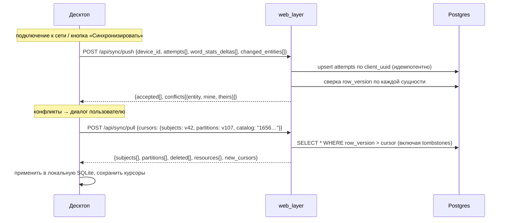

# Протокол offline-first синхронизации десктопа

Десктоп работает без сети произвольное время и синхронизируется при
подключении. Это не «кеш с обновлением», а репликация с явной моделью
конфликтов. Ключ к простоте — данные разбиты на ТРИ класса, у каждого
своя стратегия; попытка накрыть всё одной стратегией и порождает
CRDT-монстров.

> **Статус реализации (реализовано).** Сервер: `core/sync_api.py`
> (headless-логика: push с version-check и идемпотентными attempts, pull
> с курсорами/tombstones/пагинацией) + тонкий роутер
> `generator_service/routers/sync.py` (`POST /sync/push|pull`) + миграция
> 002 (`core/migrations.py`; сами sync-колонки, `devices` и
> `attempts(client_uuid PK)` создала 001). Клиент:
> `Generator/core/sync/` (SyncStore — outbox/курсоры/base_version/стэш
> конфликтов в той же локальной SQLite; SyncClient — push→pull, urllib
> или инжектируемый транспорт). Тесты: `core/test_sync_protocol.py`
> (13, сервер), `Generator/tests/test_sync_client.py` (9, клиент) +
> сквозной прогон настоящего клиента против настоящей серверной логики.
>
> Решения по местам, которые текст не фиксировал:
> 1. **Логика sync живёт в `generator_service`**, а не в web_layer: у него
>    прямой Repository и все детерминированные операции над данными уже
>    там (конвенция `partitions.py`); web_layer добавит JWT-проверку и
>    тонкий прокси `/api/sync/*` (паттерн GeneratorClient.cs) в auth-фазу.
>    Область видимости уже считается реальным RBAC Фазы 1
>    (`Repository.visible_subject_ids`); без identity-заголовков —
>    dev-заглушка «видно всё» (`sync_api.visible_scope`).
> 2. **`row_version` — глобально монотонный per-таблица** (запись через
>    MAX+1, на Postgres станет sequence), а не по-строчный `+1`: курсор
>    «максимальный полученный row_version» корректен только при уникальных
>    версиях, иначе страница, разрезанная посреди связки одинаковых
>    версий, теряет записи. Миграция 002 развязывает уже существующие.
> 3. **`Repository.delete_partition` переведён на tombstone** (строка
>    остаётся с `deleted_at`, API её скрывают) — иначе офлайн-клиент
>    никогда не узнал бы об удалении (§2 и так это требует; фиксируем,
>    что прежний физический DELETE заменён).
> 4. Tombstones в pull отдаются БЕЗ фильтра области видимости (только id и
>    версия — содержимого нет): сущность, выпавшая из области, всё равно
>    должна умереть на клиенте.
> 5. Конфликт на клиенте: сервер авторитетен — pull применяет серверную
>    версию, «моя» целиком ложится в локальный стэш `sync_conflicts` —
>    материал для конфликт-UI (сам диалог — фронтенд-работа, вне модуля).

## 1. Три класса данных

| Класс | Примеры | Стратегия | Конфликты |
|---|---|---|---|
| **Авторский контент** | subjects, partitions (включая графы `constracted=4`) | версионируемые документы: `row_version` + LWW с конфликт-UI | возможны, разрешает человек |
| **Телеметрия** | attempts, word_stats-инкременты | append-only лог с клиентским UUID | невозможны по построению |
| **Ресурсы** | словари English JSON, каталог узлов | read-only снапшоты с версией | не бывает — только устаревание |

Что офлайн НЕ работает (зафиксировано, не прячется):
- **LLM-контур** — создать партицию «через ИИ» без сети нельзя: S1/S5 —
  внешние вызовы. Джобу можно ПОСТАВИТЬ в локальный outbox, исполнится
  при подключении.
- Нейропроверки (произношение и т.п.).
- Живая статистика группы (видна последняя закешированная).
- Локальная генерация вариантов при этом работает ПОЛНОСТЬЮ — движок
  есть на десктопе; это главный смысл его автономии.

## 2. Авторский контент: версии + LWW с конфликт-UI

- Сервер авторитетен. Каждая правка на сервере инкрементирует
  `row_version` (bigint). Удаление — tombstone (`deleted_at`), строка
  не стирается: иначе офлайн-клиент никогда не узнает об удалении.
- Клиент хранит для каждой локально изменённой сущности `base_version`
  — версию, от которой правил.
- **Push**: `if server.row_version == base_version` → принять,
  `row_version++`; иначе → **конфликт**: сервер возвращает обе версии
  целиком, клиент показывает диалог. Для графов — «ваша / серверная,
  открыть обе в редакторе»; автослияние JSON графов ЗАПРЕЩЕНО: мерж
  двух валидных графов почти наверняка даёт невалидный (висячие
  провода), и даже если валидатор его поймает, молчаливое слияние
  авторского алгоритма — потеря труда. Конфликт целой сущностью честнее.
- Почему не CRDT: годы работы ради домена, где над одной партицией
  практически всегда один автор (владелец-преподаватель). Частота
  конфликтов ≈ «правил с двух своих устройств» — диалог раз в месяц
  дешевле CRDT навсегда.

## 3. Телеметрия: идемпотентный append

`attempts.client_uuid` генерируется на устройстве. Push = upsert по
UUID: повторная отправка после обрыва безвредна. Конфликтов нет —
никто не «редактирует» чужую попытку. `word_stats` синхронизируются
дельтами счётчиков (shown/correct/wrong с момента последнего sync),
сервер суммирует.

## 4. Транспорт: /api/sync поверх web_layer

Отдельная пара эндпоинтов, НЕ переиспользование CRUD: CRUD не выражает
ни дельты («всё новее версии N»), ни tombstones. Changefeed по
websocket — оверкилл: десктоп синхронизируется по событию (подключение,
кнопка, таймер), а не живёт в подписке.

- Курсор = максимальный полученный `row_version` на тип сущности —
  хранится на клиенте, сервер stateless по отношению к клиентам.
- Пейджинг дельты по размеру (батчи), порядок: сначала push (иначе pull
  затрёт base_version живых правок).
- Область pull для teacher — свои subjects + системные; для student —
  партиции его назначений. Область считает web_layer из RBAC-связей.

## 5. Аутентификация офлайн

- Refresh-токен ~30 дней, привязан к `device_id` (таблица `devices`),
  отзываем админом.
- Локальные данные доступны БЕЗ токена неограниченно: уже загруженное
  принадлежит пользователю, запирать локальную работу за протухшим
  токеном — вредительство.
- Протух refresh → push/pull требуют re-login; **outbox не теряется**:
  локальная очередь `pending_changes` (attempts + правки сущностей)
  переживает и логаут, и перезапуск, уходит при первом успешном sync.

## 6. Первичная загрузка устройства

Первый вход на десктопе = pull с нулевыми курсорами по своей области
видимости + ресурсы (словари, каталог узлов своей версии). Никакого
отдельного «инсталляционного» формата — тот же pull.
