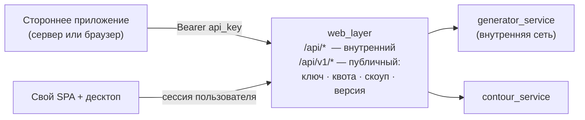

# Публичный API: можно ли сделать из сервиса продукт

Проектный документ. Отвечает на вопрос «можно ли открыть генератор заданий
наружу, как открыты Яндекс.Карты или Google Maps» — и если да, то что для
этого не хватает. Основан на фактическом коде (`web_layer/*.cs`,
`generator_service/`, `core/`), а не на желаемом.

## 1. Короткий ответ

**Можно, и архитектура для этого подготовлена лучше, чем обычно бывает.**
Три вещи уже стоят там, где надо: `web_layer` — единственная точка входа
для всех клиентов (инвариант топологии §6.1), `core/` — headless-движок без
единой зависимости от FastAPI или Qt, а генераторы и узлы графа живут в
реестрах, куда новое добавляется конфигом, а не правкой ядра.

Но «API как у Карт» — это **не префикс `/v1/` над существующими
эндпоинтами**. Карты продают не HTTP-ручку, а связку: ключ приложения,
квота, версионированный контракт с обещанием совместимости, встраиваемый
виджет и консоль разработчика. Движок у нас есть; нет ровно того, что
превращает движок в продукт. Ниже — честный перечень, что есть, чего нет и
в каком порядке это строится.

## 2. Разбор аналогии: из чего на самом деле состоит «API Карт»

| Составляющая | Что это значит | У нас сегодня |
|---|---|---|
| Ключ **приложения** | Субъект — не человек, а стороннее приложение | ❌ идентичность только человеческая (`X-User-Id` = логин) |
| Квоты и тарификация | Учёт вызовов по ключу, лимит, счёт | ❌ ничего |
| Версионированный контракт | `/v1/` живёт годами, ломать нельзя | ❌ DTO повторяют схему БД |
| Стабильные публичные id | Внешние id не равны первичным ключам | ❌ наружу торчат `partition_id`, `subject_id` |
| Встраиваемый клиент | `<script>` + виджет, не только REST | ⚠️ React-вьюхи есть, но не выделены |
| Песочница и консоль | Тестовый ключ, документация, метрики | ❌ ничего |
| Ограничение по домену | Браузерный ключ работает с одного origin | ❌ CORS открыт списком из конфига |

Вывод из таблицы: **работы не в движке, а вокруг него.** Это хорошая
новость — движок и есть самое дорогое, и он готов.

## 3. Что уже готово и переиспользуется как есть

* **Граница.** `web_layer` — ровно то место, где живёт публичный API:
  через него уже ходят и SPA, и десктоп, у него есть кеш справочников,
  Polly-ретраи и типизированный клиент к движку. Новый сервис заводить не
  нужно — это эволюция существующего, тем же ходом, каким `web_layer` стал
  оркестратором (`system_topology.md` §1).
* **Headless-ядро.** `core/` не знает про HTTP, роли и UI. Публичный API —
  ещё один потребитель тех же функций, а не форк логики.
* **Контракт генератора.** `TaskGenerator → StaticTask | InteractiveTask`
  уже абстракция нужного уровня: наружу отдаётся «задание», а не «результат
  работы конкретного генератора физики».
* **Механизм ограничения контента.** Выдачи предметов
  (`subject_grants`, `core/grants_api.py`) — уже готовый ответ на вопрос
  «кому какие предметы доступны». Для публичного API он нужен дословно, с
  заменой субъекта: не «преподавателю выдан предмет», а «ключу выдан
  предмет». Таблица и логика переиспользуются, меняется тип владельца.

## 4. Четыре блокера — и почему каждый настоящий

### 4.1. Нет субъекта «приложение»

Сегодня единственная идентичность — человек: `X-User-Id` с логином, роль
из `X-User-Role`, причём даже JWT ещё не введён (auth-фаза `web_layer` не
пришла — см. `rbac_and_data_model.md`). Стороннее приложение — это другой
вид субъекта: у него нет роли, ФИО и группы, у него есть **владелец,
скоуп и квота**.

Значит нужны свои таблицы, а не запись в `users`:

```sql
api_clients (id, name, owner_user_id, created_at, status)
api_keys    (key_hash PK, client_id, kind 'server'|'browser',
             allowed_origins, created_at, revoked_at)
api_usage   (client_id, day, endpoint, calls)      -- учёт для квоты
```

Ключ хранится **хэшем**, как пароль: утечка дампа не должна отдавать
рабочие ключи. Браузерный ключ отдельного вида — он по определению
публичен (лежит в исходнике страницы), и защищает его не секретность, а
привязка к origin.

### 4.2. Наружу торчит внутренняя схема

`GET /api/subjects` отдаёт `id` строки таблицы `Subjects`; `/api/generate`
принимает `partition_id`; в разделах наружу уезжает `constracted` —
внутреннее число, где «4 значит граф». Публичный контракт такое обещать не
может: перенумеруется таблица — сломаются все интеграции, а `constracted`
придётся поддерживать вечно, включая его историю.

Нужен слой публичных идентификаторов и словарей: стабильный `slug`/UUID
вместо первичного ключа и `"kind": "graph" | "test" | "single"` вместо
числа. Это не косметика — это то самое обещание совместимости, ради
которого версия и ставится в путь.

### 4.3. Ни квоты, ни лимита

Генерация — не бесплатная операция: за ней исполнение графа, а за
контуром (`/api/contour/jobs`) — вызовы внешних LLM за реальные деньги.
Публичный ключ без квоты — это открытый кран к чужому бюджету, и первая же
ошибка в чужом цикле `for` его выпьет. Квота — не «этап потом», а условие
самого открытия.

### 4.4. Интерактивные задания не переживают горизонтальное масштабирование

Найдено в коде, и это самый неочевидный блокер.
`generator_service/session_store.py` держит живые `InteractiveTask` в
**in-memory dict, по одному на процесс uvicorn** (там это прямо написано в
докстринге и честно оговорено). Пока инстанс один — работает. Публичный API
живёт за балансировщиком: второй запрос той же сессии придёт в другой
процесс и не найдёт её.

Лечится одним из двух: вынести состояние сессии в общее хранилище
(Postgres/Redis) — или сделать интерактив stateless, отдавая клиенту
подписанный курсор состояния. Второе честнее для публичного API (сервер без
памяти о клиенте масштабируется линейно), но требует, чтобы состояние
тренажёра сериализовалось.

### 4.5. Бонусом: два разных формата ошибок

`generator_service` (FastAPI) отвечает `{"detail": "..."}`,
`web_layer` — `{"error": "..."}`. Внутри это терпимо, наружу — нет:
у публичного API один конверт ошибки, с машинно-читаемым кодом:

```jsonc
{ "error": { "code": "quota_exceeded", "message": "…", "request_id": "…" } }
```

Унификация дешёвая и делается до всего остального, иначе её потом
придётся ломать вместе с версией.

## 5. Предлагаемая форма

**Две поверхности, а не одна.** `/api/*` остаётся внутренним — он служит
своему SPA, меняется вместе с ним и ничего никому не обещает. `/api/v1/*`
— публичный, с обещанием совместимости. Их нельзя объединять именно
потому, что у них разные обязательства: внутренний хочется менять быстро,
публичный нельзя менять вовсе.



Минимальный продуктовый набор ручек — четыре, и они же покрывают 90 %
сценариев встраивания:

```
GET  /api/v1/catalog              что доступно этому ключу
POST /api/v1/tasks                сгенерировать задание   ← основная
POST /api/v1/tasks/{id}/answer    проверить ответ / ход интерактива
POST /api/v1/exports              набор вариантов (уже есть внутри)
```

`POST` — с заголовком `Idempotency-Key`: генерация тарифицируется, и
повтор после сетевого обрыва не должен списывать второй раз.

**Встраиваемый виджет** — отдельный слой поверх REST, не вместо него:
`<script src=".../v1/embed.js">` + iframe. React-вьюхи для этого уже
существуют и уже развязаны (`StaticTaskView`, `InteractiveTaskView`,
`BlockRenderer` с реестром блоков) — виджет их переиспользует, а не
переписывает.

## 6. Порядок работ

| Этап | Содержание | Продуктовых решений требует |
|---|---|---|
| 0 | Единый конверт ошибки; заморозить DTO; OpenAPI-описание | нет |
| 1 | `api_clients`/`api_keys`, `Bearer`-аутентификация, скоуп контента через выдачи | да: кто заводит ключи |
| 2 | Учёт вызовов, квота, rate limit, `Idempotency-Key` | да: тарифы |
| 3 | Публичные id/словари вместо `partition_id`/`constracted` | нет, но ломает клиентов — только с `/v1/` |
| 4 | Сессии интерактива вне памяти процесса | нет |
| 5 | `embed.js`, песочница, консоль разработчика | да: продукт целиком |

Этапы 0 и 4 можно делать **прямо сейчас** — они не требуют ни одного
продуктового решения и полезны сами по себе, даже если публичного API не
будет: единый формат ошибки нужен своему же фронту, а сессии вне памяти
процесса чинят реальное ограничение развёртывания.

## 7. Чего делать не надо

1. **Не открывать `generator_service` наружу.** Он спроектирован
   внутренним, ролей не знает и прямо сейчас имеет write-эндпоинты без
   проверки прав (`POST/DELETE /partitions`, см.
   `rbac_and_data_model.md` §3). Публичный вход — только через `web_layer`.
2. **Не строить публичный API поверх схемы БД один в один** — см. §4.2.
   Один раз пообещав `partition_id`, его придётся хранить вечно.
3. **Не начинать с биллинга.** Сначала учёт и квота (этап 2), деньги —
   после того как есть что считать.
4. **Не вводить GraphQL и брокер сообщений.** Четыре ручки — не тот объём,
   на котором GraphQL окупается; для длительных операций уже выбрана
   job-очередь в Postgres с поллингом (`system_topology.md` §4), и менять
   это решение публичный API не заставляет.

## 8. Риск, который стоит назвать вслух

Технически открыть API можно. Но контент, который через него поедет, —
**авторский**: разделы и графы создают преподаватели, и `Subjects` уже
хранит `owner_user_id`. Отдавать их сторонним приложениям — вопрос прав на
контент, а не инженерии. Механика для разграничения есть (выдачи), решение
«что вообще доступно наружу» — продуктовое и правовое.

Безопасный старт, снимающий вопрос целиком: открывать наружу **только
встроенные code-предметы** (`owner_user_id IS NULL`) — они принадлежат
самому продукту, а не преподавателям. Авторский контент подключать
отдельным явным согласием автора, и лучше — уже после того, как публичный
API докажет спрос.
