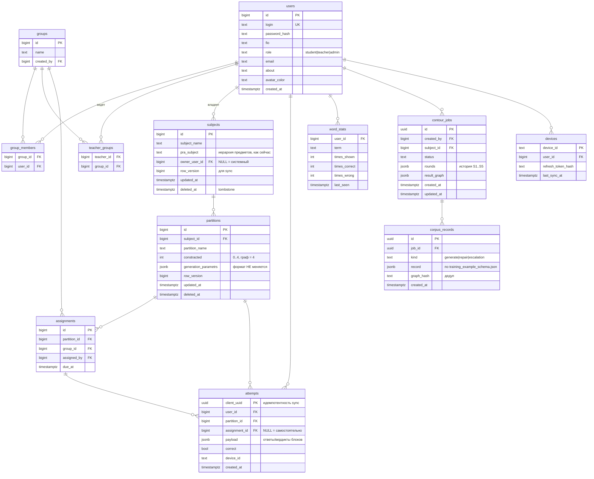

# RBAC и модель данных

Роли, владение контентом и целевая схема БД. Основано на фактической
SQLite-схеме (`core/repository.py`: `Subjects`, `Partitions`, `users`,
`WordStats`) — целевая схема спроектирована как её расширение с тремя
явно обоснованными ломающими правками.

## 1. Переход на PostgreSQL — почему обязателен

SQLite — один писатель на файл. Класс из 30 студентов, одновременно
отправляющих ответы + фоновые воркеры контура + sync-пуши десктопов —
это конкурентная запись, на которой однофайловая БД деградирует в
очередь блокировок. Postgres даёт конкурентность, JSONB для графов и
блоков (формат содержимого НЕ меняется — `generation_parametrs`
переезжает как есть), транзакционную job-очередь. Десктоп при этом
остаётся на локальном SQLite — это его офлайн-хранилище, см.
`offline_sync_protocol.md`.

## 2. Три ломающих правки текущей схемы (каждая — с обоснованием)

1. **`users.login` (TEXT PK) → числовой `users.id`, login уникален.**
   Логин — изменяемый атрибут человека; делать его ключом — значит
   каскадно переписывать все ссылки при смене логина. Все новые таблицы
   ссылаются на `user_id`.
2. **`users."group"` (свободная строка) → таблица `groups` + membership.**
   Строка не даёт ни «преподаватель видит свою группу», ни статистики по
   группе — это соединительная сущность, а не атрибут.
3. **Пароль открытым текстом → argon2id-хэш.** Сейчас
   `repo.find_user(login, password)` сравнивает сырые строки — для
   локального десктопа терпимо, для веба недопустимо. Миграция: при
   первом успешном входе перехешировать.

Всё остальное — аддитивно (новые таблицы и колонки).

## 3. Роли и права

Одна роль на пользователя, иерархия аддитивна: `admin ⊃ teacher ⊃
student`. Отдельная таблица user_roles не вводится: в учебном домене
совмещение ролей закрывается иерархией, а плата за many-to-many —
джойны в каждом authz-чеке; если совмещение всё же понадобится,
добавление таблицы — аддитивная миграция.

| Право | student | teacher | admin |
|---|---|---|---|
| Решать назначенные задания, видеть свой прогресс | ✅ | ✅ | ✅ |
| Генерировать варианты из доступных партиций | ✅ | ✅ | ✅ |
| Создавать/редактировать СВОИ subjects/partitions/графы | — | ✅ | ✅ |
| Запускать LLM-контур, утверждать его результаты (S6) | — | ✅ (свои) | ✅ |
| Назначать задания своим группам, видеть их статистику | — | ✅ | ✅ |
| Управлять пользователями, группами, чужим контентом | — | — | ✅ |
| Встроенные code-предметы (owner IS NULL) | читать | читать | редактировать |

**Владение**: `subjects.owner_user_id` (NULL = системный/встроенный —
такие сейчас создаёт `bootstrap.sync_database`); партиции наследуют
владельца от предмета, отдельного поля нет — одна точка истины, права
на партицию выводятся из предмета.

**Enforcement — только в `web_layer`**: JWT (access ~15 мин, refresh ~30
дней — длинный refresh нужен офлайн-десктопу) с claims `user_id`,
`role`; политики на эндпоинтах. Внутрь `generator_service` личность
пробрасывается заголовком — паттерн уже существует
(`generator_service/context.py: current_user_id`), он расширяется, а не
изобретается. Движки ролей не знают — симметрично тому, как core не
знает типов блоков.

## 4. Целевая ER-схема

Sync-колонки (`row_version`, `updated_at`, `deleted_at`) есть только у
реплицируемых сущностей (`subjects`, `partitions`) — их семантика в
`offline_sync_protocol.md`. `attempts` в версионировании не нуждаются —
append-only с клиентским UUID.

## 5. Корпус контура: БД, не файлы (решение)

Рабочий корпус (`generate`/`repair`/`escalation`) — таблица
`corpus_records` (JSONB по `training_example_schema.json` дословно,
`graph_hash` — канонический хэш для дедупа). Обоснование: записи
рождаются в транзакциях джобов (атомарно со сменой статуса), а отбор,
квоты по категориям и дедуп — это SQL-запросы. Для обучения корпус
ЭКСПОРТИРУЕТСЯ в JSONL одной командой — тренинг ест файлы, но файлы
— производная, не источник.

Исключение: golden-артефакты (`training_seed_examples/`,
`eval_set.json`) ОСТАЮТСЯ файлами в git репозитория Generator — они
версионируются вместе с движком, которым провалидированы, и участвуют
в код-ревью. Граница: git — эталоны, БД — поток.
