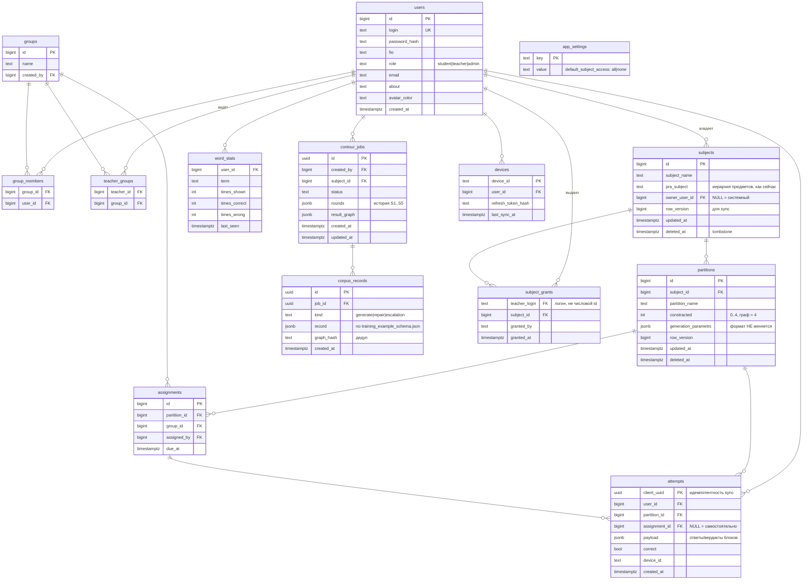

# RBAC и модель данных

Роли, владение контентом и целевая схема БД. Основано на фактической
SQLite-схеме (`core/repository.py`: `Subjects`, `Partitions`, `users`,
`WordStats`) — целевая схема спроектирована как её расширение с тремя
явно обоснованными ломающими правками.

> **Статус реализации (Фаза 1, реализовано).** `core/migrations.py`
> (версионированный раннёр + миграция 001 «rbac_foundation»),
> `core/passwords.py`, расширенный `Repository` и `core/test_rbac_migration.py`
> (6 проверок, headless, прогнаны на копии боевой БД: 5 пользователей → id
> 1–5, 9 предметов и 65 разделов сохранены, вход по унаследованному паролю
> работает и апгрейдит хеш). Два сознательных отклонения от текста ниже,
> продиктованных окружением:
> 1. **pbkdf2_sha256 (stdlib) вместо argon2id.** argon2-cffi недоступен, а
>    слой `core/` обязан работать без внешних зависимостей (тот же код грузит
>    десктоп). Формат хранения самоописателен (`pbkdf2_sha256$…`), поэтому
>    argon2id подключается позже за тем же интерфейсом без миграции данных.
> 2. **Числовой id добавлен, но `login` остаётся PRIMARY KEY (фаза «expand»).**
>    Полный отказ от login-PK (контракция) отложен, чтобы не переписывать
>    существующие роутеры разом; новые таблицы уже ссылаются на числовой id.
> 3. Миграция выполнена **на SQLite портируемым DDL** (`ALTER`/`CREATE`); сам
>    перенос движка на Postgres — отдельный инфраструктурный шаг (см. §1),
>    все схемные изменения из этого документа уже применены миграцией 001.

## 1. Переход на PostgreSQL — почему обязателен

SQLite — один писатель на файл. Класс из 30 студентов, одновременно
отправляющих ответы + фоновые воркеры контура + sync-пуши десктопов —
это конкурентная запись, на которой однофайловая БД деградирует в
очередь блокировок. Postgres даёт конкурентность, JSONB для графов и
блоков (формат содержимого НЕ меняется — `generation_parametrs`
переезжает как есть), транзакционную job-очередь. Десктоп при этом
остаётся на локальном SQLite — это его офлайн-хранилище, см.
`offline_sync_protocol.md`.

## 2. Три ломающих правки текущей схемы (каждая — с обоснованием)

1. **`users.login` (TEXT PK) → числовой `users.id`, login уникален.**
   Логин — изменяемый атрибут человека; делать его ключом — значит
   каскадно переписывать все ссылки при смене логина. Все новые таблицы
   ссылаются на `user_id`.
2. **`users."group"` (свободная строка) → таблица `groups` + membership.**
   Строка не даёт ни «преподаватель видит свою группу», ни статистики по
   группе — это соединительная сущность, а не атрибут.
3. **Пароль открытым текстом → argon2id-хэш.** Сейчас
   `repo.find_user(login, password)` сравнивает сырые строки — для
   локального десктопа терпимо, для веба недопустимо. Миграция: при
   первом успешном входе перехешировать.

Всё остальное — аддитивно (новые таблицы и колонки).

## 3. Роли и права

Одна роль на пользователя, иерархия аддитивна: `admin ⊃ teacher ⊃
student`. Отдельная таблица user_roles не вводится: в учебном домене
совмещение ролей закрывается иерархией, а плата за many-to-many —
джойны в каждом authz-чеке; если совмещение всё же понадобится,
добавление таблицы — аддитивная миграция.

| Право | student | teacher | admin |
|---|---|---|---|
| Решать назначенные задания, видеть свой прогресс | ✅ | ✅ | ✅ |
| Генерировать варианты из доступных партиций | ✅ | ✅ | ✅ |
| Создавать/редактировать СВОИ subjects/partitions/графы | — | ✅ | ✅ |
| Запускать LLM-контур, утверждать его результаты (S6) | — | ✅ (свои) | ✅ |
| Назначать задания своим группам, видеть их статистику | — | ✅ | ✅ |
| Управлять пользователями, группами, чужим контентом | — | — | ✅ |
| Встроенные code-предметы (owner IS NULL) | читать | читать | редактировать |

**Владение**: `subjects.owner_user_id` (NULL = системный/встроенный —
такие сейчас создаёт `bootstrap.sync_database`); партиции наследуют
владельца от предмета, отдельного поля нет — одна точка истины, права
на партицию выводятся из предмета.

**Enforcement — только в `web_layer`**: JWT (access ~15 мин, refresh ~30
дней — длинный refresh нужен офлайн-десктопу) с claims `user_id`,
`role`; политики на эндпоинтах. Внутрь `generator_service` личность
пробрасывается заголовком — паттерн уже существует
(`generator_service/context.py: current_user_id`), он расширяется, а не
изобретается. Движки ролей не знают — симметрично тому, как core не
знает типов блоков.

> **Где enforcement стоит (состояние на сегодня).**
> Запись контента авторизуется ОДНИМ правилом на оба пути
> (`core/content_authz.py`): нужна идентичность, роль teacher/admin, и
> чужой предмет преподавателю недоступен на запись — выдача даёт право
> видеть, а не переписывать. Владельца создаваемого предмета назначает
> сервер, а не клиент.
>
> Правило зовут `sync_api.push` и CRUD разделов (`POST /partitions`,
> `DELETE /partitions/{id}`); `web_layer` пробрасывает на них
> `X-User-Id` / `X-User-Role` тем же `ProxyAsync`, что и на аналитику с
> админкой, а SPA шлёт их из сессии.
>
> Раньше правило было только у синка, а CRUD не проверял ничего — любой,
> кто дотянулся до сервиса, мог переписать или снести чужой раздел, послав
> запрос мимо синка. Так дыры и заводятся: правило пишут там, где о нём
> подумали, а второй вход добавляют позже и про правило не вспоминают.
> Поэтому оно теперь одно, а не скопировано, и `core/test_partitions_authz.py`
> сверяет оба входа на одних и тех же случаях.
>
> **Чтение авторского содержимого закрыто тем же скоупом.**
> `GET /partitions/{id}` отдаёт `generation_params` — граф или конфиг
> генератора, — и раньше читался по id кем угодно.
> `content_authz.check_authoring_read` требует идентичности, роли
> teacher/admin и предмета в `visible_scope`, то есть в том же скоупе, по
> которому отдаёт pull синка. `GET /partitions/candidates/{subject_id}`
> вдобавок ФИЛЬТРУЕТ соседние предметы: иначе проверку обходят с другой
> стороны — не «покажи чужой раздел», а «покажи список, в котором он
> окажется».
>
> Правило намеренно не копия правила записи. Мягче по владельцу: выданный
> чужой предмет читать можно — выдача ровно для этого и нужна, и pull такой
> граф уже присылает, а запрет развёл бы веб и синк. Строже по роли:
> решающему «кишки» задания не нужны, зато помогают угадывать ответы.
>
> Чужое отвечает **404**, тем же телом, что и несуществующее: id
> последовательные, и различимый отказ превратился бы в карту чужих
> разделов.
>
> **Витрина (`GET /subjects`, `GET /subjects/{id}/partitions`) остаётся
> открытой.** Она отдаёт имена и виды разделов, а не их устройство, и по
> ней ходит решающий задачи гость. Закрывать её — отдельное продуктовое
> решение про доступ гостя к каталогу.
>
> `generator_service` при этом всё равно обязан оставаться закрытым от
> внешней сети — он задуман внутренним (`system_topology.md`).

> **Что запланировано сверх этого.** Организации как контейнер над
> группами (с владельцем-руководителем и заготовкой под иерархию), роль
> «разработчик» с примеркой чужих ролей и изоляция исполнения графов от БД
> описаны в `interactive_tasks_plan.md` §8, §12 и §9. Там же зафиксировано,
> почему роль разработчика нельзя вводить до auth-фазы: сегодня
> `X-User-Role` заявляет клиент, и сервер ему верит.

## 4. Целевая ER-схема

```mermaid
erDiagram
    users {
        bigint id PK
        text login UK
        text password_hash
        text fio
        text role "student|teacher|admin"
        text email
        text about
        text avatar_color
        timestamptz created_at
    }
    groups {
        bigint id PK
        text name
        bigint created_by FK
    }
    group_members {
        bigint group_id FK
        bigint user_id FK
    }
    teacher_groups {
        bigint teacher_id FK
        bigint group_id FK
    }
    subjects {
        bigint id PK
        text subject_name
        text pra_subject "иерархия предметов, как сейчас"
        bigint owner_user_id FK "NULL = системный"
        bigint row_version "для sync"
        timestamptz updated_at
        timestamptz deleted_at "tombstone"
    }
    partitions {
        bigint id PK
        bigint subject_id FK
        text partition_name
        int constracted "0..4, граф = 4"
        jsonb generation_parametrs "формат НЕ меняется"
        bigint row_version
        timestamptz updated_at
        timestamptz deleted_at
    }
    assignments {
        bigint id PK
        bigint partition_id FK
        bigint group_id FK
        bigint assigned_by FK
        timestamptz due_at
    }
    attempts {
        uuid client_uuid PK "идемпотентность sync"
        bigint user_id FK
        bigint partition_id FK
        bigint assignment_id FK "NULL = самостоятельно"
        jsonb payload "ответы/вердикты блоков"
        bool correct
        text device_id
        timestamptz created_at
    }
    word_stats {
        bigint user_id FK
        text term
        int times_shown
        int times_correct
        int times_wrong
        timestamptz last_seen
    }
    contour_jobs {
        uuid id PK
        bigint created_by FK
        bigint subject_id FK
        text status
        jsonb rounds "история S1..S5"
        jsonb result_graph
        timestamptz created_at
        timestamptz updated_at
    }
    corpus_records {
        uuid id PK
        uuid job_id FK
        text kind "generate|repair|escalation"
        jsonb record "по training_example_schema.json"
        text graph_hash "дедуп"
        timestamptz created_at
    }
    devices {
        text device_id PK
        bigint user_id FK
        text refresh_token_hash
        timestamptz last_sync_at
    }
    subject_grants {
        text teacher_login FK "логин, не числовой id"
        bigint subject_id FK
        text granted_by
        timestamptz granted_at
    }
    app_settings {
        text key PK
        text value "default_subject_access: all|none"
    }

    users ||--o{ group_members : ""
    groups ||--o{ group_members : ""
    users ||--o{ teacher_groups : "ведёт"
    groups ||--o{ teacher_groups : ""
    users ||--o{ subjects : "владеет"
    subjects ||--o{ partitions : ""
    partitions ||--o{ assignments : ""
    groups ||--o{ assignments : ""
    users ||--o{ attempts : ""
    partitions ||--o{ attempts : ""
    assignments ||--o{ attempts : ""
    users ||--o{ word_stats : ""
    users ||--o{ contour_jobs : ""
    contour_jobs ||--o{ corpus_records : ""
    users ||--o{ devices : ""
    users ||--o{ subject_grants : "выдано"
    subjects ||--o{ subject_grants : ""
```

**Выдачи предметов** (`subject_grants`, миграция 006) — отдельное измерение
поверх владения: владение отвечает на «что я могу редактировать»,
выдача — на «что мне позволено видеть». Админ раздаёт преподавателям
доступ к предметам, преподаватель видит только выданные; умолчание
`app_settings.default_subject_access` ('all' — преподаватель без выдач видит
всё, 'none' — только выданное) делает выкатку безопасной: раздали, потом
переключили в строгий режим. Ключ выдачи — логин, как у групповых связей
после миграции 003. Доезжает изменение выдач до десктопа через scope-эпоху
(`users.scope_version`, см. `offline_sync_protocol.md` §4); контракт с
десктопом целиком — `Generator/docs/subject_grants.md`.

Sync-колонки (`row_version`, `updated_at`, `deleted_at`) есть только у
реплицируемых сущностей (`subjects`, `partitions`) — их семантика в
`offline_sync_protocol.md`. `attempts` в версионировании не нуждаются —
append-only с клиентским UUID.

## 4.1. Слой доступа: устройство и почему не ORM

`Repository` разрезан по доменам (`core/repo/`): `content` (предметы,
разделы, владение), `users`, `teaching` (группы и домашки), `access`
(выдачи и ключи приложений), `runtime` (сессии, статистика), плюс `base` —
файл БД, схема, соединение. Собирается миксинами в `core/repo/__init__.py`;
`core/repository.py` остался точкой импорта. Композиция миксинами, а не
объектами-неймспейсами (`repo.subjects.list()`), выбрана сознательно:
публичная поверхность обязана была остаться прежней, иначе механическое
перекладывание файлов смешалось бы с содержательной правкой полусотни
вызовов.

**Соединение — одно на поток**, а не на вызов метода: `sqlite3.Connection`
не переносится между потоками (sync-роуты FastAPI работают в пуле), а
открытие соединения на операцию — та самая работа, которую на Postgres в
любом случае заменит пул.

**`transaction()` публичная и вложенная.** Многошаговые операции живут не в
Repository, а слоем выше (`grants_api.set_teacher_grants`,
`admin_api.change_role`), и раньше брали приватное `_connect()` с `# noqa`
— то есть атомарности у них не было: между проверкой и записью могло
произойти что угодно. Показательный случай — «нельзя понизить последнего
администратора»: два одновременных понижения оба видели бы `count == 2`,
оба проходили бы проверку, и система осталась бы без единого админа.
Вложенность обязательна, иначе публичность бесполезна: внешний вызов
дёргает обычные методы Repository, каждый из которых тоже открывает
транзакцию, и первый же вложенный `commit()` фиксировал бы половину чужой
работы.

**ORM не вводится, и это решение, а не инерция.** Три довода, все — про
этот код:

1. **Dataclass'ы уже правильные.** `Subject`, `Partition`, `Assignment` —
   `frozen`, без зависимостей, с `to_dict()`. Сущности ORM живут в сессии,
   мутабельны и имеют identity map; смешивать две модели — ровно тот
   сценарий, в котором ORM-проекты становятся неуправляемыми.
2. **Синк держится на точной семантике SQL** — глобальная монотонность
   `row_version` через `MAX+1`, идемпотентность `INSERT OR IGNORE` по
   `client_uuid`, курсорная пагинация, tombstone'ы. Это не «запросы», это
   протокол (`offline_sync_protocol.md`); прослойка между кодом и этой
   семантикой — место для тонких поломок, а не для удобства.
3. **Repository и есть та абстракция, ради которой заводят ORM.** Переезд
   на Postgres переписывает нутро методов, но ни одного вызывающего.

Что при переезде на Postgres действительно понадобится: Alembic вместо
самописного раннёра миграций и, возможно, SQLAlchemy **Core** (не ORM) как
диалектный слой ПОД фасадом Repository — сейчас в коде есть
SQLite-специфика (`rowid`, `AUTOINCREMENT`, `PRAGMA`, `INSERT OR IGNORE`).
Это отдельный шаг, и делать его следует вместе со сменой движка, а не до.

## 5. Корпус контура: БД, не файлы (решение)

Рабочий корпус (`generate`/`repair`/`escalation`) — таблица
`corpus_records` (JSONB по `training_example_schema.json` дословно,
`graph_hash` — канонический хэш для дедупа). Обоснование: записи
рождаются в транзакциях джобов (атомарно со сменой статуса), а отбор,
квоты по категориям и дедуп — это SQL-запросы. Для обучения корпус
ЭКСПОРТИРУЕТСЯ в JSONL одной командой — тренинг ест файлы, но файлы
— производная, не источник.

Исключение: golden-артефакты (`training_seed_examples/`,
`eval_set.json`) ОСТАЮТСЯ файлами в git репозитория Generator — они
версионируются вместе с движком, которым провалидированы, и участвуют
в код-ревью. Граница: git — эталоны, БД — поток.
