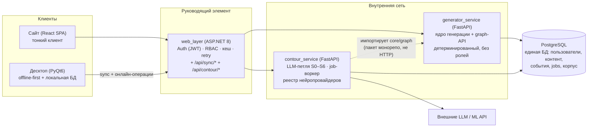

# Топология сервисов итогового продукта

Архитектурный документ. Фиксирует состав сервисов, их границы и способ
вызова длительных операций. Основан на реальном коде монорепо
(`web_layer/Program.cs`, `generator_service/main.py`) и проектном пакете
контура из репозитория Generator (`docs/closed_loop_contract.md`).

## 1. Решение в одном абзаце

«Руководящий элемент» — это **эволюция существующего `web_layer`**, а не
новый сервис. Он уже стоит в единственно правильной точке: оба клиента
говорят только с ним, у него есть typed-клиент к FastAPI, retry (Polly),
кеш справочников. К нему добавляются аутентификация, RBAC-мидлварь и
маршрутизация к одному НОВОМУ сервису — `contour_service` (Python),
владеющему LLM-петлёй и реестром нейропровайдеров. `generator_service`
остаётся детерминированным движком без понятия ролей. БД одна — Postgres.



## 2. Распределение ответственности

| Компонент | Было | Становится |
|---|---|---|
| `frontend` | SPA без ролей | SPA + ролевые экраны (RBAC-claims из JWT); граф-канвас (см. graph_editor_api_contract.md) |
| `web_layer` | тонкий прокси без auth | **оркестратор**: JWT-auth, RBAC-политики на эндпоинтах, sync-API для десктопа, проксирование job'ов контура; кеш/Polly сохраняются |
| `generator_service` | FastAPI над core | то же + graph-роутер (каталог/валидация/превью); по-прежнему без ролей — личность приходит проброшенным заголовком, паттерн `context.current_user_id` уже существует |
| `contour_service` | — | НОВЫЙ: петля S0–S6, job-очередь, реестр нейропровайдеров |
| Десктоп (репо Generator) | сам читает SQLite | локальная БД + sync-клиент к `web_layer`; редактор графов остаётся |

## 3. Почему contour_service — отдельный процесс, но Python

Отдельный от `generator_service`: петля живёт минуты (несколько раундов
LLM), гоняется фоновыми воркерами и не должна делить процесс с
интерактивной генерацией заданий (латентность «сгенерировать вариант»
для студента — сотни мс, её нельзя ставить в очередь за LLM-джобами);
масштабируются они независимо (контур — по числу LLM-вызовов, генерация
— по числу пользователей).

Python и тот же монорепо-пакет `core/`: стадии S2 (сборка
`GraphExecutor`) и S3 (probe) — это ИМПОРТ движка, не сетевой вызов.
Дублировать движок по HTTP значило бы сериализовать то, что уже лежит в
одном пакете. Один новый сервис, не несколько: генератор-агент, критик и
нейропровайдеры — это вызовы внешних API из одной петли, разрезать их по
процессам нечем обосновать.

## 4. Модель длительных операций (job-очередь)

Синхронный HTTP для петли не годится (минуты). Решение:

- Таблица `contour_jobs` в Postgres — она и есть очередь: воркер
  забирает `SELECT … FOR UPDATE SKIP LOCKED`. Redis/RabbitMQ НЕ
  вводятся: при десятках джобов в день брокер — чистая инфраструктурная
  плата; Postgres-очередь транзакционна с персистом раундов и корпуса
  (одна запись — один коммит). Шов на будущее: интерфейс `JobQueue` в
  contour_service; замена на брокер локальна.
- Клиент: `POST /api/contour/jobs` → `202 {job_id}`; статус —
  **polling** `GET /api/contour/jobs/{id}` каждые 2–5 с. SSE/webhook не
  на старте: статус лежит в БД, транспорт статуса — заменяемая деталь.

Подробности жизненного цикла джобы — `contour_integration.md`.

## 5. Реестр нейропровайдеров (та же философия, что NodeRegistry)

Абстракция «нечёткой задачи»: `task_type → провайдер → структурированный
результат`. Живёт МОДУЛЕМ внутри contour_service (не отдельный сервис):
это те же исходящие вызовы внешних API тем же async-паттерном.

```
Provider:
    task_type: str            # "llm.generate_graph" | "llm.critic"
                              # | "speech.pronunciation" | "text.sentence_gen"
    invoke(payload: dict) -> dict   # структурированный результат + confidence
```

Ключевое объединение: сами агенты петли — S1 (генератор графа) и S5
(критик) — тоже провайдеры этого реестра. «Агенты контура» и «нейросети
для произношения» — одна абстракция, добавление модели = конфиг-запись,
не архитектурная правка. Это калька с `NodeRegistry`/`GeneratorRegistry`
— проектная философия уже такая.

Выделение в отдельный сервис предусмотрено (интерфейс уже провайдерный),
триггер — появление тяжёлого ЛОКАЛЬНОГО инференса (произношение на
собственной GPU-модели). До этого — модуль.

## 6. Правила границ (инварианты топологии)

1. Клиенты не ходят мимо `web_layer` (в т.ч. десктоп: всё онлайн-общение
   — через него; прямого доступа к Postgres у клиентов нет).
2. `generator_service` и `contour_service` — приватная сеть, доверяют
   заголовку `X-User-Id`/`X-User-Role` только от `web_layer`.
3. Роли и права существуют ТОЛЬКО в `web_layer` (см.
   `rbac_and_data_model.md`); движки ролей не знают.
4. Формат графа на проводе — ровно `GraphSpec.to_dict()` (см.
   `graph_editor_api_contract.md`), у всех сервисов и клиентов.
5. Один источник каталога узлов — `NodeRegistry` через graph-API;
   никакие клиенты не хардкодят список узлов.
