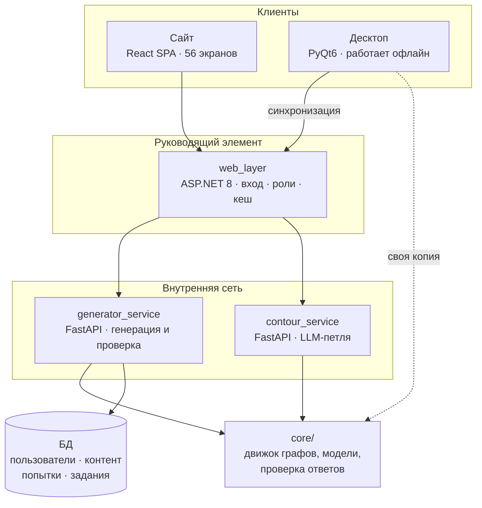

# 01. Что это такое

## Одним абзацем

Система генерации учебных заданий с проверяемым ответом. Преподаватель
описывает задание один раз — как **граф вычислений**, — а система выдаёт
из него сколько угодно вариантов с разными числами и разными правильными
ответами, проверяет ответы студентов и копит статистику. Работает в двух
видах: сайт и десктопное приложение, которое умеет работать без сети.

Ключевое отличие от «генератора вариантов из шаблона»: правильный ответ
не хранится строкой, а **вычисляется вместе с условием** и проверяется по
правилам своей предметной области. `2/4` и `0.5` — один и тот же ответ;
`x*x` и `x^2` — одно и то же выражение; программа, печатающая то же
самое, — тот же результат.

## Из чего состоит



Подробности про границы сервисов и почему «руководящий элемент» — это
эволюция `web_layer`, а не новый сервис:
[`docs/architecture/system_topology.md`](../architecture/system_topology.md).

## Два репозитория и общее ядро

| Репозиторий | Что в нём | Размер |
|---|---|---|
| `ventanolemon/GenerationWeb` | сервер, веб, ядро | 62 тыс. строк Python + 13.6 тыс. TS |
| `ventanolemon/Generator` | десктоп PyQt6, зеркало ядра | 57 тыс. строк Python |

**Ядро (`core/`) существует в двух копиях.** Это не небрежность, а
решение: десктоп обязан генерировать и проверять задания без сети, то
есть исполнять ту же логику у себя. Автоматической синхронизации нет —
правки переносятся руками, а расхождение ловится проверкой
`python -m scripts.core_drift`, которая сравнивает узлы по AST, а не
файлы построчно.

Что законно различается, а что нет — [06. Правила работы](06-working-rules.md).

## Где что лежит

### Сервер (`GenerationWeb`)

```
core/                 движок и предметная область — 47 тыс. строк
  graph/              язык графов: узлы, исполнитель, документ, ресурсы
    nodes/            145 узлов в 8 модулях
  models/             5 моделей предметной области
  answers.py          спецификация ответа: что считать правильным
  word_tolerance.py   допуск опечатки в словарном диктанте
  pronunciation.py    транскрипция и звук термина
  pronunciation_match.py  приём произношения: ближайший эталон в словаре
  partition_ids.py    номера разделов (единственное место выдачи)
  export_api.py       раскладка .docx: варианты и размещение ответов
  guide.py            формат базы знаний; guide_store.py — правки поверх
  repo/               слой доступа к БД, разрезан по доменам
  *_api.py            роутеры FastAPI (по домену: admin, subjects, …)
  migrations.py       версионированные миграции схемы
exercises/            предметные генераторы: матан, линал, физика, ОПВС, английский
generator_service/    FastAPI-сервис генерации
contour_service/      FastAPI-сервис LLM-петли
web_layer/            ASP.NET 8: вход, роли, маршрутизация
frontend/             React SPA
resources/            поставка: словари, звук, транскрипции, БД-шаблон
scripts/              обслуживание: дрейф ядра, снимки, учётные записи
docs/architecture/    21 архитектурный документ
docs/guide/           база знаний, вкомпилированная в сборку фронта
docs/handbook/        эта серия
```

### Десктоп (`Generator`)

```
core/                 ЗЕРКАЛО ядра сервера (без API и слоя БД сервера)
exercises/            зеркало предметных генераторов
ui/                   PyQt6: окна, редакторы, холст графа — 12.9 тыс. строк
  editors/graph_canvas/   холст: сцена, узлы, провода, роутер трасс
tools/                сборка звука и транскрипций (не рантайм)
resources/            поставка + шаблон БД
tests/                тесты, специфичные для десктопа
```

## Язык графов: что в каталоге

145 узлов. Раскладка по категориям — замер, а не план:

| Категория | Узлов | О чём |
|---|---|---|
| `symbolic` | 41 | символьная арифметика: выражения, упрощение, подстановка |
| `linalg` | 38 | матрицы, векторы, собственные значения |
| `control` | 15 | ветвление, циклы, повторы |
| `source` | 11 | источники: числа, диапазоны, файлы |
| `list` | 8 | коллекции |
| `english` | 5 | словари, предложения |
| `compute` | 4 | арифметика над числами |
| `ode` | 4 | дифференциальные уравнения |
| `informatics` | 4 | код, вывод программы |
| `image` | 4 | картинки, схемы |
| `content` | 4 | текст, формулы, блоки |
| `plot` | 3 | графика на комплексной плоскости |
| `assembly` | 3 | сборка блоков |
| `task` | 1 | финальный узел: собственно задание |

Модули языка: `core`, `symbolic`, `linalg`, `ode`, `english`,
`informatics`, `image`, `plot`.

Про то, как язык устроен и почему у него именно такой набор типов
портов — [`docs/architecture/july_language_wishlist.md`](../architecture/july_language_wishlist.md)
и [`docs/architecture/informatics_on_july.md`](../architecture/informatics_on_july.md).

## Два способа задать задание, и оба живые

**Код-генератор** — python-класс, выдающий условие и ответ. Старый
способ. Так сделаны матан, линал, ОПВС: около 70 разделов.

**Граф** — узлы и провода, собранные в редакторе. Новый способ. Так
сделаны 9 поставочных заданий и всё, что собирает преподаватель.

Второй не заменил первый и не должен: замена сменила бы содержимое уже
выданных домашних заданий и разошлась бы со статистикой попыток. Они
сосуществуют, и реестр генераторов выдаёт то и другое по номеру раздела.

## Что делает систему не «ещё одним генератором»

Три вещи, каждая из которых упирается в одно наблюдение: **понятие
равенства принадлежит предметной области.**

1. **Ответ — данные, а не строка.** `core/answers.py` описывает, ЧТО
   считать правильным: число с допуском и единицей, текст с допуском
   опечатки, выражение с точностью до эквивалентности, вывод программы.
2. **Проверка и генерация понимают «то же самое» одинаково.** Правило
   равенства живёт в `core/` (`boolean_text`, `program_output`,
   `equation_text`, `word_tolerance`) и используется обеими сторонами.
   Разложенное по вызывающим правило живёт до второго вызывающего.
3. **Генератор проверяется прогоном.** Утверждение «этот генератор
   выдаёт задания с верным ответом» проверяется не чтением кода, а
   исполнением: сто вариантов, у каждого вычисленный ответ сверяется с
   независимо посчитанным.

Развёрнуто — [`docs/architecture/thesis_foundation.md`](../architecture/thesis_foundation.md),
раздел 1.
