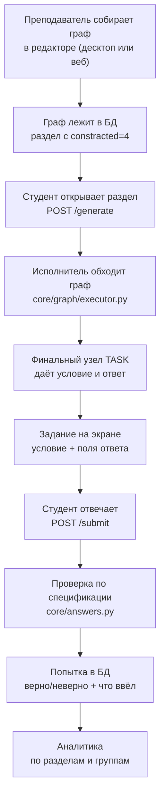

# 02. Как это работает

Один сквозной путь: от того, что собрал преподаватель, до того, что
увидел и сдал студент. Если читать в проекте что-то одно — читайте это.

## Путь задания целиком

Дальше — по шагам, с тем, где что лежит.

## 1. Автор собирает граф

Холст: `ui/editors/graph_canvas/` (десктоп) и `frontend/src/` (веб).
Узлы соединяются проводами; цвет провода — тип значения, как в LabVIEW.

Что важно понимать про холст:

* **Ветки «условие» и «ответ» вычисляются, а не хранятся.** Куда попадёт
  узел — в условие или в ответ, — определяется обратным обходом от
  финального узла. Хранимая пометка разошлась бы с проводами при первой
  же правке. См. `core/graph/branches.py`.
* **Файлы адресуются идентификатором, а не путём.** `res:words/unit1.json`
  разрешается относительно `resources/` ТОЙ машины, которая исполняет
  граф. Путь верен ровно на одной машине; граф уезжает по синхронизации.
  См. `core/graph/resources.py`.
* **Номер раздела выводится из имени файла**, а не из его места в
  каталоге. См. `core/partition_ids.py` и историю в [03](03-whats-broken.md).

## 2. Граф хранится в БД

Таблица `Partitions`, колонка `generation_parametrs` — JSON графа.
Колонка `constracted` говорит, чем раздел обслуживается:

| `constracted` | Что это |
|---|---|
| 0 | обслуживается КОДОМ: python-генератор с этим номером |
| 1 | конструктор физики (формула + переменные) |
| 2 | группа: набор других разделов |
| 3 | тест |
| 4 | граф |

**Связь «раздел ↔ код» держится только на номере**, и за её целостностью
следит проверка на старте (`bootstrap.unserved_partitions`). Раздел с
`constracted=0`, которому не соответствует ни один генератор, — это
раздел, который нельзя открыть; такой находился в поставке и падал при
клике.

## 3. Студент открывает раздел

Веб: `POST /api/generate` через `web_layer` → `generator_service`.
Десктоп: тот же код напрямую, без сети.

Реестр (`core/registry.py`) выдаёт генератор по номеру раздела. Для
графа это адаптер, исполняющий граф; для код-раздела — python-класс.

## 4. Исполнитель обходит граф

`core/graph/executor.py`. Обход топологический: узел исполняется, когда
готовы все его входы. Финальный узел — единственный со свободным выходом
типа `TASK`; если таких несколько, холст показывает это как конфликт,
потому что «какое из двух заданий считать результатом» кода не имеет.

Случайность у каждого узла-источника своя, и вся она выводится из одного
ЗЕРНА варианта. Это то, что делает вариант воспроизводимым: по зерну
можно получить ровно то же задание и разобрать жалобу «здесь неверный
ответ», а не гадать.

## 5. Финальный узел даёт условие и ответ

`TASK` собирает две вещи:

* **условие** — список блоков (текст, формула, картинка, поле ввода);
* **спецификация ответа** — не строка, а описание того, ЧТО считать
  правильным.

Спецификации живут в `core/answers.py`:

| Вид | Что проверяет | Пример допуска |
|---|---|---|
| `NumberSpec` | число | значащие цифры, единица измерения |
| `TextSpec` | текст | регистр, пробелы, опечатка по длине слова |
| `ExprSpec` | выражение | эквивалентность, а не совпадение записи |
| `ChoiceSpec` | выбор | номер варианта |

## 6. Проверка ответа

`POST /submit` (или локально на десктопе). Проверяет та же
спецификация, что пришла с заданием, — не отдельный код проверки.

Здесь работает главное правило проекта: **понятие равенства принадлежит
предметной области**, и живёт оно в одном месте на обе стороны.

| Модуль | Что решает |
|---|---|
| `core/boolean_text.py` | когда две логические формулы — одно и то же |
| `core/program_output.py` | когда два вывода программы — один и тот же |
| `core/equation_text.py` | когда две записи уравнения — одна и та же |
| `core/word_tolerance.py` | когда опечатка — это опечатка, а не другое слово |
| `core/pronunciation.py` | как звучит термин (транскрипция и звук) |
| `core/pronunciation_match.py` | когда произнесено ЭТО слово, а не соседнее |

Показательный случай — `word_tolerance`. Мягкая проверка принимала
правку на расстоянии Левенштейна ≤ 1. На поставочных словарях это дало
**17 пар, неразличимых проверкой** (замер по объединённому словарю из
160 терминов; отдельно по каждому из 16 словарей поставки — 48 пар на
830 позициях): `LAN` принимал `MAN`, `WAN` и
`WLAN`. Студент, написавший `WAN` вместо `LAN`, не опечатался — он не
знает разницы. Правило переписано так, что допуск ограничен расстоянием
до ближайшего соседа В СЛОВАРЕ; столкновений стало ноль, а из 128
проверенных опечаток приниматься продолжают 121.

**То же правило на звуке.** `pronunciation_match` принимает запись, если
эталон целевого слова оказался к ней ближе эталонов остальных слов
словаря. Абсолютного порога нет намеренно: его пришлось бы калибровать
под голос и микрофон, а порядок близости общий сдвиг тракта записи не
меняет. Правило умеет ОТКАЗАТЬСЯ судить — отдельный код вердикта
`uncertain`, потому что «я не расслышал» и «вы сказали не то» — разные
вещи, и говорить студенту второе вместо первого нельзя.

**Окрестностью задан и порог этого отказа** — и это исправление, а не
исходный замысел. Сначала уверенность решалась константой (отрыв ≥ 8%);
замер по всем 14 словарям поставки дал 144 уверенно неверных вердикта на
11 словарях. Теперь отрыв меряется долей от `separation` — расстояния
между эталонами САМОГО словаря, — и уверенно неверных ноль на всех
словарях, ценой падения покрытия с 78,6% до 39,6%.

Урок шире произношения: **применить принцип наполовину — значит не
применить его.** Половина, оставленная на константе, определила поведение
всего механизма.

## 7. Попытка сохраняется

Таблица `attempts`: кто, какой раздел, что ввёл, верно ли, в каком
режиме. Отсюда растёт аналитика (`core/analytics/`) и адаптивная выдача.

**Ответ, который в попытку не помещается.** Поле текстовое, а ответ на
задание по произношению — запись. Она не хранится: вердикт считается на
месте, и в попытку идёт результат (`{term, accepted, reason}`), который
сессия рассказывает о себе сама (`SpecSession.attempt_payload`). Обход
осознанный — двоичное хранилище это отдельная работа, — и он не мешает
завести хранение потом.

## Офлайн: что происходит, когда сети нет

Десктоп держит СВОЮ копию БД и своё ядро. Работает полностью автономно:
генерирует, проверяет, копит попытки в очередь (`sync_outbox`).

При появлении сети — обмен с сервером: изменения уезжают, чужие
приезжают. Разрешение конфликтов по версии строки (`row_version`),
удаления передаются надгробиями, а не пропажей записи.

Протокол: [`docs/architecture/offline_sync_protocol.md`](../architecture/offline_sync_protocol.md).

**Ловушка, из-за которой был живой дефект:** синхронизация переносит
разделы ПО НОМЕРУ. Пока номер выводился из места файла в каталоге, а
каталоги на сервере (20 словарей) и на десктопе (12) разной длины, один
и тот же номер означал РАЗНЫЕ словари. Задание, выданное на сервере,
открывало на десктопе другой словарь — молча.

## Кто что может

Роль — свойство сессии, не пользователя. `core/auth_sessions.py`.

| Роль | Может |
|---|---|
| `student` | получать задания, отвечать, видеть свою статистику |
| `teacher` | всё выше + собирать разделы, выдавать задания, видеть группы |
| `admin` | всё выше + учётные записи, организации, выдача предметов |

Отдельно `is_superuser` — администратор развёртывания. Ему доступна
**примерка роли**: посмотреть систему глазами студента, не заводя
учётную запись. Примерка только ВНИЗ и снимает `is_superuser` — значит,
забытая проверка стоит точности картинки, а не безопасности.

`Identity.role` — ВСЕГДА действующая роль; настоящая лежит в
`true_role`. Это сделано так намеренно: код, который забыл про примерку,
ошибается в безопасную сторону.
