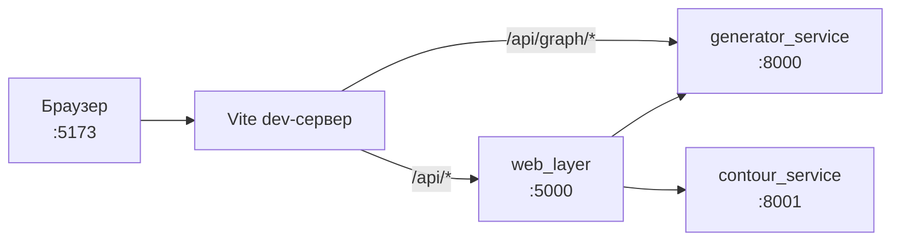

# 07. Как запустить

Команды. Порты. Что от чего зависит.

---

## Быстро: три варианта запуска

| Что нужно | Что поднимать |
|---|---|
| Посмотреть десктоп | только `Generator/main.py` — сети не требует |
| Разработка веба без .NET | `generator_service` + фронт в прямом режиме |
| Всё как в работе | `generator_service` + `contour_service` + `web_layer` + фронт |

---

## Десктоп: один шаг

```bash
cd Generator
pip install -r requirements.txt
python main.py
```

Работает автономно: своя БД (`resources/users_database.db`), своё ядро,
никакой сети. Гостевой вход — кнопка на экране авторизации.

Учётные записи с полным доступом:

```bash
python -m scripts.seed_accounts       # заведёт dev и owner
```

**След от падения** (у собранного приложения консоли нет):

```bash
GEN_CRASH_LOG=/путь/crash.txt python main.py
```

---

## Сервер: разработка без .NET

Самый быстрый способ поднять веб. `web_layer` — тонкий прокси, и для
разработки фронта его можно не поднимать.

```bash
# терминал 1 — движок генерации
cd GenerationWeb
pip install -r requirements.txt
uvicorn generator_service.main:app --host 127.0.0.1 --port 8000

# терминал 2 — фронт в прямом режиме
cd GenerationWeb/frontend
npm install
VITE_API_DIRECT=1 npm run dev
```

Открыть: **http://localhost:5173**

`VITE_API_DIRECT=1` переадресует весь `/api` прямо на FastAPI со
срезанным префиксом — маршруты совпадают, потому что `web_layer` их не
меняет.

Проверить, что движок жив: **http://127.0.0.1:8000/docs**

---

## Сервер: полный состав

```bash
# 1. движок генерации
uvicorn generator_service.main:app --host 127.0.0.1 --port 8000

# 2. LLM-петля (нужна только для контура и куратора корпуса)
uvicorn contour_service.main:app --host 127.0.0.1 --port 8001

# 3. руководящий элемент
cd web_layer && dotnet run          # http://localhost:5000

# 4. фронт
cd frontend && npm run dev          # http://localhost:5173
```

Открыть: **http://localhost:5173** (Vite переадресует `/api` на :5000).

### Порты и кто куда ходит



`/api/graph` идёт мимо `web_layer` намеренно: graph-роутер живёт в
`generator_service` — см.
[`graph_editor_api_contract.md`](../architecture/graph_editor_api_contract.md) §2.

Адреса сервисов для `web_layer` — в `web_layer/appsettings.json`
(`BaseUrl`: `http://127.0.0.1:8000` и `:8001`).

### CORS

Если фронт на другом порту:

```bash
export GENERATOR_CORS_ORIGINS="http://localhost:5173,http://localhost:5000"
```

---

## Учётные записи

```bash
cd GenerationWeb
python -m scripts.seed_accounts
```

Заводит `dev` (разработчик) и `owner` (хозяин организации) — обе с
полным доступом и `is_superuser`.

**Пароли по умолчанию лежат в репозитории открытым текстом.** Перед
выкладкой наружу:

```bash
python -m scripts.seed_accounts \
    --dev-password '…' --owner-password '…' --reset-password
```

Скрипт печатает это предупреждение при каждом запуске — намеренно.

---

## Проверки

```bash
# сервер: 1665 тестов
cd GenerationWeb
python -m unittest discover -t . -s . -p "test_*.py"

# десктоп: 2313 тестов
cd Generator
QT_QPA_PLATFORM=offscreen python -m unittest discover -t . -s . -p "test_*.py"

# фронт: 71 тест + сборка с проверкой типов
cd GenerationWeb/frontend
npm test
npm run build

# расхождение ядра между репозиториями
cd GenerationWeb
python -m scripts.core_drift ../Generator
```

**`-t .` обязателен** — без него ломаются относительные импорты, и
ошибки выглядят как настоящие поломки.

`QT_QPA_PLATFORM=offscreen` нужен там, где нет дисплея.

---

## Пересборка производного

Эти вещи собираются из исходников и в рантайме не пересчитываются.

```bash
# база знаний: markdown → JSON для фронта
# (после правки docs/guide/*.md — иначе фронт покажет старое)
python -m scripts.guide_export

# снимки для базы знаний
python -m scripts.guide_shots

# описание HTTP API
python -m scripts.export_openapi

# транскрипции: IPA из CMUdict
python tools/generate_transcriptions.py

# звук: WAV через espeak-ng (нужен apt-get install espeak-ng)
python tools/generate_audio.py
```

Последние две — только когда меняется состав словарей. Готовые 405
транскрипций и 462 звука уже лежат в `resources/`. Звук покрывает 465
терминов из 495 (93,9%): три сокращения находятся через запасной путь —
термин без скобочного пояснения (`BIOS` ← `BIOS (Basic Input/Output
System)`). Непокрытые 30 принадлежат словарям, добавленным после
последнего запуска этих двух команд.

```bash
# замер проверки произношения: один словарь и вся поставка
python -m scripts.measure_pronunciation --words 20
python -m scripts.measure_pronunciation --all
python -m scripts.figure_pronunciation      # рисунок 7.3 диплома
```

---

## Если что-то не поднимается

| Симптом | Причина |
|---|---|
| `no such table: …` на десктопе | БД не прошла `sync_database` — запускать через `main.py`, а не напрямую |
| `database disk image is malformed` | см. [03. Что сломано](03-whats-broken.md) §2 |
| Фронт не собирается по типам | `npm run build` показывает место; сборка ломалась от неиспользованных импортов |
| Тесты ядра падают с `ImportError` | забыт `-t .` в `discover` |
| `/generate` падает на узле | узел есть на десктопе и нет на сервере — `scripts.core_drift` |
| Раздел не открывается, `KeyError` | раздел `constracted=0` без генератора; проверка печатает это на старте |
