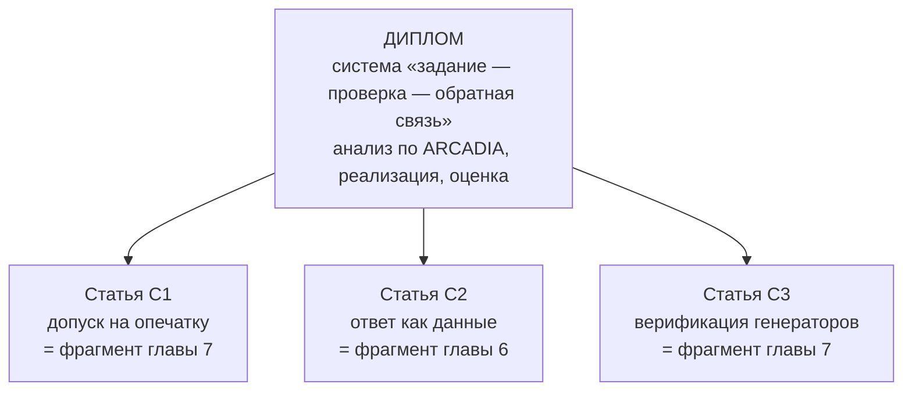

# Позиционирование: чем этот проект является для диплома и для статей

Документ отвечает на один вопрос: **что именно в этой работе является
результатом**, а что — обстоятельством, при котором результат получен.
Различать их обязательно, иначе диплом превращается в отчёт «я написал
программу», а статья — в описание функциональности.

Развёрнутый разбор материала по степени новизны —
[`../architecture/thesis_foundation.md`](../architecture/thesis_foundation.md).
Здесь — итог и распределение по жанрам.

---

## 1. Что здесь результат, а что обстоятельство

**Обстоятельство:** написана система генерации учебных заданий с сайтом,
десктопом, синхронизацией, ролями и аналитикой. Это объём работы, но не
научный результат: подобных систем много, и «у нас тоже есть» ничего не
утверждает.

**Результат** — три утверждения, каждое из которых можно проверить и
опровергнуть:

| № | Утверждение | Чем подтверждено |
|---|---|---|
| Р1 | Проверка ответа должна опираться на понятие равенства ПРЕДМЕТНОЙ ОБЛАСТИ, а не на сравнение строк; иначе она систематически ошибается | замер: 48 неразличимых пар на 830 словах |
| Р2 | Допуск на ошибку студента не может быть свойством одного ответа — он определяется окрестностью ответа в множестве допустимых | то же правило даёт 0 столкновений при сохранении 94,5% принятых опечаток |
| Р3 | Корректность генератора заданий проверяется прогоном, а не доказательством: генератор порождает пары «условие — ответ», и согласованность пары можно проверять массово | набор из 4098 проверок, включая сверку вычисленного ответа с независимо посчитанным |

Всё остальное — реализация, обеспечивающая возможность эти утверждения
проверить.

---

## 2. Специальность и что она требует

Диплом по направлению **системный анализ и управление**. Требования,
которые из этого следуют, и как они закрываются:

| Требование специальности | Чем закрывается |
|---|---|
| объект исследования — СИСТЕМА, а не программа | система «преподаватель — задание — студент — проверка», в которой обратная связь замкнута через попытки |
| анализ на разных уровнях абстракции | ARCADIA: OA → SA → LA → PA, четыре уровня с явным переходом |
| формализация в принятой нотации | Capella / ARCADIA (см. [главу 5](05-chapter-arcadia.md)) |
| количественная оценка результата | замеры: столкновения, доля принятых опечаток, покрытие проверками, расхождение двух установок |
| управление как отдельный предмет | сценарий выдачи (тренировка/зачёт), адаптивная выборка по статистике попыток |

**Слабое место, которое надо назвать честно.** Ни одного замера НА
СТУДЕНТАХ пока нет. Все числа — свойства системы, а не свидетельства
учебного эффекта. Для диплома этого достаточно, если формулировать
результат как «свойство метода проверки», а не «повышение успеваемости».
Формулировать второе без эксперимента нельзя.

---

## 3. Распределение материала по жанрам

### Диплом (одна работа, четыре главы)

| Глава | Что в ней | Опора |
|---|---|---|
| 1. Контекст деятельности | процесс AS-IS, стороны, проблемы, цели | Р1, замер столкновений |
| 2. Анализ альтернатив | 6 вариантов, взвешенные суммы, Парето, чувствительность | замеры + оценки |
| 3. Целевая система | назначение, возможности, MOE/MOP | все замеры |
| 4. Режимы и сценарии | фазы, состояния, сценарии использования | `core/scenarios.py` |
| 5. ARCADIA | OA→SA→LA→PA, альтернативы на переходах, Capella | реальная топология |
| 6. Реализация | язык описания, механизм проверки, автономность | 145 узлов, синхронизация |
| 7. Результаты | замеры, границы применимости, что не проверено | все прогоны |

### Статьи (три темы, разные по зрелости)

| Тема | Зрелость | Куда |
|---|---|---|
| **С1.** Допуск на опечатку как функция окрестности в словаре | готова: правило, замер, цена | конференция по информатизации образования / e-learning |
| **С2.** Ответ как типизированные данные вместо строки | готова по идее, нужен второй пример предметной области | журнал по образовательным технологиям |
| **С3.** Верификация генераторов заданий массовым прогоном | самая интересная, нужна формализация критерия | конференция по программной инженерии |

**Чем статьёй НЕ является:** сама система, редактор графов, поддержка
офлайн, роли и организации. Это инженерные решения, и в статье они
годятся как контекст, но не как утверждение.

---

## 4. Как соотносятся диплом и статьи

Диплом — рамка, статьи — вырезки из неё.

Порядок работы: **сначала статья С1** — у неё готовы и правило, и замер,
и цена; текст собирается из существующего материала. Она же становится
разделом главы 7 диплома. Дальше С3, для которой надо сформулировать
критерий согласованности пары «условие — ответ» в общем виде.

---

## 5. Формулировки для титульного листа

**Тема (вариант для системного анализа):**
«Системный анализ и разработка архитектуры программного комплекса
автоматической генерации и проверки учебных заданий с предметно-
ориентированными критериями эквивалентности ответа»

**Объект исследования:** процесс выдачи и проверки учебных заданий с
автоматизированной обратной связью.

**Предмет исследования:** методы задания критериев эквивалентности
ответа и способы верификации генераторов заданий.

**Цель:** повысить достоверность автоматической проверки ответа за счёт
переноса критерия эквивалентности в предметную область и обеспечить
проверяемость генераторов массовым прогоном.

**Задачи:**
1. проанализировать процесс выдачи и проверки заданий, выделить точки,
   где строковое сравнение даёт систематическую ошибку;
2. построить многоуровневую модель системы (ARCADIA: OA, SA, LA, PA);
3. предложить представление ответа как типизированных данных с
   предметно-ориентированным критерием эквивалентности;
4. предложить правило допуска на ошибку, зависящее от окрестности
   ответа в множестве допустимых;
5. реализовать комплекс и подтвердить свойства замерами;
6. оценить границы применимости и назвать непроверенное.

**Научная новизна** (то, что можно защищать):
1. правило допуска, выводимое из окрестности ответа, а не задаваемое
   константой; доказано, что при нём другой допустимый ответ не может
   быть принят как ошибка написания;
2. схема верификации генератора заданий массовым прогоном с независимой
   сверкой ответа.

**Практическая значимость:** комплекс работает, содержит 145 узлов языка
описания заданий и проверяется набором из 4098 автоматических проверок;
одинаково исполняется в сети и автономно.
