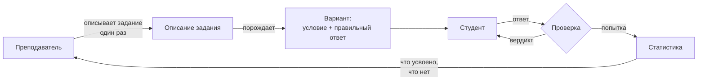

# Глава 1. Анализ предметной области и постановка задачи

*Материал и связный текст. Курсивом — пометки о том, что надо дописать
или заменить своими данными.*

---

## 1.1. Процесс, который автоматизируется

Рассматривается процесс выдачи и проверки учебных заданий с
индивидуальными вариантами. В нём участвуют три стороны и обращаются
четыре сущности.



Контур замкнут: статистика попыток возвращается преподавателю и
управляет тем, какие задания выдаются дальше. Это делает объект
исследования **системой с обратной связью**, а не набором утилит, — и
задаёт границу: всё, что не влияет на замыкание контура, во внимание не
принимается.

### Как это выглядит сегодня без автоматизации

Преподаватель составляет варианты вручную либо порождает их скриптом,
раздаёт, собирает ответы, проверяет глазами. Три следствия:

1. **число вариантов ограничено трудоёмкостью** — обычно 2–4 на группу,
   что делает списывание естественной стратегией;
2. **обратная связь запаздывает** на дни, то есть приходит тогда, когда
   студент уже не помнит хода своего рассуждения;
3. **статистика не накапливается** — преподаватель знает оценку, но не
   знает, ЧТО именно не усвоено.

---

## 1.2. Почему автоматическая проверка — нетривиальная задача

Кажется, что задача сводится к сравнению строк: система знает
правильный ответ, студент его вводит, строки сравниваются. Это неверно,
и неверно систематически.

### Наблюдение 1: один ответ имеет много записей

| Предметная область | Правильный ответ | Записи, которые студент имеет право дать |
|---|---|---|
| Арифметика | 0,5 | `0.5`, `1/2`, `2/4`, `0,5`, `.5` |
| Алгебра | x² | `x^2`, `x*x`, `x·x` |
| Физика | 32 Н | `32 Н`, `32 H`, `32.0 Н` |
| Логика | A ∧ B | `A и B`, `A&B`, `B ∧ A` |
| Информатика | вывод программы | с завершающим переводом строки и без |

Строковое сравнение отвергает верные ответы. Обычный ответ на это —
нормализация: привести обе строки к канонической форме. Но канонической
формы, общей для всех областей, не существует: `2/4` и `0.5` равны в
арифметике, а `x*x` и `x^2` — в алгебре, и правило первого не выводит
второе.

### Наблюдение 2: допуск на ошибку нельзя задать константой

Если проверка строгая, студент теряет балл за пропущенную букву. Значит,
нужен допуск: принимать ответ, отличающийся от правильного не более чем
на *k* исправлений (расстояние Левенштейна).

**Здесь и находится систематическая ошибка.** Если *k* задано константой
или функцией одной лишь длины слова, то в множестве допустимых ответов
неизбежно окажутся пары, между которыми расстояние не превышает
допуска, — и проверка их не различит.

Замер на 16 поставочных словарях (830 слов) при правиле «*k* = 1 для слов
до 6 символов, *k* = 2 для более длинных»:


**48 пар**, которые проверка не различает. Пары не случайные:

```
LAN       принимает  MAN, WAN, WLAN
AI        принимает  AR
DSL       принимает  SDSL, SSL
hardware  принимает  shareware
```

Все они присутствуют в тех же словарях как РАЗНЫЕ термины. Студент,
написавший `WAN` вместо `LAN`, не опечатался — он не знает разницы, а
проверка засчитывает это как знание. Для словарного диктанта это не
мелкая неточность, а отказ проверять именно то, ради чего диктант
проводится.

### Наблюдение 3: генератор нельзя проверить чтением

Генератор порождает пары «условие — правильный ответ». Ошибка в нём —
не падение, а **согласованное расхождение**: условие говорит одно, ответ
посчитан для другого. Такая ошибка не видна ни при просмотре кода, ни на
одном примере: она проявляется на некоторых значениях параметров.

*Пример из практики проекта, годится как иллюстрация:* проверка
характеристического многочлена использовала символ `lambda`, тогда как
модель переименовала его в `lamda`. Подстановка молча ничего не
подставляла, проверка проходила на любых данных. Обнаружено прогоном на
сорока вариантах.

---

## 1.3. Обзор существующих решений

*Раздел требует ссылок на источники — здесь классы решений и критерий
сравнения; конкретные системы и литературу подставить свои.*

Критерий сравнения выберем из наблюдений 1–3:

* **К1** — задаётся ли критерий эквивалентности ответа отдельно от его
  записи;
* **К2** — зависит ли допуск на ошибку от множества допустимых ответов;
* **К3** — предусмотрена ли проверка самого генератора;
* **К4** — исполняется ли одно и то же описание задания автономно и в
  сети.

| Класс решений | К1 | К2 | К3 | К4 |
|---|---|---|---|---|
| Системы тестирования с выбором варианта (LMS-тесты) | не нужен: ответ — номер | — | — | + |
| Системы с открытым ответом и регулярными выражениями | частично: шаблон записи, а не смысла | нет | нет | зависит |
| Системы компьютерной алгебры в проверке (STACK и аналоги) | да для алгебры | нет | частично | нет |
| Автогенераторы вариантов на шаблонах | нет: ответ — строка | нет | нет | зависит |
| **Предлагаемое решение** | да, критерий — часть предметной области | да, из окрестности | да, массовый прогон | да |

Вывод обзора: критерий эквивалентности рассматривается либо как
особенность одной области (алгебры), либо как деталь реализации
проверки. Как **самостоятельный объект проектирования**, который
задаётся вместе с заданием и переносится между областями, он не
рассматривается. Допуск на ошибку задаётся константой везде, где он
вообще предусмотрен.

---

## 1.4. Противоречие и постановка задачи

**Противоречие.** Автоматическая проверка должна одновременно:

* принимать все записи верного ответа — иначе она наказывает за форму;
* отвергать все неверные ответы — иначе она не проверяет знание.

При строковом сравнении с постоянным допуском эти требования
несовместимы: расширение допуска ради первого неизбежно втягивает в
принимаемое множество другие допустимые ответы (замер: 48 пар).

**Задача.** Построить способ задания критерия эквивалентности ответа,
при котором:

1. критерий выражается в терминах предметной области, а не строки;
2. допуск на ошибку выводится из окрестности ответа в множестве
   допустимых, а не задаётся константой;
3. согласованность пары «условие — ответ» проверяется массово;
4. одно и то же описание задания исполняется одинаково автономно и в
   сети.

**Гипотеза.** Если допуск ограничить расстоянием до ближайшего другого
допустимого ответа, то второе требование выполняется ПО ПОСТРОЕНИЮ (а не
подбором констант), при этом доля принимаемых опечаток снижается
незначительно.

*Проверка гипотезы — глава 4; забегая вперёд: 48 → 0 столкновений при
снижении доли принятых опечаток с 100% до 94,5%.*

---

## 1.5. Границы работы

Что в работу **входит**: способ задания критерия эквивалентности,
правило допуска, схема верификации генераторов, архитектура комплекса,
замеры свойств системы.

Что **не входит** и почему:

| Не входит | Почему |
|---|---|
| педагогический эксперимент на студентах | требует организации курса и контрольной группы; без него нельзя утверждать учебный эффект, и работа его не утверждает |
| распознавание рукописного ввода | другая задача (обработка изображений), контур замыкается и без неё |
| генерация заданий языковой моделью | в комплексе присутствует как вспомогательный контур, но предметом исследования не является: результат модели проверяется теми же средствами |
| проверка произношения по записи голоса | требует нетекстовой формы ответа; в архитектуре место предусмотрено, реализация не входит |

Последняя строка важна: **отсутствие чего-то надо называть, а не
обходить молчанием.** Читатель, который найдёт пробел сам, перестанет
доверять остальному.
