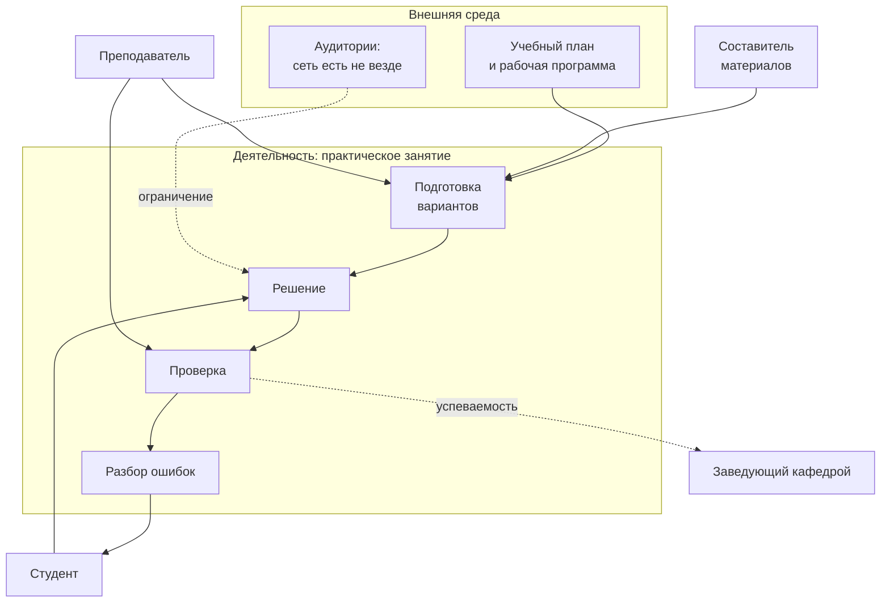
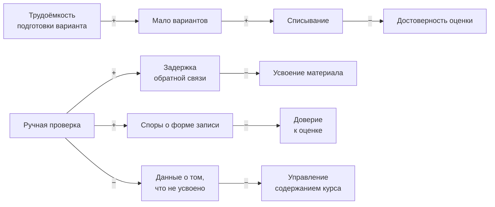

# Глава 1. Контекст деятельности и постановка задачи

Глава построена по той же схеме, что и курсовая работа «АРКУ»:
процесс деятельности → заинтересованные стороны → проблемы → потребности
→ цели → целевые показатели удовлетворённости. Схема сохранена
намеренно: она даёт сквозную трассировку от интереса конкретного
человека до технической характеристики системы, и защищать работу по
ней проще, чем по свободному изложению.

**Важное предупреждение о числах.** Часть показателей в этой главе
**замерена в проекте** (они помечены «замер»), часть **требует замера** и
приведена как оценка с указанием методики сбора (помечены «требует
замера»). Смешивать их нельзя: замеренное можно защищать, оценочное —
только обосновывать. В курсовой все числа были производственной
статистикой предприятия; здесь такой статистики пока нет, и делать вид,
что она есть, значило бы подставить работу под первый же вопрос.

---

## 1.1. Контекст деятельности

**Контекст:** организация выдачи и проверки индивидуальных учебных
заданий в высшем и среднем профессиональном образовании.

### Текущий процесс (AS-IS) — ручная подготовка и проверка

**Основной процесс:** «Проведение практического занятия / контрольной
работы с индивидуальными вариантами»

1. **Подготовка**
   1.1. Определение темы и типа задания
   1.2. Составление условия задания
   1.3. Расчёт правильного ответа для каждого варианта
   1.4. Оформление и размножение вариантов
   1.5. Распределение вариантов между студентами
2. **Выполнение**
   2.1. Решение задания студентом
   2.2. Сдача работы
3. **Проверка и обратная связь**
   3.1. Сверка ответа с эталоном
   3.2. Разбор спорных случаев (форма записи, единицы, округление)
   3.3. Выставление оценки
   3.4. Возврат работы и разбор ошибок
   3.5. Учёт результата

### Проблемные зоны процесса

| Этапы | Что не так |
|---|---|
| 1.3–1.4 | трудоёмкость растёт линейно числу вариантов, поэтому вариантов делают мало |
| 1.5 | при малом числе вариантов списывание становится рациональной стратегией |
| 3.1–3.2 | проверка формы вместо содержания: спор о `0,5` против `1/2` |
| 3.4 | запаздывание обратной связи на дни — она приходит, когда студент уже не помнит хода рассуждения |
| 3.5 | накапливается оценка, а не знание о том, ЧТО не усвоено |

### Диаграмма контекста деятельности

*Рис. 1.1. Диаграмма контекста деятельности.*

### Диаграмма влияний

*Рис. 1.2. Диаграмма влияний. Знак «+» — усиление, «−» — ослабление.*

---

## 1.2. Заинтересованные стороны

**Таблица 1.1 — Заинтересованные стороны**

| ID | Сторона | Приоритет | Ключевой интерес |
|---|---|---|---|
| St.01 | Студент | Средний | Получить обратную связь до того, как забудет ход решения; не терять балл за форму записи верного ответа; понимать, за что снят балл |
| St.02 | Преподаватель | **Высокий** | 1) выдать индивидуальные варианты без роста трудозатрат; 2) не тратить время на разбор споров о форме ответа; 3) видеть, что именно не усвоено группой |
| St.03 | Заведующий кафедрой | Средний | Единообразие и сохранность учебных материалов; работоспособность в аудиториях без сети; переносимость материалов между преподавателями |
| St.04 | Составитель материалов | Средний | Возможность описать задание один раз и не программировать; уверенность, что его задание считается верно |

Приоритет St.02 наивысший: преподаватель одновременно и заказчик
процесса, и его исполнитель, и тот, чьи трудозатраты ограничивают число
вариантов.

---

## 1.3. Проблемы заинтересованных сторон

**Таблица 1.2 — Проблемы**

| ID | Проблема | Сторона | Статус числа |
|---|---|---|---|
| Pr.01 | Трудоёмкость подготовки: составление и расчёт одного варианта занимает существенное время, поэтому на группу готовят 2–4 варианта вместо числа, равного числу студентов | St.02 | **требует замера** (методика — §1.7) |
| Pr.02 | Проверка отвергает верные ответы, записанные в другой форме. Замер на 681 варианте поставки: из 282 альтернативных верных записей строгое сравнение строк отвергает **все 282**, аккуратная нормализация — **78 (27,7%)**. Разложение резкое: у чисел нормализация покрывает все записи, у выражений — **ни одной** | St.01, St.02 | **замер** |
| Pr.03 | Проверка с допуском на опечатку **принимает другой допустимый ответ как опечатку**: на 16 поставочных словарях (830 позиций) обнаружено **48 пар**, неразличимых проверкой, — `LAN`/`WAN`/`MAN`/`WLAN`, `DSL`/`SDSL`/`SSL`, `hardware`/`shareware` | St.01, St.02 | **замер** |
| Pr.04 | Одно и то же задание в разных средах открывается по-разному: замер двух установок показал, что раздел с номером 1001 означал `complete_vocabulary` на одной и `complete_words` на другой, то есть студенту выдавался не тот материал — молча, без сообщений об ошибке | St.02, St.03 | **замер** |
| Pr.05 | Жалобу «здесь неверный ответ» невозможно разобрать, если вариант не воспроизводится: преподаватель не может получить тот же вариант повторно | St.01, St.02 | **установлено по устройству** |
| Pr.06 | Ошибка в генераторе не проявляется как отказ: условие и ответ расходятся согласованно, и проверка проходит на любых данных. Обнаружено 2 таких случая, один делал часть проверок бездействующей | St.04, St.02 | **замер** |

Pr.03, Pr.04 и Pr.06 — центральные для работы: они не решаются
организационно и не устраняются аккуратностью исполнителя. Это
**системные** дефекты, встроенные в способ построения проверки.

---

## 1.4. Потребности заинтересованных сторон

**Таблица 1.3 — Потребности**

| ID | Потребность | Трассировка |
|---|---|---|
| N.01 | Число вариантов не должно ограничиваться трудозатратами преподавателя | Pr.01 |
| N.02 | Верный ответ должен засчитываться независимо от допустимой формы записи | Pr.02 |
| N.03 | Проверка обязана различать разные допустимые ответы между собой | Pr.03 |
| N.04 | Задание должно означать одно и то же во всех средах, где оно открывается | Pr.04 |
| N.05 | Выданный вариант должен воспроизводиться для разбора | Pr.05 |
| N.06 | Корректность генератора должна быть проверяема до выдачи студентам | Pr.06 |
| N.07 | Занятие должно быть возможным там, где сети нет | Pr.01 (косвенно), St.03 |

---

## 1.5. Цели

**Таблица 1.4 — Цели**

| ID | Цель | Трассировка |
|---|---|---|
| G.01 | Снять зависимость числа вариантов от трудозатрат: один раз описанное задание порождает варианты по числу студентов (*Efficiency*) | N.01 |
| G.02 | Исключить отказ проверки по форме записи верного ответа: критерий эквивалентности задаётся в терминах предметной области (*Correctness*) | N.02 |
| G.03 | Исключить принятие другого допустимого ответа как ошибки написания — довести число неразличимых пар до 0 при сохранении не менее 90% принимаемых опечаток (*Correctness*) | N.03 |
| G.04 | Обеспечить одинаковое исполнение описания задания в подключённой и автономной средах (*Reliability, Portability*) | N.04, N.07 |
| G.05 | Обеспечить воспроизводимость варианта по идентификатору (*Traceability*) | N.05 |
| G.06 | Обеспечить массовую проверку согласованности пары «условие — ответ» (*Verifiability*) | N.06 |

G.03 сформулирована количественно и с двух сторон намеренно: требование
«довести до нуля» выполняется тривиально запретом любого допуска, и без
второй половины оно бессмысленно.

---

## 1.6. Целевые показатели удовлетворённости сторон

**Таблица 1.5 — Показатели удовлетворённости**

| ID | Показатель | Трассировка |
|---|---|---|
| StG.01 | Преподаватель выдаёт индивидуальный вариант каждому студенту группы, затрачивая на подготовку время, не зависящее от числа студентов | St.02 → G.01 |
| StG.02 | Студент не теряет балл за форму записи верного ответа; доля обращений «ответ верный, но не принят» стремится к нулю | St.01 → G.02 |
| StG.03 | Студент, спутавший два термина, получает «неверно», а не зачёт: неразличимых пар в словаре нет | St.01 → G.03 |
| StG.04 | Преподаватель проводит занятие в аудитории без сети без изменения хода занятия | St.03 → G.04 |
| StG.05 | Преподаватель разбирает жалобу на проверку, получая тот же вариант, а не похожий | St.02 → G.05 |
| StG.06 | Составитель материалов получает подтверждение корректности своего задания до выдачи студентам | St.04 → G.06 |

---

## 1.7. Методика сбора недостающих данных

Показатели Pr.01 и Pr.02 в работе **не замерены**, и это надо не
скрывать, а закрыть планом. Обе методики просты и выполнимы силами
одного человека.

### Замер Pr.01 — трудоёмкость подготовки варианта

**Что измеряется:** время от решения «нужно задание по теме X» до
готового варианта с проверенным ответом.

**Как:** хронометраж на 10 заданиях трёх типов (расчётное, символьное,
словарное) у 2–3 преподавателей. Фиксировать отдельно: составление
условия, расчёт ответа, оформление, проверку ответа перепроверкой.

**Что даст:** зависимость трудозатрат от числа вариантов, то есть
количественное обоснование Pr.01 и проверяемость StG.01.

### Замер Pr.02 — выполнен, но не тем способом, каким планировался

**Что планировалось:** прогнать накопленные попытки двумя проверками —
строгой и предметной — и сравнить вердикты.

**Почему так не вышло.** Проверка показала, что накопленные 519 попыток
демонстрационные: поле введённого текста в них пустое. Мерить на них
нечего, и подгонять данные под замысел нельзя.

**Что сделано вместо.** Свойство от студентов не зависит: вопрос
«сколько допустимых записей одного ответа отвергнет строковое сравнение»
решается на самих спецификациях. Спецификация умеет перечислить записи,
которые она признаёт верными, и каждая из них проверена её же проверкой.
Замер прогоняет все генераторы поставки, берёт эти перечни и сравнивает
три проверки: строгую, нормализованную и предметную.

    python -m scripts.measure_answer_forms --variants 20

Результат — §7.2. Это показатель СИСТЕМЫ (MOP), а не процесса (MOE):
он говорит, сколько верных записей строковое сравнение способно
отвергнуть, а не сколько их реально пишут студенты.

**Что осталось незамеренным.** Pr.01 (трудоёмкость) требует организации
хронометража. В главе 7 это названо прямо, и выводы работы построены так,
чтобы от него не зависеть.

---

## 1.8. Границы работы

| Входит | Не входит | Почему не входит |
|---|---|---|
| способ задания критерия эквивалентности | педагогический эксперимент | требует курса, контрольной группы и семестра |
| правило допуска на ошибку | распознавание рукописного ввода | другая задача; контур замыкается без неё |
| схема верификации генераторов | проверка произношения по голосу | требует нетекстовой формы ответа; место в архитектуре предусмотрено |
| архитектура комплекса и его реализация | генерация заданий языковой моделью как предмет исследования | присутствует как вспомогательный контур; без экспертной оценки качества утверждать нечего |
| замеры свойств системы | оценка учебного эффекта | нет данных; см. §1.7 |

---

## 1.9. Выводы по главе

1. Процесс выдачи и проверки индивидуальных заданий содержит четыре
   системных дефекта (Pr.02, Pr.03, Pr.04, Pr.06), которые не
   устраняются организационными мерами: они встроены в способ
   построения проверки.
2. Центральное противоречие: расширение допуска ради приёма верных
   записей неизбежно втягивает в принимаемое множество другие допустимые
   ответы. Замер: 48 неразличимых пар на 830 позициях.

   **Гипотеза работы.** Если допуск на ошибку ограничить расстоянием до
   ближайшего другого допустимого ответа, требование «другой допустимый
   ответ не принимается как ошибка написания» выполняется ПО ПОСТРОЕНИЮ,
   а не подбором констант, при этом доля принимаемых опечаток снижается
   незначительно. Проверка гипотезы — глава 7, §7.1.
3. Сформулированы шесть целей (G.01–G.06) с трассировкой к потребностям
   и проблемам; для каждой определён показатель удовлетворённости.
4. Из двух незамеренных показателей один замерен по ходу работы
   (Pr.02 — способом, отличным от первоначального замысла, потому что
   данных для него не оказалось); второй (Pr.01) требует хронометража,
   и выводы работы построены так, чтобы от него не зависеть.
