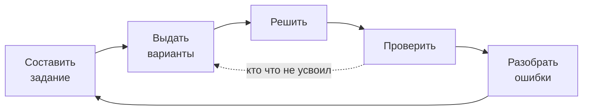
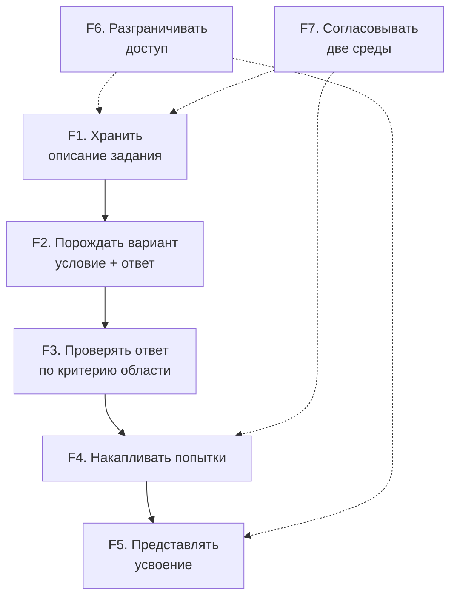
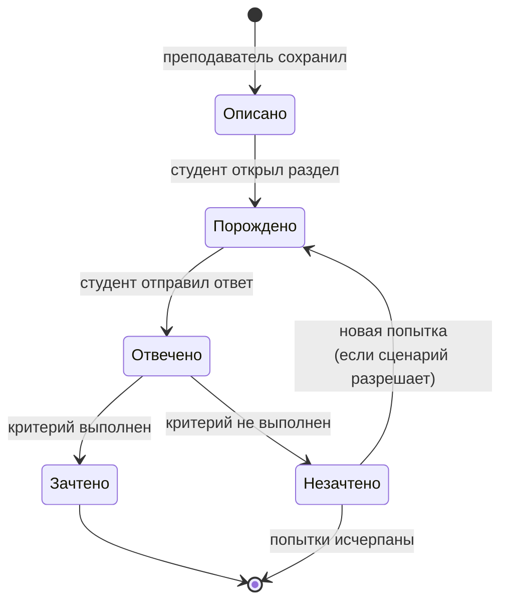
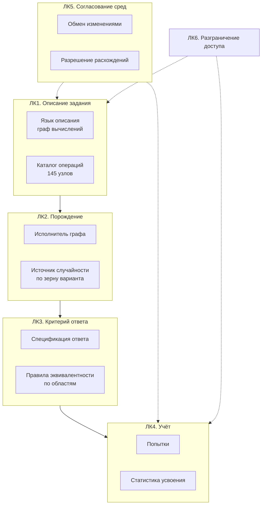
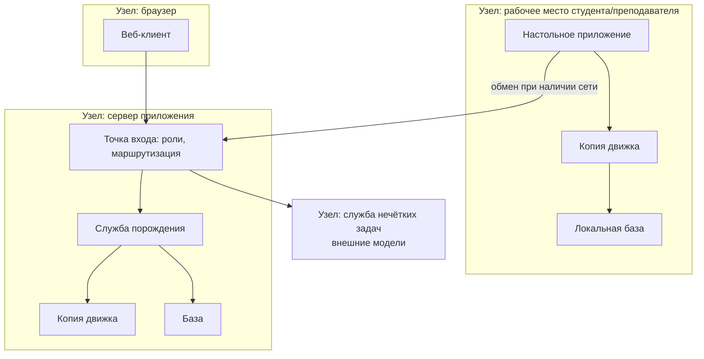

# Глава 2. Системный анализ и архитектура

Глава строится по методологии **ARCADIA** (Architecture Analysis and
Design Integrated Approach) в нотации **Capella**: четыре уровня, на
каждом свой вопрос и свой набор диаграмм.

| Уровень | Вопрос уровня | Диаграммы Capella |
|---|---|---|
| **OA** Operational Analysis | что делают люди и зачем, безотносительно системы | OAB, OAIB, OES |
| **SA** System Analysis | что система обязана делать для этих людей | SAB, SDFB, MSM |
| **LA** Logical Architecture | из каких компонентов это складывается | LAB, LDFB, LFBD |
| **PA** Physical Architecture | чем это исполняется на самом деле | PAB, PDFB |

Ниже — содержание каждого уровня. Диаграммы приведены в текстовой
нотации (mermaid), пригодной для чтения; **в Capella их надо построить
заново** — это отдельная работа, и её объём назван в §2.6.

---

## 2.1. Почему ARCADIA здесь ложится хорошо

Не как формальность, а по существу: у системы есть **настоящий переход
между уровнями**, и на каждом переходе принимаются решения, которых на
предыдущем уровне не было.

* На уровне OA действующие лица делают то же, что делали до
  автоматизации: составляют задание, решают, проверяют. Система в OA не
  упоминается вовсе — и это выполнимо, потому что процесс существовал до
  неё.
* На уровне SA появляется главное системное требование, которого у людей
  не было: **описание задания должно исполняться одинаково в двух средах
  с разной доступностью сети**. Оно не выводится из OA, оно добавлено.
* На уровне LA это требование порождает разделение на «движок» и
  «оболочку», причём движок обязан существовать в обеих средах.
* На уровне PA то же требование даёт две физические копии движка и
  механизм контроля их расхождения.

Одно требование, прослеженное через четыре уровня до конкретного
инструмента, — это и есть материал для главы по системному анализу.

---

## 2.2. Уровень OA — операционный анализ

### Действующие лица (Operational Entities)

| Лицо | Что делает |
|---|---|
| Преподаватель | составляет задание, выдаёт, оценивает усвоение |
| Студент | получает задание, решает, узнаёт результат |
| Заведующий (администратор) | распределяет предметы между преподавателями |
| Составитель материалов | готовит словари, банки задач, справочные материалы |

### Операционные возможности (Operational Capabilities)

* **OC1.** Выдать группе индивидуальные варианты одного задания.
* **OC2.** Получить обратную связь по ответу до того, как она перестанет
  быть полезной.
* **OC3.** Узнать, что именно не усвоено, а не только оценку.
* **OC4.** Работать там, где сеть недоступна или запрещена.

OC4 — не техническое пожелание, а операционное ограничение: аудитории
без сети существуют, и учебный процесс в них идёт.

### Операционный процесс (OAIB)

Обратная связь показана двумя стрелками намеренно: короткая (студенту,
немедленно) и длинная (преподавателю, для следующей выдачи). В ручном
процессе обе медленные; автоматизация укорачивает первую и делает
возможной вторую.

---

## 2.3. Уровень SA — системный анализ

### Границы системы

Система **отвечает** за: хранение описаний заданий, порождение
вариантов, проверку ответов, накопление и представление статистики,
разграничение доступа.

Система **не отвечает** за: содержание курса, методику, оценку в
ведомости, идентификацию личности студента вне учётной записи.

### Системные функции (SDFB)

### Ключевые системные требования

| № | Требование | Откуда |
|---|---|---|
| СТ1 | Критерий эквивалентности ответа задаётся вместе с заданием и выражается в терминах предметной области | глава 1, наблюдение 1 |
| СТ2 | Допуск на ошибку определяется окрестностью ответа в множестве допустимых | глава 1, наблюдение 2 |
| СТ3 | Согласованность пары «условие — ответ» проверяема массово | глава 1, наблюдение 3 |
| СТ4 | Одно описание задания исполняется одинаково автономно и в сети | OC4 |
| СТ5 | Вариант воспроизводим: по идентификатору восстанавливается тот же вариант | разбор жалоб на проверку |

**СТ4 — самое дорогое требование работы.** Именно оно определяет всю
дальнейшую архитектуру, и в §2.5 видно, чего оно стоит.

### Состояния варианта (MSM)

Число попыток — свойство **сценария выдачи**, а не задания: одно и то же
задание в тренировке и в зачёте живёт по-разному. Это отдельное
системное решение, и на диаграмме оно видно как условие перехода.

---

## 2.4. Уровень LA — логическая архитектура

### Компоненты (LAB)

### Обоснование двух решений уровня LA

**Решение LA-1: описание задания — граф, а не программа.**

Альтернатива — задавать задание кодом на языке общего назначения (так
сделана часть заданий и в этой системе). Граф выбран потому, что:

* его составляет преподаватель, а не программист;
* он **передаётся между средами как данные** — требование СТ4; передать
  код означало бы исполнять на студенческой машине произвольный код,
  присланный извне;
* его можно проанализировать до исполнения: определить, что попадёт в
  условие, а что в ответ, и найти ошибки соединения.

**Решение LA-2: критерий ответа — отдельный компонент, а не часть
проверяющего кода.**

Спецификация ответа порождается вместе с вариантом и путешествует с ним.
Это то, что делает СТ1 выполнимым: **проверка и показ используют одну и
ту же величину**, поэтому ответ, переписанный студентом с экрана,
засчитывается по построению, а не по совпадению.

### Ключевое понятие: равенство принадлежит предметной области

Правила эквивалентности (ЛК3-C2) вынесены в отдельные логические
функции по областям:

| Функция | Что решает |
|---|---|
| эквивалентность чисел | значащие цифры, единица измерения, десятичный разделитель |
| эквивалентность текста | регистр, пробелы, допуск на опечатку по окрестности |
| эквивалентность выражений | алгебраическое равенство, а не совпадение записи |
| эквивалентность программ | одинаковый вывод при одинаковом входе |
| эквивалентность логических формул | одинаковая таблица истинности |

Каждая используется И при проверке ответа, И при порождении примеров для
предпросмотра. Разделение этих двух путей — источник расхождения:
проверка принимает то, чего предпросмотр не показывает, и наоборот.

---

## 2.5. Уровень PA — физическая архитектура

### Размещение (PAB)

### Главное следствие требования СТ4

Движок физически существует **в двух копиях**. Это прямая цена
автономной работы: студент без сети обязан получать те же варианты и ту
же проверку.

Отсюда — риск, которого на уровне LA не было: **расхождение копий**.
Узел, существующий в одной копии и отсутствующий в другой, приводит к
отказу при выдаче; узел с разной реализацией даёт РАЗНОЕ задание, ничего
об этом не сообщая.

Мера контроля: автоматическое сравнение копий по абстрактному
синтаксическому дереву на уровне отдельных операций (не построчное
сравнение файлов — операции переносят между модулями, и построчное
сравнение тонет в шуме). Сравнение включено в регламент проверок; при
подготовке настоящей работы расхождений нет.

### Следствие для идентификации содержимого

Файлы (словари, изображения, звук) адресуются **идентификатором внутри
поставки**, а не путём в файловой системе. Путь верен ровно на той
машине, где выбран; описание задания уезжает в другую среду.

Замер, подтверждающий необходимость: описание, составленное на рабочем
месте с путём к файлу, на сервере не исполняется.

Аналогично номер раздела выводится из **имени** описания, а не из его
положения в списке. Замер на двух установках: при выводе номера из
положения один и тот же номер означал разные словари (у одной установки
20 словарей, у другой 12), и задание, выданное на сервере, открывало на
рабочем месте другой словарь — без каких-либо сообщений об ошибке.

---

## 2.6. Что надо построить в Capella

Текстовые диаграммы выше — материал; для защиты нужны они же в Capella.
Оценка объёма:

| Уровень | Диаграммы | Что переносить |
|---|---|---|
| OA | OAB, OAIB, 2× OES | 4 действующих лица, 4 возможности, 5 операций |
| SA | SAB, SDFB, MSM, 3× сценария | 7 системных функций, 5 требований, состояния варианта |
| LA | LAB, LDFB, 6× LFBD | 6 логических компонентов, декомпозиция ЛК1–ЛК3 |
| PA | PAB, PDFB, таблица размещения | 4 узла, распределение компонентов |

Дополнительно — **таблицы прослеживания**, и они здесь важнее диаграмм:

* OC → системные функции;
* системные требования → логические компоненты;
* логические компоненты → физические узлы.

Прослеживание СТ4 (одно описание, две среды) проходит через все четыре
уровня и заканчивается конкретной мерой контроля — это лучший
единственный пример для защиты.

---

## 2.7. Выводы по главе

1. Процесс существовал до автоматизации, поэтому уровень OA описывается
   без упоминания системы — признак того, что границы проведены верно.
2. Ключевое системное требование (одно описание, две среды) не выводится
   из операционного уровня, а добавляется на системном; далее оно
   определяет и логическую, и физическую архитектуру.
3. Логическая архитектура опирается на два решения: описание задания как
   граф-данные и критерий ответа как отдельный переносимый компонент.
4. Физическая архитектура вынуждена содержать две копии движка; отсюда
   риск расхождения и мера контроля, включённая в регламент.
5. Два замера подтверждают, что решения приняты не из соображений
   красоты: адресация путём и вывод номера из положения в списке дают
   отказы и подмену содержимого при переходе между средами.
