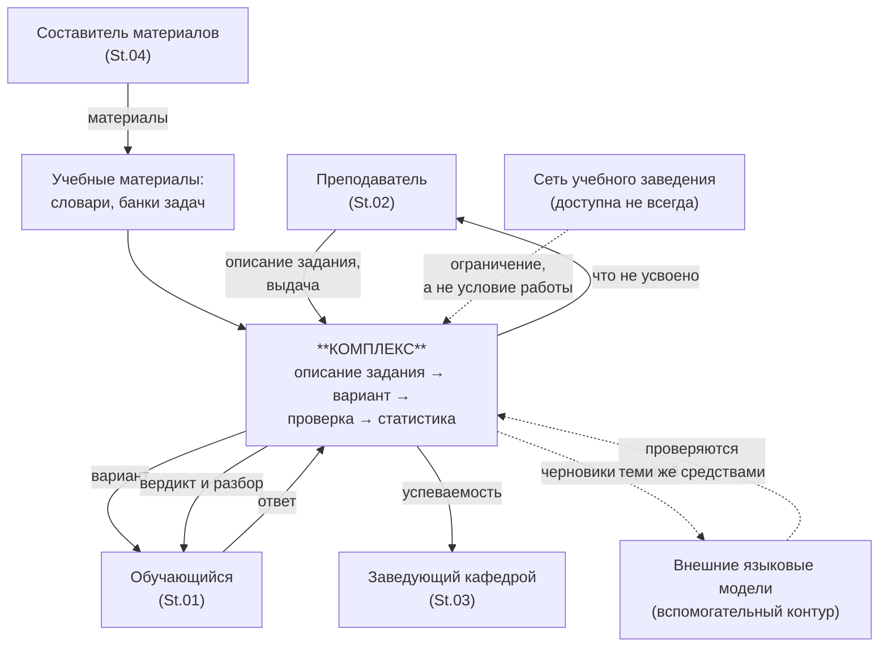

# Глава 3. Определение целевой системы и показателей результативности

Глава соответствует пунктам 3 и 4 курсовой работы: назначение системы,
контекстная диаграмма, возможности системы и их связь с задачами
надсистемы, затем показатели результативности с разграничением MOE и
MOP.

---

## 3.1. Назначение системы

**Целевая система:** программный комплекс генерации и проверки учебных
заданий с предметно-ориентированными критериями эквивалентности ответа
(далее — Комплекс).

**Назначение.** Обеспечить выдачу каждому обучающемуся индивидуального
варианта задания и автоматическую проверку ответа по критерию,
принадлежащему предметной области задания, — без роста трудозатрат
преподавателя вместе с числом обучающихся и без зависимости хода занятия
от наличия сети.

Комплекс предназначен для замены человеческого труда на двух этапах
процесса из §1.1: **1.3–1.4** (расчёт ответа и оформление вариантов) и
**3.1** (сверка ответа с эталоном). Этапы 1.1–1.2 (что именно
спрашивать) и 3.4 (разбор ошибок с обучающимся) остаются за
преподавателем намеренно: это содержательная работа, и её автоматизация
не входит в задачу.

---

## 3.2. Контекстная диаграмма системы

*Рис. 3.1. Контекстная диаграмма системы.*

**Описание диаграммы.** Работа начинается с описания задания, которое
составляет преподаватель или составитель материалов; описание опирается
на учебные материалы (словари, банки задач), поставляемые вместе с
Комплексом или добавленные автором. По запросу обучающегося Комплекс
порождает индивидуальный вариант и принимает ответ; вердикт возвращается
обучающемуся немедленно, а сведения о том, что не усвоено, — преподавателю.
Заведующий кафедрой получает сводную успеваемость и является надсистемой:
он ставит задачи преподавателю и распоряжается учебными материалами.

Сеть показана пунктиром: её отсутствие ограничивает обмен между
установками, но не останавливает занятие — это прямое следствие цели
G.04. Внешние языковые модели тоже пунктиром: они порождают ЧЕРНОВИКИ
заданий, которые проходят ту же проверку, что и написанные человеком, и
потому не являются частью основного контура.

---

## 3.3. Надсистема и её задачи

**Надсистема:** учебный процесс по дисциплине.

Ключевые задачи надсистемы:

* **Задача 1.** Обеспечить каждому обучающемуся достаточную практику по
  теме при ограниченном фонде времени преподавателя.
* **Задача 2.** Получить достоверную оценку усвоения, а не оценку
  аккуратности оформления.
* **Задача 3.** Обеспечить управляемость курса: знать, какие темы не
  усвоены, до итогового контроля, а не после.

---

## 3.4. Возможности системы и их связь с задачами надсистемы

**Таблица 3.1 — Возможности (способности) системы**

| № | Возможность | Связь с задачей надсистемы |
|---|---|---|
| **C.01** | Порождать по одному описанию произвольное число вариантов с различными данными и соответствующими им правильными ответами | Прямая связь с **Задачей 1**. Снимает ограничение на число вариантов: трудозатраты преподавателя перестают зависеть от числа обучающихся (G.01). Обеспечивает индивидуальную практику вместо 2–4 общих вариантов |
| **C.02** | Проверять ответ по критерию эквивалентности, принадлежащему предметной области задания (число с допуском и размерностью, алгебраическое выражение, логическая формула, вывод программы, термин с допуском на написание) | Прямая связь с **Задачей 2**. Устраняет отказ по форме записи (G.02) и, что важнее, устраняет принятие другого допустимого ответа: 48 неразличимых пар → 0 (G.03). Оценка перестаёт зависеть от того, какую из допустимых записей выбрал обучающийся |
| **C.03** | Исполнять описание задания одинаково в подключённой и автономной средах, согласуя изменения при появлении связи | Обеспечивает **Задачи 1 и 2** в аудиториях без сети (G.04). Без этой способности часть занятий выпадает из процесса, а часть материалов расходится между установками — замеренный дефект Pr.04 |
| **C.04** | Накапливать попытки с сохранением введённого ответа и вердикта, представлять усвоение по темам и группам | Прямая связь с **Задачей 3**. Превращает контроль из источника оценки в источник сведений о том, что не усвоено |
| **C.05** | Воспроизводить ранее выданный вариант по его идентификатору | Обеспечивает **Задачу 2**: спор о проверке разбирается на том же варианте, а не на похожем (G.05) |
| **C.06** | Подтверждать согласованность пары «условие — правильный ответ» массовым прогоном с независимой сверкой результата | Обеспечивает **Задачу 2** на этапе подготовки: ошибка генератора обнаруживается до выдачи обучающимся, а не по жалобе (G.06) |
| **C.07** | Принимать ответ голосом и выносить по нему вердикт местными средствами, отказываясь судить при недостаточной уверенности | Расширяет **Задачу 1** на языковые дисциплины: словарный тренажёр учит письменной форме слова, которое обучающийся никогда не слышал. Реализует то же правило окрестности, что C.02, на второй модальности (§7.3) |

Возможность C.07 отличается от остальных тем, что содержит **отказ от
вердикта как штатный исход**: при недостаточной уверенности система не
ставит оценку. Это не деградация, а требование — уверенно ошибиться в
учебной системе дороже, чем не ответить.

Возможности C.05 и C.06 в системах этого класса обычно не выделяют.
Здесь они выделены потому, что закрывают проблемы Pr.05 и Pr.06, которые
без них остаются неустранимыми в принципе, а не «пока не сделано».

---

## 3.5. Показатели результативности: MOE и MOP

Как и в курсовой работе, разграничиваются:

* **MOE** (Measures of Effectiveness) — показатели результативности
  **деятельности надсистемы**: насколько учебный процесс достигает своих
  целей;
* **MOP** (Measures of Performance) — показатели производительности
  **самой системы**: насколько хорошо Комплекс выполняет свои функции.

Связь: **MOE = f(MOP₁, MOP₂, …)**.

Различение существенно для этой работы. Например, «доля ответов,
отвергнутых по форме» — это MOE (свойство процесса, зависит и от того,
какие ответы дают обучающиеся), а «число неразличимых пар в множестве
допустимых ответов» — MOP (свойство системы, не зависит от поведения
обучающихся). Работа замеряет MOP и честно указывает, что MOE требуют
данных эксплуатации.

**Таблица 3.2 — Показатели результативности системы**

| Группа | Показатель | Значение | Методика измерения | Кто/что | Как часто | Статус |
|---|---|---|---|---|---|---|
| Достоверность проверки | Число неразличимых пар в множестве допустимых ответов | **0** (было 48 на 830 позициях) | прогон правила по всем парам словаря | автоматическая проверка | каждая сборка | **замер** |
| | Доля принимаемых опечаток | **≥ 90%** (факт 94,5%) | модель опечатки «выпадение буквы», прогон по словарю | автоматическая проверка | каждая сборка | **замер** |
| | Доля отвергнутых верных записей | → 0 | сверка вердиктов строгой и предметной проверки на накопленных попытках | автоматическая проверка | по накоплении данных | **требует данных** |
| Корректность генерации | Доля вариантов с согласованной парой «условие — ответ» | **100%** | массовый прогон с независимой сверкой (свойство результата) | автоматическая проверка | каждая сборка | **замер** |
| | Число проверок, не дающих ни одного теста | **0** | проверка полноты набора | автоматическая проверка | каждая сборка | **замер** |
| Переносимость | Расхождение движка между средами | **0 из 140 операций** | сравнение по абстрактному синтаксическому дереву | автоматическая проверка | каждая сборка | **замер** |
| | Совпадение идентификаторов материалов между установками | **100%** | построение идентификаторов по каталогам разной длины | автоматическая проверка | каждая сборка | **замер** |
| Масштабируемость | Число вариантов на одно описание | **не ограничено** | порождение N вариантов, проверка попарной различности | автоматическая проверка | каждая сборка | **замер** |
| | Время подготовки описания задания | требует замера | хронометраж, §1.7 | преподаватель | однократно | **требует замера** |
| Автономность | Доля функций, доступных без сети | **100%** для генерации, проверки, накопления попыток | прогон сценария занятия при отключённой сети | преподаватель | при приёмке | **проверяемо** |
| Воспроизводимость | Совпадение варианта, восстановленного по идентификатору | **100%** | повторное порождение по зерну и побайтовое сравнение | автоматическая проверка | каждая сборка | **замер** |
| Охват | Число предметных областей с проверяемым ответом | **6** | перечень реализованных критериев эквивалентности | — | при изменении | **замер** |
| Достоверность проверки | Доля отвергнутых верных записей: строгое сравнение / нормализованное / предметное | **100% / 27,7% / 0%** | перечень признаваемых записей по 681 варианту поставки | автоматическая проверка | каждая сборка | **замер** |
| Проверка голосом | Доля верных среди вынесенных вердиктов | **100%** (86 из 86) | шесть искажений эталона, словарь 20 слов | автоматическая проверка | каждая сборка | **замер** |
| | Доля случаев, где вердикт вынесен | **71,7%** | то же | автоматическая проверка | каждая сборка | **замер** |

---

## 3.6. Трассировка «цель — MOE — возможность — MOP»

**Таблица 3.3 — Сквозная трассировка**

| Цель надсистемы (G) | MOE (показатель результативности процесса) | Формула MOE | Возможность (C) | MOP (показатели системы) |
|---|---|---|---|---|
| **G.01** Снять зависимость числа вариантов от трудозатрат | MOE₁: доля обучающихся, получивших индивидуальный вариант, % | MOE₁ = *N*инд / *N*всего × 100%. Цель: 100% | C.01 | MOP₁₁: число различных вариантов на одно описание (не ограничено) MOP₁₂: время подготовки описания, мин (**требует замера**) |
| **G.02** Исключить отказ проверки по форме записи | MOE₂: доля верных ответов, отвергнутых по форме, % | MOE₂ = *N*ложн.откл / *N*верных × 100%. Цель: → 0 | C.02 | MOP₂₁: число реализованных критериев эквивалентности (5) MOP₂₂: доля принимаемых допустимых записей на контрольном наборе |
| **G.03** Исключить принятие другого допустимого ответа | MOE₃: доля попыток, где принят чужой ответ, % | MOE₃ = *N*ложн.прин / *N*всего × 100%. Цель: 0% | C.02 | MOP₃₁: **число неразличимых пар = 0** (было 48) MOP₃₂: **доля принимаемых опечаток = 94,5%** (было 100%) |
| **G.04** Обеспечить одинаковое исполнение в двух средах | MOE₄: доля занятий, проведённых без изменения хода из-за отсутствия сети, % | MOE₄ = *N*без.сбоев / *N*занятий × 100%. Цель: 100% | C.03 | MOP₄₁: **расхождение движка = 0 из 140 операций** MOP₄₂: **совпадение идентификаторов = 100%** |
| **G.05** Обеспечить воспроизводимость варианта | MOE₅: доля разобранных спорных случаев, % | MOE₅ = *N*разобрано / *N*жалоб × 100%. Цель: 100% | C.05 | MOP₅₁: **совпадение восстановленного варианта = 100%** |
| **G.06** Обеспечить проверяемость генератора | MOE₆: доля ошибок генератора, обнаруженных до выдачи, % | MOE₆ = *N*до.выдачи / *N*всего.ошибок × 100% | C.06 | MOP₆₁: **согласованность пары = 100%** MOP₆₂: **число бездействующих проверок = 0** |
| **G.02** (вторая модальность) Принимать верный ответ голосом | MOE₇: доля обучающихся, слышавших произношение изучаемого термина, % | MOE₇ = *N*с озвучкой / *N*всего × 100% | C.07 | MOP₇₁: верных вердиктов среди вынесенных = **100% на словаре длинных терминов, 65,1% по всей поставке** (§7.3.1) MOP₇₂: **доля вынесенных вердиктов = 71,7%** MOP₇₃: покрытие поставки звуком = **462 из 495** |

**Что видно из таблицы и что стоит сказать на защите.** Все MOP
замерены; из MOE не замерен ни один — они требуют данных эксплуатации.
Это не пробел работы, а различие природы величин: MOP измеряется на
системе, MOE — на процессе с участием людей. Работа утверждает то, что
измерила, и указывает, что нужно для измерения остального.

---

## 3.7. Выводы по главе

1. Назначение системы определено с явным указанием того, какие этапы
   процесса она заменяет, а какие остаются за преподавателем.
2. Выделено семь возможностей системы, каждая связана с задачей
   надсистемы; три из них (воспроизводимость варианта, проверяемость
   генератора и вердикт по голосу с правом отказа) обычно не
   выделяются, но именно они закрывают проблемы, иначе неустранимые.
3. Показатели разделены на MOE и MOP; построена сквозная трассировка от
   цели надсистемы до измеримой характеристики системы.
4. Все MOP замерены; MOE требуют данных эксплуатации, и это указано в
   таблице явно, а не обойдено молчанием.
