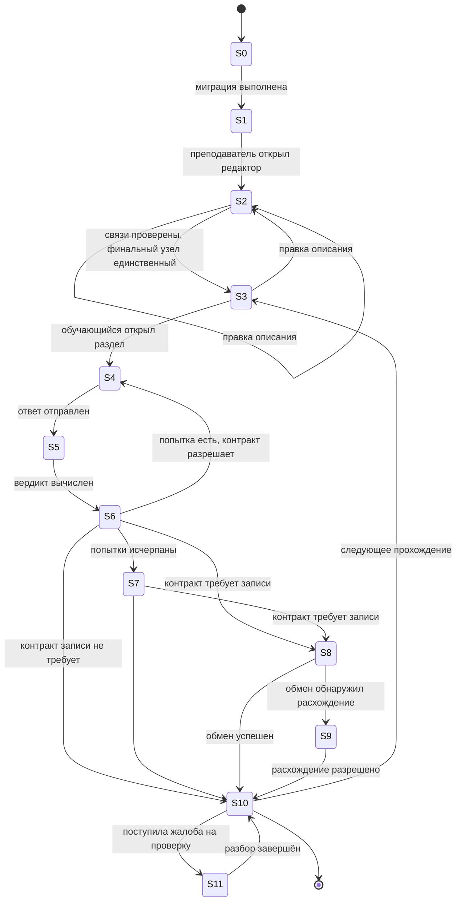

# Глава 4. Режимы работы, состояния и сценарии взаимодействия

Глава соответствует пунктам 5 и 6 курсовой работы. Отличие от курсовой
существенное и его стоит назвать сразу: у роботизированного комплекса
режимы задаются физикой процесса (нельзя убирать, не заправившись), а
здесь — **контрактом о том, что записывается в статистику**. Режим
«тренировка» отличается от режима «зачёт» не набором настроек, а тем,
что в первом случае строку попытки писать нельзя вовсе.

Это различие не теоретическое: оно реализовано и закреплено в коде
(`core/scenarios.py`).

---

## 4.1. Определения

**Фаза** — верхний уровень временнóй декомпозиции жизненного цикла
функционирования, охватывающий логически связанный набор режимов.
Минимум три: подготовительная, основная, завершающая. Внутри фазы —
не менее двух режимов.

**Режим** — способность системы выполнять функциональную задачу,
объединяющая один или несколько сценариев использования. Уникален для
одной фазы; переход между режимами требует запускающего события и
предопределённых условий.

**Рабочее состояние** — наблюдаемая, измеримая конфигурация активности
элементов системы, определяющая допустимые и запрещённые действия.
Каждое состояние обязано иметь хотя бы одно допустимое и хотя бы одно
запрещённое действие — иначе оно неотличимо от соседнего.

---

## 4.2. Режимы работы

### 4.2.1. Режимы прохождения (контракты о записи попытки)

**Таблица 4.1 — Режимы прохождения**

| Режим | Пишется попытка | Влияет на успеваемость | Адаптация | Попыток | Проверка | Ответ показывается | Статус |
|---|---|---|---|---|---|---|---|
| Свободная тренировка | **нет** | нет | разрешена | 3 | мягкая | да | **реализован** |
| Тренировка со статистикой | да | да | разрешена | 3 | мягкая | да | **реализован** |
| Домашнее задание | да | да | **запрещена** | 2 | мягкая | да | описан, не открыт |
| Зачёт | да | да | **запрещена** | **1** | **строгая** | **нет** | описан, не открыт |

**Почему это четыре режима, а не четыре набора настроек.** «Тренировка
без статистики» отличается от «тренировки со статистикой» не значением
параметра, а тем, что в первом случае строки попытки не появляется
вовсе. Свести это к флагу — значит потерять причину, по которой строки
нет: при разборе задним числом отсутствие строки будет неотличимо от
сбоя записи.

**Почему два режима описаны, но не открыты.** Домашнее задание и зачёт
требуют дисциплины выдачи: срок, единственная попытка, недоступность
условия после сдачи. Пометить попытку зачётом, не обеспечив условий
зачёта, — значит получить статистику, про которую нельзя сказать, что
она означает. Модель при этом описана полностью: это дёшево сейчас и
невосстановимо потом, когда накопятся попытки без пометки режима.

### 4.2.2. Технические режимы установки

**Таблица 4.2 — Технические режимы**

| Режим | Описание |
|---|---|
| Автономный | Установка работает без сети: порождает варианты, проверяет ответы, накапливает попытки в очередь обмена |
| Подключённый | То же плюс обмен изменениями с сервером и получение выданных заданий |
| Согласование | Двусторонний обмен: отправка очереди, приём чужих изменений, разрешение расхождений по версии записи |
| Обслуживание | Обновление приложения, установка пакетов узлов, миграция схемы данных |
| Диагностический | Режим разработчика: примерка роли, воспроизведение варианта по идентификатору, вывод сведений о графе |

Автономный режим — **основной**, а не аварийный. Это прямое следствие
цели G.04: занятие в аудитории без сети идёт так же, как с сетью, и
подключение лишь добавляет обмен.

---

## 4.3. Фазы и состояния

**Таблица 4.3 — Фазы, режимы и состояния**

| ID | Фаза | Режим | Состояние | Допустимо | Запрещено |
|---|---|---|---|---|---|
| S0 | Подготовительная | Обслуживание | Не настроена | миграция схемы, установка пакетов | выдача заданий |
| S1 | | Обслуживание | Готова к работе | вход, просмотр каталога | выдача без описания задания |
| S2 | | Автономный / Подключённый | Описание задания | правка графа, проверка связей, предпросмотр | выдача незавершённого описания |
| S3 | | Автономный / Подключённый | Описание проверено | выдача, включение в группу | правка без переоткрытия |
| S4 | Основная | Режим прохождения | Вариант порождён | показ условия, приём ответа | повторное порождение в том же прохождении |
| S5 | | Режим прохождения | Ответ принят к проверке | вычисление вердикта | приём второго ответа до вердикта |
| S6 | | Режим прохождения | Вердикт вынесен | показ разбора, запись попытки (если контракт разрешает) | изменение вердикта |
| S7 | | Режим прохождения | Попытки исчерпаны | показ правильного ответа (если контракт разрешает) | новая попытка |
| S8 | Завершающая | Подключённый | Попытка в очереди обмена | отправка при появлении связи | удаление до подтверждения |
| S9 | | Согласование | Расхождение при обмене | разрешение по версии записи, запись в журнал расхождений | молчаливая перезапись чужого изменения |
| S10 | | Автономный / Подключённый | Прохождение завершено | пересчёт усвоения, представление преподавателю | правка записанной попытки |
| S11 | Любая | Диагностический | Разбор спорного случая | воспроизведение варианта по идентификатору | изменение вердикта задним числом |

**Наблюдение, важное для защиты.** Состояние S9 (расхождение при обмене)
не имеет аналога в курсовой работе: у робота нет второй копии самого
себя. Здесь оно возникает как прямое следствие требования G.04 и
является ценой автономности. Запрещённое действие в нём названо
специально: молчаливая перезапись чужого изменения — самый естественный
и самый разрушительный способ «разрешить» расхождение.

### Диаграмма переходов состояний

*Рис. 4.1. Диаграмма переходов состояний.*

---

## 4.4. Акторы

| Актор | Роль в сценариях |
|---|---|
| Обучающийся (St.01) | получает вариант, отвечает, видит разбор |
| Преподаватель (St.02) | описывает задание, выдаёт, разбирает жалобы, смотрит усвоение |
| Заведующий кафедрой (St.03) | распоряжается доступом к материалам, видит сводную успеваемость |
| Составитель материалов (St.04) | готовит словари и банки задач, проверяет свои задания |
| Комплекс | целевая система |
| Служба обмена | часть Комплекса, отвечающая за согласование установок |
| Внешняя языковая модель | вспомогательный контур: черновики заданий |

---

## 4.5. Сценарии использования

**Таблица 4.4 — Сценарии использования**

| ID | Режим | Сценарий | Основной актор | Предусловия | Основной поток | Альтернативные потоки | Постусловия |
|---|---|---|---|---|---|---|---|
| **UC-01** | Автономный / Подключённый | Описание задания | Преподаватель | S1, есть доступ к предмету | 1. Открывает редактор. 2. Размещает узлы, соединяет. 3. Система проверяет типы соединений. 4. Предпросмотр варианта. 5. Сохранение | A1.1: несовместимые типы портов → соединение не создаётся, показана причина. A1.2: свободных финальных узлов несколько → предупреждение о неоднозначности, сохранение разрешено, выдача — нет | S3: описание сохранено и проверено |
| **UC-02** | Автономный / Подключённый | Проверка описания массовым прогоном | Составитель материалов | S3 | 1. Запуск прогона на N вариантов. 2. Для каждого — независимая сверка ответа. 3. Отчёт о расхождениях | A2.1: независимой сверки для класса задания нет → отчёт помечает класс как непроверяемый, а не «проверен». A2.2: расхождение найдено → вариант с зерном приложен к отчёту | Согласованность подтверждена либо названы варианты-исключения |
| **UC-03** | Режим прохождения | Прохождение задания | Обучающийся | S3, раздел доступен | 1. Открывает раздел. 2. Комплекс порождает вариант по зерну. 3. Показ условия. 4. Ввод ответа. 5. Проверка по спецификации. 6. Показ вердикта и разбора | A3.1: ответ верен по значению, но без размерности → вердикт «неверно» с указанием причины, а не «неверно» без пояснения. A3.2: попытки исчерпаны → показ правильного ответа, если контракт разрешает. A3.3: сети нет → сценарий идёт полностью, попытка помещается в очередь | S6/S7; попытка записана согласно контракту режима |
| **UC-04** | Режим прохождения | Работа с сессией тренажёра | Обучающийся | S3, раздел интерактивного типа | 1. Начало сессии. 2. Цикл «вопрос — ответ — разбор». 3. Завершение при исчерпании набора | A4.1: мягкая проверка принимает опечатку → в разборе показано правильное написание. A4.2: ответ совпадает с другим термином словаря → вердикт «неверно» (правило окрестности) | Сессия завершена, статистика по словам обновлена |
| **UC-05** | Согласование | Обмен изменениями между установками | Служба обмена | S8, связь доступна | 1. Отправка очереди попыток. 2. Приём чужих изменений. 3. Применение по версии записи | A5.1: расхождение версий → S9, разрешение по правилу, запись в журнал. A5.2: связь пропала → очередь сохраняется, повтор при следующем подключении. A5.3: удалённая на сервере сущность → применяется отметка удаления, а не пропуск записи | S10: установки согласованы |
| **UC-06** | Диагностический | Разбор жалобы на проверку | Преподаватель | S11, есть идентификатор варианта | 1. Ввод идентификатора. 2. Воспроизведение того же варианта. 3. Просмотр спецификации ответа и вердикта | A6.1: вердикт признан неверным → правка описания задания, старые попытки не изменяются. A6.2: вариант не воспроизводится → дефект воспроизводимости, регистрируется отдельно | Спор разобран на том же варианте |
| **UC-07** | Автономный / Подключённый | Просмотр усвоения | Преподаватель | S10, есть накопленные попытки | 1. Выбор группы и темы. 2. Представление усвоения. 3. Переход к конкретным попыткам | A7.1: попыток недостаточно для вывода → показано «данных мало», а не нулевой процент | Преподаватель видит, что не усвоено |
| **UC-08** | Обслуживание | Обновление установки | Заведующий кафедрой | S0/S1 | 1. Проверка подписи обновления. 2. Миграция схемы. 3. Проверка целостности данных | A8.1: подпись не сходится → обновление отклоняется. A8.2: миграция не завершилась → откат к предыдущему состоянию | S1: установка готова |
| **UC-09.1** | Любая | Отказ: раздел без обслуживающего кода | Комплекс | Запуск установки | 1. Проверка «у каждого раздела есть чем его открыть». 2. Сообщение с перечнем | — | Дефект назван при старте, а не при клике обучающегося |
| **UC-09.2** | Любая | Отказ: расхождение движка между средами | Комплекс | Сборка | 1. Сравнение операций по синтаксическому дереву. 2. Отказ сборки при расхождении | — | Расхождение не доходит до эксплуатации |
| **UC-09.3** | Режим прохождения | Отказ: ошибка исполнения описания | Комплекс | S4 | 1. Ошибка перехвачена. 2. Обучающемуся показано «задание временно недоступно». 3. Преподавателю — причина и зерно | A9.3.1: ошибка воспроизводима → вариант приложен к сообщению | Обучающийся не видит внутренней ошибки, преподаватель видит причину |

**Замечание о структуре сценариев.** Аварийные сценарии вынесены в
группу UC-09 намеренно и построены иначе, чем у робота: там аварийный
сценарий останавливает процесс, здесь — **не даёт дефекту дойти до
обучающегося**. UC-09.1 и UC-09.2 срабатывают до начала занятия, и это
проектное решение: обнаружение при старте дешевле обнаружения по жалобе.

---

## 4.6. Нефункциональные характеристики

**Таблица 4.5 — Нефункциональные характеристики**

| Характеристика | Значение | Сценарии | Обоснование |
|---|---|---|---|
| Время порождения варианта | ≤ 1 с для типового описания | UC-03, UC-04 | занятие идёт в реальном времени |
| Время вынесения вердикта | ≤ 0,5 с | UC-03 | обратная связь должна ощущаться немедленной |
| Полнота автономной работы | 100% функций порождения, проверки, накопления | UC-03, UC-04 | цель G.04 |
| Расхождение движка между средами | 0 операций | UC-09.2 | одно описание — одно поведение |
| Воспроизводимость варианта | побитово по идентификатору | UC-06 | цель G.05 |
| Достоверность проверки | 0 неразличимых пар | UC-03, UC-04 | цель G.03 |
| Сохранность попыток при потере связи | 100%, очередь переживает перезапуск | UC-05 | попытка — учебный документ |
| Порог входа для преподавателя | описание типового задания без программирования | UC-01 | иначе система не будет использоваться |
| Диагностируемость отказа | причина и зерно доступны преподавателю | UC-09.3 | без этого разбор превращается в гадание |

**Таблица 4.6 — Связь характеристик с режимами**

| Режим | Ключевые нефункциональные характеристики |
|---|---|
| Свободная тренировка | время порождения, время вердикта, полнота автономной работы |
| Тренировка со статистикой | то же + сохранность попыток |
| Домашнее задание | сохранность попыток, воспроизводимость варианта |
| Зачёт | воспроизводимость, достоверность проверки, невозможность повторной попытки |
| Автономный | полнота автономной работы, сохранность очереди |
| Согласование | сохранность попыток, отсутствие молчаливой перезаписи |
| Обслуживание | проверка подписи, откат миграции |
| Диагностический | воспроизводимость, диагностируемость отказа |

---

## 4.7. Выводы по главе

1. Режимы прохождения заданы **контрактами о записи попытки**, а не
   наборами настроек; различие обосновано невосстановимостью сведений
   задним числом.
2. Четыре режима описаны в модели, два открыты в эксплуатации;
   ограничение названо явно и обосновано отсутствием дисциплины выдачи.
3. Выделено двенадцать состояний с указанием допустимых и запрещённых
   действий; состояние «расхождение при обмене» не имеет аналога в
   системах без второй копии и является ценой автономности.
4. Построены девять сценариев использования, включая три сценария
   отказа; последние спроектированы так, чтобы дефект обнаруживался до
   занятия, а не по жалобе обучающегося.
5. Нефункциональные характеристики связаны с режимами: набор
   существенных характеристик различается по режимам, и в зачёте он
   строже, чем в тренировке.
