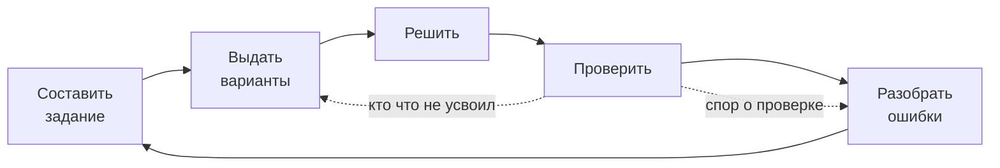
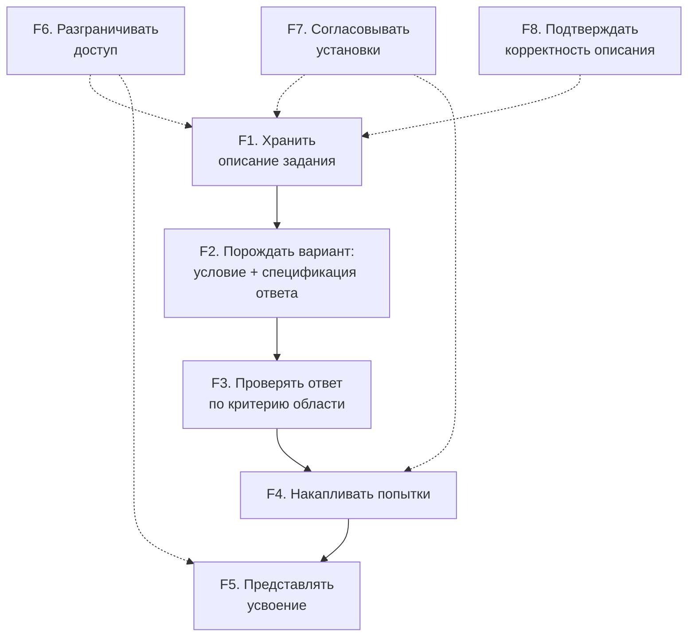
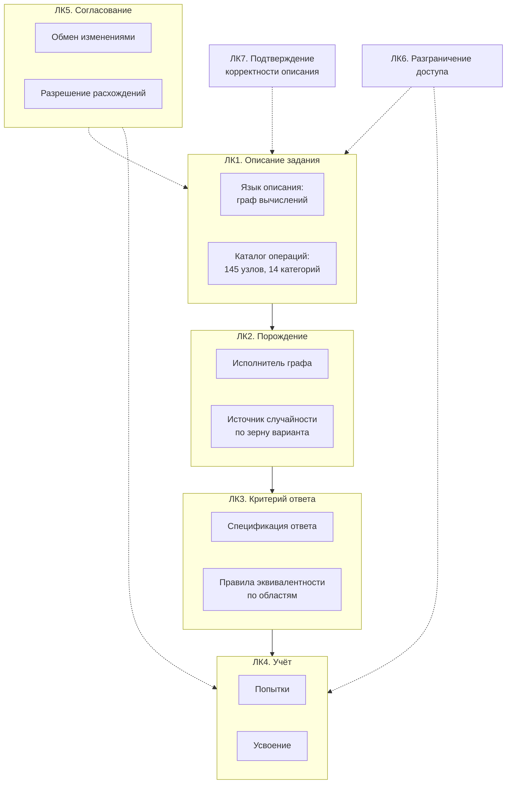
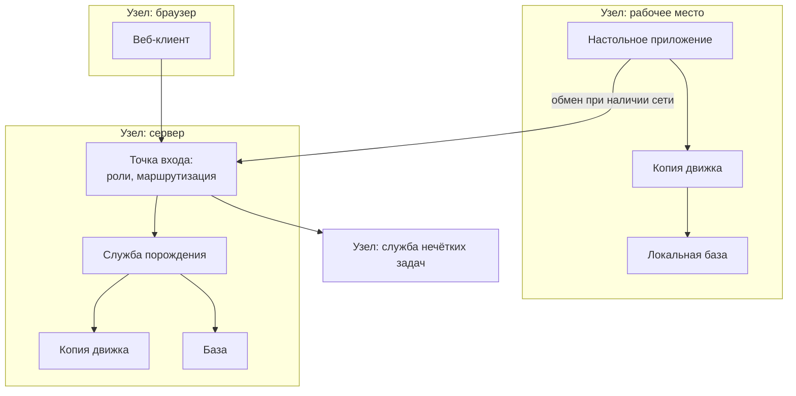

# Глава 5. Многоуровневый системный анализ по ARCADIA

Глава строится по методологии **ARCADIA** (Architecture Analysis and
Design Integrated Approach) в нотации **Capella**. К четырём уровням
добавлено то, чего в курсовой работе не было и что для диплома
обязательно: **на каждом переходе между уровнями проводится анализ
альтернативных вариантов той же методикой взвешенных сумм, что и в
главе 2.**

Это не формальность. Переход между уровнями ARCADIA — это и есть место,
где принимается проектное решение: уровень выше говорит, ЧТО нужно, а
уровень ниже отвечает, ЧЕМ это будет сделано, и ответ всегда не
единственный. Записать выбранный ответ, не показав отвергнутые, — значит
выдать решение за данность.

| Уровень | Вопрос уровня | Диаграммы Capella |
|---|---|---|
| **OA** Operational Analysis | что делают люди и зачем, безотносительно системы | OAB, OAIB, OES, OCB |
| **SA** System Analysis | что система обязана делать для этих людей | SAB, SDFB, MSM, ES |
| **LA** Logical Architecture | из каких компонентов это складывается | LAB, LDFB, LFBD, ES |
| **PA** Physical Architecture | чем это исполняется на самом деле | PAB, PDFB, PCBD |

---

## 5.1. Почему ARCADIA здесь применима по существу

Не «потому что требуется нотация», а потому что у системы есть настоящий
переход между уровнями, и на каждом переходе добавляется решение,
которого на предыдущем уровне не было и быть не могло.

* На уровне **OA** действующие лица делают то же, что делали до
  автоматизации: составляют задание, решают, проверяют. Система в OA не
  упоминается вовсе — и это выполнимо, потому что процесс существовал до
  неё. Это признак того, что граница проведена верно.
* На уровне **SA** появляется требование, которого у людей не было:
  описание задания обязано исполняться одинаково в двух средах с разной
  доступностью сети (СТ4). Оно не выводится из OA — оно добавлено при
  переходе.
* На уровне **LA** это требование порождает разделение на движок и
  оболочку, причём движок обязан существовать в обеих средах.
* На уровне **PA** то же требование даёт две физические копии движка и
  механизм контроля их расхождения.

Одно требование, прослеженное через четыре уровня до конкретного
инструмента контроля, — это и есть материал главы по системному анализу.

---

## 5.2. Уровень OA — операционный анализ

### Операционные сущности (Operational Entities)

| Сущность | Деятельность |
|---|---|
| Преподаватель | составляет задание, выдаёт, оценивает усвоение |
| Обучающийся | получает задание, решает, узнаёт результат |
| Заведующий кафедрой | распоряжается материалами, наблюдает успеваемость |
| Составитель материалов | готовит словари и банки задач |

### Операционные возможности (Operational Capabilities)

* **OC1.** Выдать группе индивидуальные варианты одного задания.
* **OC2.** Получить обратную связь по ответу, пока она ещё полезна.
* **OC3.** Узнать, что именно не усвоено, а не только оценку.
* **OC4.** Провести занятие там, где сеть недоступна.
* **OC5.** Разобрать спорную проверку на том же материале, что вызвал спор.

OC4 — не техническое пожелание, а операционное ограничение: аудитории
без сети существуют, и учебный процесс в них идёт.

### Операционный процесс (OAIB)

*Рис. 5.1. Операционный процесс. Обратная связь показана двумя стрелками
намеренно: короткая — обучающемуся немедленно, длинная — преподавателю
для следующей выдачи. В ручном процессе обе медленные.*

---

## 5.3. Переход OA → SA: анализ альтернатив

**Решаемый вопрос:** где провести границу системы — что автоматизируем,
а что оставляем людям.

**Таблица 5.1 — Варианты границы системы**

| Вариант | Что внутри системы |
|---|---|
| A1 | только порождение вариантов; проверка остаётся преподавателю |
| A2 | порождение + автоматическая проверка ответа |
| A3 | A2 + накопление и представление усвоения |
| A4 | A3 + выставление итоговой оценки |

**Критерии и веса:** масштабируемость (0.30, из G.01); достоверность
проверки (0.30, из G.02/G.03); **обратимость** — насколько легко
отказаться от автоматизации этого этапа (0.20); порог входа (0.20).

Критерий обратимости добавлен именно здесь: чем глубже граница, тем
дороже ошибка выбора, и на переходе OA→SA это главный риск.

**Таблица 5.2 — Оценка**

| Вариант | Масштаб (0.30) | Достоверность (0.30) | Обратимость (0.20) | Порог входа (0.20) | Итог |
|---|---|---|---|---|---|
| A1 | 9 | 2 | 9 | 8 | 6.70 |
| **A2** | 9 | 9 | 7 | 6 | **8.00** |
| A3 | 9 | 9 | 6 | 5 | 7.60 |
| A4 | 9 | 9 | 2 | 3 | 6.40 |

**Выбран A2**, а накопление усвоения (A3) вынесено за границу
**обязательного** контура и реализовано как отдельная возможность C.04.
Обоснование: A3 набирает почти столько же, но каждая единица его
преимущества уходит в необратимость — накопленная статистика становится
источником решений, и отказаться от неё потом нельзя.

**A4 отвергнут по обратимости (2).** Выставление оценки — деятельность с
юридическими последствиями; передав её системе, вернуть обратно нельзя
без пересмотра регламента. При этом по достоверности A4 не лучше A2:
оценка складывается из вердиктов, которые уже вычислены.

---

## 5.4. Уровень SA — системный анализ

### Границы системы

**Отвечает за:** хранение описаний заданий, порождение вариантов,
проверку ответов, накопление попыток, представление усвоения,
разграничение доступа, согласование установок.

**Не отвечает за:** содержание курса, методику, выставление итоговой
оценки, идентификацию личности вне учётной записи.

### Системные функции (SDFB)

*Рис. 5.2. Системные функции и потоки.*

### Системные требования

| № | Требование | Откуда |
|---|---|---|
| СТ1 | Критерий эквивалентности ответа задаётся вместе с заданием и выражается в терминах предметной области | G.02 |
| СТ2 | Допуск на ошибку определяется окрестностью ответа в множестве допустимых | G.03 |
| СТ3 | Согласованность пары «условие — ответ» проверяема массово | G.06 |
| СТ4 | Одно описание задания исполняется одинаково автономно и в сети | G.04, OC4 |
| СТ5 | Вариант воспроизводим по идентификатору | G.05, OC5 |
| СТ6 | Число вариантов не ограничено трудозатратами | G.01, OC1 |

**СТ4 — самое дорогое требование работы.** Оно определяет всё дальнейшее
и в §5.8 видно, чего оно стоит.

---

## 5.5. Переход SA → LA, решение 1: форма описания задания

**Решаемый вопрос:** чем преподаватель описывает задание.

**Таблица 5.3 — Варианты формы описания**

| Вариант | Описание |
|---|---|
| B1 | код-генератор: программа на языке общего назначения |
| B2 | шаблон условия с подстановкой значений |
| B3 | граф вычислений: узлы-операции, дуги-значения |
| B4 | декларативная схема: структура без явного потока данных |

**Критерии (равные веса по 0.25):** порог для непрограммиста;
переносимость между средами (СТ4); анализируемость до исполнения (СТ3);
выразительность.

**Таблица 5.4 — Оценка**

| Вариант | Порог | Переносимость | Анализируемость | Выразительность | Итог |
|---|---|---|---|---|---|
| B1 код-генератор | 2 | 2 | 3 | 10 | 4.25 |
| B2 шаблон | 9 | 9 | 7 | 3 | 7.00 |
| **B3 граф** | 7 | 9 | 9 | 8 | **8.25** |
| B4 декларативная схема | 6 | 9 | 8 | 4 | 6.75 |

**Выбран B3.** Обоснование ключевых оценок:

* **B1 получает 2 по переносимости** — и это решающее. Передать код на
  другую установку означает исполнить там программу, присланную извне.
  Требование СТ4 при этом формально выполнимо, но ценой, которую не
  платят.
* **B1 получает 10 по выразительности честно:** язык общего назначения
  выразительнее любого предметного. Именно поэтому код-генераторы в
  системе оставлены (около 70 разделов) и не переводятся на графы —
  см. §5.9.
* **B3 уступает B2 по порогу входа (7 против 9).** Граф требует понимания
  потока данных; шаблон не требует ничего. Это признаваемая цена
  выразительности.

---

## 5.6. Переход SA → LA, решение 2: место критерия эквивалентности

**Решаемый вопрос:** где живёт правило «что считать верным ответом».

**Таблица 5.5 — Варианты**

| Вариант | Описание |
|---|---|
| C1 | в проверяющем коде: функция проверки знает, как сравнивать |
| C2 | в задании: спецификация ответа порождается вместе с вариантом и путешествует с ним |
| C3 | отдельно в БД: у раздела есть настройка проверки |

**Критерии:** показ и проверка из одной величины (0.35, из СТ1);
переносимость (0.25, СТ4); расширяемость на новые области (0.25);
простота (0.15).

**Таблица 5.6 — Оценка**

| Вариант | Одна величина | Переносимость | Расширяемость | Простота | Итог |
|---|---|---|---|---|---|
| C1 | 3 | 3 | 5 | 8 | 4.25 |
| **C2** | 10 | 9 | 9 | 6 | **8.90** |
| C3 | 5 | 6 | 7 | 5 | 5.75 |

**Выбран C2** с наибольшим отрывом среди всех решений главы.

Критерий «показ и проверка из одной величины» получил наибольший вес не
случайно: именно его нарушение порождает класс дефектов, при котором
проверка принимает то, чего показ не предлагает. При C1 и C3 показ
ответа и его проверка — два независимых пути, и расходятся они молча.

---

## 5.7. Уровень LA — логическая архитектура

*Рис. 5.3. Логические компоненты.*

---

## 5.8. Переход LA → PA, решение 1: способ обеспечить автономность

**Это самое дорогое решение работы, и анализ здесь дал результат против
реализованного варианта. Разбор этого случая — содержательная часть
главы, а не признание ошибки.**

**Таблица 5.7 — Варианты**

| Вариант | Описание |
|---|---|
| D1 | тонкий клиент с кешем заданий: логика на сервере |
| D2 | полная копия движка на рабочем месте |
| D3 | сборка ядра в WebAssembly: один код исполняется в браузере |
| D4 | предгенерация вариантов пакетом заранее |

### Проход 1 — исходный набор критериев

**Критерии:** полнота автономных функций (0.35); риск расхождения копий
(0.25); стоимость сопровождения (0.20); скорость поставки правок (0.20).

| Вариант | Полнота | Риск расхождения | Сопровождение | Скорость правок | Итог |
|---|---|---|---|---|---|
| D1 | 3 | 9 | 9 | 9 | 6.90 |
| D2 (реализован) | 10 | 3 | 5 | 4 | **6.05 — последнее место** |
| **D3** | 8 | 8 | 4 | 7 | **7.00** |
| D4 | 5 | 8 | 7 | 6 | 6.35 |

Первый проход поставил реализованное решение на последнее место.
Возможных объяснений два: решение принято неверно либо **набор критериев
неполон**. Проверка показала второе.

### Что пропущено в первом проходе

Все четыре критерия описывают систему как программу, исполняющую логику.
Но требование OC4 звучит иначе: **занятие должно идти там, где сети
нет**, а занятие включает выгрузку вариантов в документ для печати,
работу с локальными файлами преподавателя и локальное хранение попыток.

WebAssembly (D3) даёт исполнение ядра в браузере, но не даёт настольного
приложения: нет локальной базы, нет доступа к файловой системе
преподавателя, нет выгрузки в редактируемый документ. То есть **D3
удовлетворяет требование частично, а критерий «полнота автономных
функций» этого не улавливает**, потому что сформулирован в терминах
функций системы, а не операционной возможности.

Добавляется критерий: **соответствие форме настольного приложения с
локальной базой и выгрузкой документов** (вес 0.25, отобран
пропорционально у остальных).

### Проход 2 — с восстановленным критерием

| Вариант | Полнота (0.30) | Риск (0.20) | Сопровождение (0.15) | Скорость (0.10) | Настольное приложение (0.25) | Итог |
|---|---|---|---|---|---|---|
| D1 | 3 | 9 | 9 | 9 | 2 | 5.45 |
| **D2** | 10 | 3 | 5 | 4 | 10 | **7.25** |
| D3 | 8 | 8 | 4 | 7 | 2 | 5.80 |
| D4 | 5 | 8 | 7 | 6 | 6 | 6.25 |

**Анализ чувствительности:** D2 обгоняет D3 при весе нового критерия
**от 0.15**. При весе 0.10 лидирует D3 с преимуществом 0.05 — то есть
выбор чувствителен, и назвать его очевидным нельзя.

### Что из этого следует

1. **Реализованное решение обосновано**, но не «с запасом»: оно
   выигрывает за счёт одного критерия, и этот критерий — операционный, а
   не технический.
2. **Риск расхождения копий (оценка 3) остаётся главным недостатком
   выбранного варианта.** Он не устраняется, а компенсируется мерой
   контроля — сравнением копий по абстрактному синтаксическому дереву
   (замер: 0 расхождений из 140 операций).
3. **Условие пересмотра названо:** если требование настольного
   приложения ослабнет (например, выгрузка документов уйдёт на сервер, а
   локальные файлы преподавателя перестанут быть нужны), вес нового
   критерия упадёт ниже 0.15 и предпочтительным станет D3.

Этот разбор — пример того, ради чего анализ альтернатив на переходах
вообще проводится: он не подтвердил принятое решение, а заставил найти
пропущенное требование.

---

## 5.9. Переход LA → PA, решение 2: хранение и перенос описаний

**Таблица 5.8 — Варианты**

| Вариант | Описание |
|---|---|
| E1 | файлы в каталоге, перенос копированием |
| E2 | база данных с обменом по версии записи |
| E3 | система контроля версий как хранилище описаний |

**Критерии:** работа без сети (0.30); разрешение расхождений (0.30);
простота для преподавателя (0.20); история правок (0.20).

| Вариант | Без сети | Расхождения | Простота | История | Итог |
|---|---|---|---|---|---|
| E1 | 9 | 2 | 7 | 2 | 5.10 |
| **E2** | 9 | 8 | 9 | 5 | **7.90** |
| E3 | 8 | 9 | 2 | 10 | 7.50 |

**Выбран E2.** Разрыв с E3 невелик (0.40), и это честно: система
контроля версий лучше по двум критериям из четырёх и проигрывает
практически только порогом входа (2 против 9). Для инструмента,
которым пользуется преподаватель, а не программист, этот единственный
критерий и оказывается решающим.

**Отвергнутое E1 показательно:** оно выигрывает по работе без сети
наравне с E2, но получает 2 по разрешению расхождений. Две копии
каталога, изменённые независимо, сводятся только вручную, и при
регулярном обмене это ежедневная работа.

---

## 5.10. Уровень PA — физическая архитектура

*Рис. 5.4. Физическая архитектура.*

### Следствия требования СТ4

**Движок физически существует в двух копиях** — прямая цена автономной
работы, принятая решением §5.8. Отсюда риск, которого на уровне LA не
было: расхождение копий. Операция, существующая в одной копии и
отсутствующая в другой, приводит к отказу при выдаче; операция с разной
реализацией даёт **другое задание, не сообщая об этом**.

Мера контроля: сравнение копий по абстрактному синтаксическому дереву на
уровне отдельных операций. Построчное сравнение файлов не годится —
операции переносят между модулями, и построчный разбор тонет в шуме.
Замер: 140 операций в каждой копии, все 140 идентичны.

### Следствие для идентификации содержимого

Материалы адресуются **идентификатором внутри поставки**, а не путём:
путь верен ровно на той машине, где выбран. Замер: описание, составленное
на рабочем месте с путём к файлу, на сервере не исполняется.

Номер раздела выводится из **имени** описания, а не из его положения в
списке. Замер двух установок: при выводе из положения один и тот же номер
означал разные словари (20 и 12 файлов соответственно), и задание,
выданное на сервере, открывало на рабочем месте другой материал — без
сообщений об ошибке.

---

## 5.11. Прослеживание требования СТ4 через все уровни

Единственный самый показательный пример для защиты.

| Уровень | Что появляется | Решение и его альтернативы |
|---|---|---|
| **OA** | OC4: занятие идёт там, где сети нет | операционное ограничение, не выбор |
| **OA→SA** | — | граница системы: A2 (порождение + проверка) |
| **SA** | СТ4: одно описание — одинаковое исполнение в двух средах | требование добавлено, из OA не выводится |
| **SA→LA** | описание должно переноситься как данные | B3 граф (8.25) против B1 кода (4.25) — код не переносится |
| **SA→LA** | критерий ответа должен ехать вместе с вариантом | C2 спецификация в задании (8.90) |
| **LA** | движок отделён от оболочки и обязан существовать в обеих средах | следствие B3 + C2 |
| **LA→PA** | как обеспечить автономность | D2 полная копия (7.25) — выбор потребовал восстановления пропущенного критерия |
| **PA** | две копии движка → риск расхождения | мера контроля: сравнение по АСТ, замер 0 из 140 |

Восемь строк, одно требование, четыре уровня, три анализа альтернатив и
конкретный инструмент контроля в конце. Это и есть содержание работы по
системному анализу.

---

## 5.12. Что построить в Capella

Текстовые диаграммы выше — материал; для защиты нужны они же в нотации.

**Таблица 5.9 — Объём работ в Capella**

| Уровень | Диаграммы | Содержание |
|---|---|---|
| **OA** | OAB (Operational Architecture Blank) | 4 операционные сущности, их взаимодействия |
| | OCB (Operational Capabilities Blank) | 5 операционных возможностей OC1–OC5 |
| | OAIB (Operational Activity Interaction) | 5 операционных действий, потоки между ними |
| | 2× OES (Operational Entity Scenario) | сценарий «выдача и проверка», сценарий «разбор спора» |
| **SA** | SAB (System Architecture Blank) | граница системы, 4 внешних актора |
| | SDFB (System Data Flow) | 8 системных функций F1–F8, потоки |
| | MSM (Mode & State Machine) | 12 состояний S0–S11 из главы 4 |
| | 3× ES (Exchange Scenario) | UC-03, UC-05, UC-06 |
| **LA** | LAB (Logical Architecture Blank) | 7 логических компонентов ЛК1–ЛК7 |
| | LDFB (Logical Data Flow) | распределение системных функций по компонентам |
| | 3× LFBD (Logical Function Breakdown) | декомпозиция ЛК1, ЛК2, ЛК3 |
| **PA** | PAB (Physical Architecture Blank) | 4 узла, размещение логических компонентов |
| | PDFB (Physical Data Flow) | потоки между узлами, в т.ч. обмен установок |
| | PCBD (Physical Component Breakdown) | состав узла рабочего места |

**Таблицы прослеживания в Capella — важнее диаграмм:**

* Operational Capability → System Function (OC → F);
* System Requirement → Logical Component (СТ → ЛК);
* Logical Component → Physical Component (ЛК → узел);
* System Function → Mode/State (F → S).

Capella строит такие таблицы автоматически по установленным связям — при
условии, что связи проставлены, а не нарисованы стрелками на схеме. Это
основной объём работы: **связи, а не картинки**.

**Практическое замечание.** Прослеживание СТ4 (§5.11) в Capella
выражается цепочкой связей от OC4 до физического узла. Именно её стоит
показывать на защите: она демонстрирует, что модель связная, а не
набор независимых диаграмм.

---

## 5.13. Выводы по главе

1. Процесс существовал до автоматизации, поэтому уровень OA описан без
   упоминания системы — признак верно проведённой границы.
2. На каждом переходе между уровнями проведён анализ альтернатив
   взвешенными суммами: пять решений, для каждого 3–4 варианта.
3. Переход OA→SA: выбрана граница «порождение + проверка»; вариант с
   выставлением оценки отвергнут по критерию обратимости, а не по
   качеству.
4. Переход SA→LA: выбраны граф как форма описания (8.25) и спецификация
   ответа в задании (8.90 — наибольший отрыв в главе).
5. Переход LA→PA: первый проход поставил реализованное решение на
   последнее место, что вынудило найти пропущенный критерий —
   соответствие форме настольного приложения. После его восстановления
   решение обосновано, но чувствительно: при весе критерия ниже 0.15
   предпочтительным становится другой вариант. Условие пересмотра
   названо.
6. Требование СТ4 прослежено через все четыре уровня до конкретной меры
   контроля с замеренным значением.
