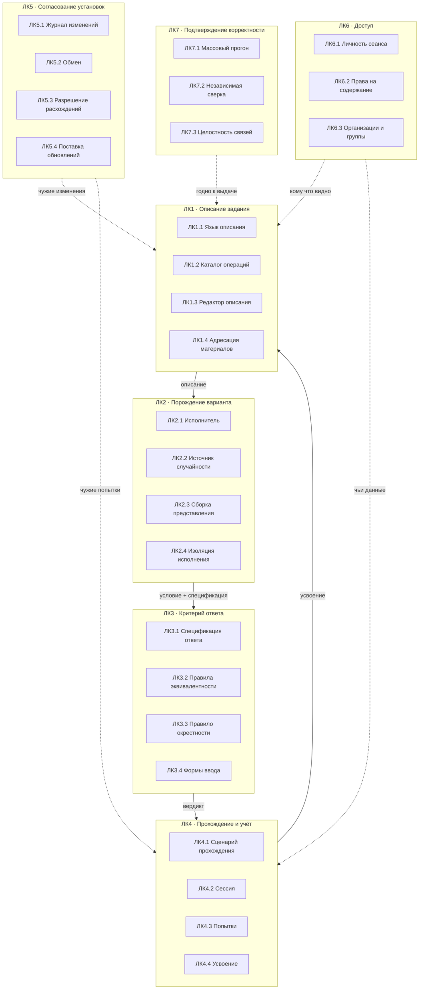
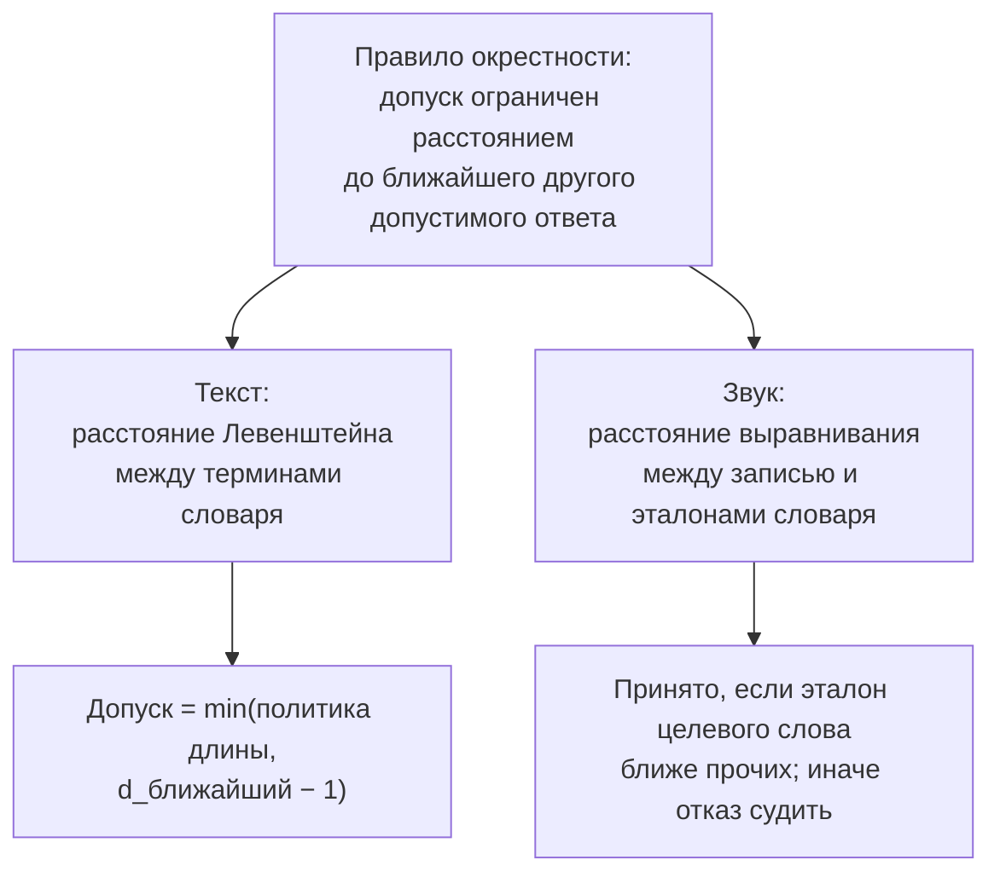
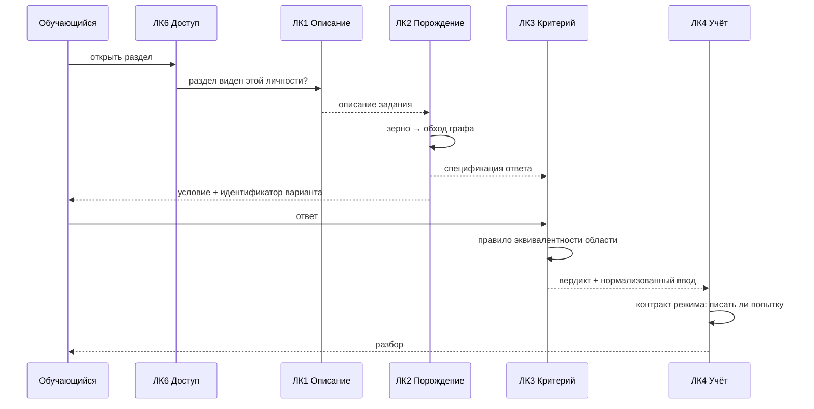
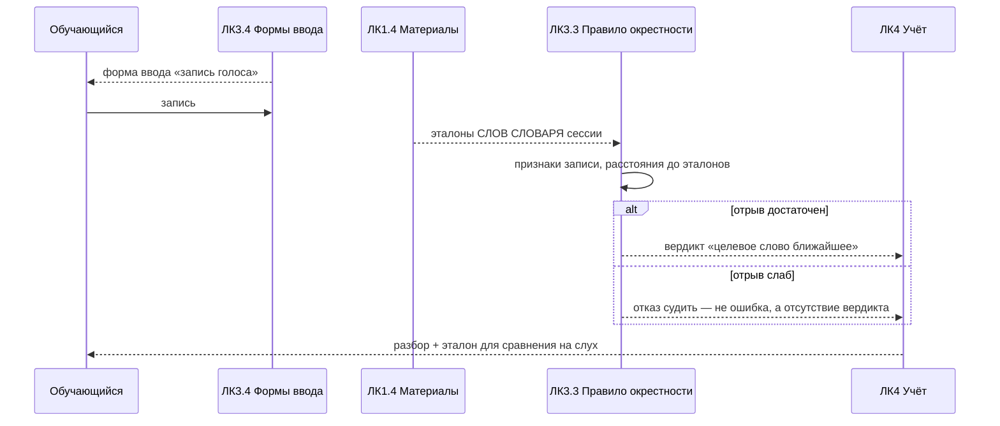
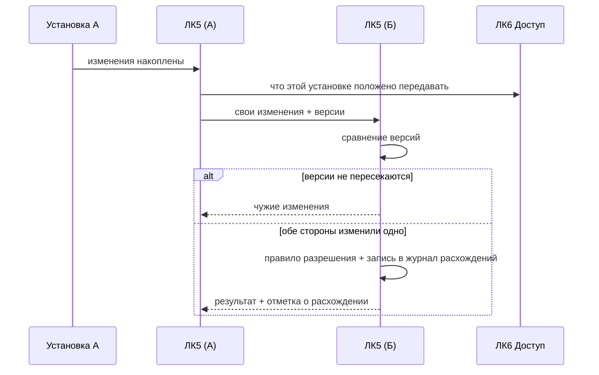

# Глава 5а. Логическая архитектура (уровень LA) — подробно

Развёрнутый уровень LA методологии ARCADIA: полный состав логических
компонентов, распределение системных функций по ним, интерфейсы между
компонентами и прослеживание к требованиям.

Уровень LA отвечает на вопрос **«из чего состоит система»** — но ещё не
«чем это исполняется». Здесь нет ни языков программирования, ни узлов
сети: компонент LA может оказаться модулем, службой или библиотекой, и
это решается на уровне PA (глава 5б).

---

## 5а.1. Состав логических компонентов

Семь компонентов первого уровня. Разбиение проведено по **владению
понятием**, а не по слоям: компонент отвечает за одно понятие предметной
области целиком, включая его хранение, порождение и проверку.

*Рис. 5а.1. Логические компоненты и их декомпозиция.*

---

## 5а.2. ЛК1 — Описание задания

**Владеет понятием:** что такое задание до того, как оно стало вариантом.

| Подкомпонент | Ответственность | Ключевое решение |
|---|---|---|
| ЛК1.1 Язык описания | синтаксис и семантика графа: вершины, дуги, типы значений, правила соединения | типизация дуг: несовместимое соединение отвергается при составлении, а не при исполнении |
| ЛК1.2 Каталог операций | реестр доступных операций, их входы, выходы и параметры | каталог **расширяем пакетами**, но набор типов значений закрыт — иначе типизация перестаёт что-либо гарантировать |
| ЛК1.3 Редактор описания | размещение вершин, соединение, предпросмотр, диагностика | принадлежность вершины условию или ответу **вычисляется обратным обходом**, а не хранится |
| ЛК1.4 Адресация материалов | ссылки на словари, изображения, звук внутри поставки | идентификатор, а не путь; выход за пределы поставки — отказ, а не срезание |

**Интерфейсы ЛК1:**

| Интерфейс | С кем | Что передаётся |
|---|---|---|
| И1.1 | ЛК2 | описание задания как данные |
| И1.2 | ЛК5 | описание для обмена + версия записи |
| И1.3 | ЛК6 | запрос «кому это описание видно» |
| И1.4 | ЛК7 | описание на проверку перед выдачей |
| И1.5 | ЛК1.4 → внешняя среда | чтение материалов поставки |

---

## 5а.3. ЛК2 — Порождение варианта

**Владеет понятием:** вариант задания.

| Подкомпонент | Ответственность | Ключевое решение |
|---|---|---|
| ЛК2.1 Исполнитель | топологический обход графа, вычисление значений | вершина срабатывает, когда готовы все входы; финальная вершина единственна |
| ЛК2.2 Источник случайности | вся случайность варианта | выводится из ОДНОГО зерна — отсюда воспроизводимость (СТ5) |
| ЛК2.3 Сборка представления | из значений — блоки условия: текст, формула, изображение, поле ввода | представление отделено от значения: одно и то же число показывается по-разному в вебе и в документе |
| ЛК2.4 Изоляция исполнения | ограничение времени и ресурсов при исполнении описания | описание приезжает по обмену от чужой установки; бесконечный цикл в нём не должен останавливать службу |

**Интерфейсы ЛК2:**

| Интерфейс | С кем | Что передаётся |
|---|---|---|
| И2.1 | ЛК1 | описание задания |
| И2.2 | ЛК3 | спецификация ответа, порождённая вместе с условием |
| И2.3 | ЛК4 | условие + идентификатор варианта (зерно) |
| И2.4 | ЛК7 | пакет вариантов для массового прогона |

---

## 5а.4. ЛК3 — Критерий ответа

**Владеет понятием:** что считать верным ответом. Центральный компонент
работы.

| Подкомпонент | Ответственность | Ключевое решение |
|---|---|---|
| ЛК3.1 Спецификация ответа | типизированное описание верного ответа, путешествующее вместе с вариантом | показ и проверка идут из одной величины |
| ЛК3.2 Правила эквивалентности | по одному на предметную область | равенство принадлежит области, а не строке |
| ЛК3.3 Правило окрестности | допуск на ошибку выводится из множества допустимых ответов | **применяется к двум модальностям: тексту и звуку** |
| ЛК3.4 Формы ввода | какой способ ввода соответствует виду ответа | вид ввода — свойство показа, а не ответа |

### Правила эквивалентности (ЛК3.2) — полный состав

| Правило | Что считает одним ответом | Замер |
|---|---|---|
| числовое | значение с допуском, размерность отдельно от величины | 204 альтернативные записи, нормализация покрывает все |
| выражение | алгебраически эквивалентные записи | 78 альтернативных записей, нормализация не покрывает ни одной |
| логическая формула | совпадающие таблицы истинности | — |
| вывод программы | совпадающий результат исполнения | — |
| термин | различающиеся ошибкой написания в пределах окрестности | 48 неразличимых пар → 0 |
| **произношение** | **запись, чей ближайший эталон — целевое слово** | **86 из 86 верны на длинных терминах; 52 из 149 неверны по всей поставке (§7.3.1)** |

### ЛК3.3 — правило окрестности на двух модальностях

Это то место архитектуры, где результат работы виден яснее всего: **одно
правило обслуживает две разные модальности.**

*Рис. 5а.2. Одно правило, две модальности.*

Разница в форме, но не в существе: и там, и там **вердикт выносится
сравнением с остальными допустимыми ответами, а не с порогом**. Для
текста это даёт число допустимых правок; для звука — выбор ближайшего с
отказом при слабом отрыве.

**Интерфейсы ЛК3:**

| Интерфейс | С кем | Что передаётся |
|---|---|---|
| И3.1 | ЛК2 | спецификация, порождённая с вариантом |
| И3.2 | ЛК4 | вердикт: принято/отклонено, причина, нормализованный ввод |
| И3.3 | ЛК1.4 | эталоны произношения из поставки |
| И3.4 | ЛК7 | перечень допустимых записей для проверки |

---

## 5а.5. ЛК4 — Прохождение и учёт

**Владеет понятием:** попытка и то, что из неё следует.

| Подкомпонент | Ответственность | Ключевое решение |
|---|---|---|
| ЛК4.1 Сценарий прохождения | контракт о записи попытки: пишется ли, считается ли, разрешена ли адаптация | четыре режима — **четыре контракта**, а не четыре набора настроек |
| ЛК4.2 Сессия | последовательность вопросов, состояние прохождения | сессия переживает перезапуск службы |
| ЛК4.3 Попытки | хранение введённого, вердикта, режима, устройства | режим пишется в попытку: задним числом его не восстановить |
| ЛК4.4 Усвоение | сведение попыток в картину по темам и группам | «данных мало» — отдельный ответ, а не нулевой процент |

**Интерфейсы ЛК4:**

| Интерфейс | С кем | Что передаётся |
|---|---|---|
| И4.1 | ЛК3 | ответ на проверку, вердикт обратно |
| И4.2 | ЛК5 | попытки в очередь обмена |
| И4.3 | ЛК6 | чьи это данные и кому их видно |
| И4.4 | ЛК1 | обратная связь на выбор следующего задания (адаптация) |

---

## 5а.6. ЛК5 — Согласование установок

**Владеет понятием:** одна и та же сущность на двух установках.

| Подкомпонент | Ответственность | Ключевое решение |
|---|---|---|
| ЛК5.1 Журнал изменений | версия записи у каждой сущности, отметки удаления | удаление передаётся отметкой, а не исчезновением: иначе оно неотличимо от отсутствия |
| ЛК5.2 Обмен | двусторонняя передача изменений, очередь на время отсутствия связи | очередь переживает перезапуск |
| ЛК5.3 Разрешение расхождений | что делать, когда обе стороны изменили одно | правило + журнал расхождений; **молчаливая перезапись запрещена** |
| ЛК5.4 Поставка обновлений | версии приложения и пакетов операций, подпись | пакеты едут **только от сервера к рабочему месту** |

**Интерфейсы ЛК5:**

| Интерфейс | С кем | Что передаётся |
|---|---|---|
| И5.1 | ЛК1 | описания заданий: свои наружу, чужие внутрь |
| И5.2 | ЛК4 | попытки наружу, чужие внутрь |
| И5.3 | ЛК6 | какие сущности этой установке положено видеть |
| И5.4 | внешняя среда | канал связи (может отсутствовать) |

---

## 5а.7. ЛК6 — Доступ

| Подкомпонент | Ответственность | Ключевое решение |
|---|---|---|
| ЛК6.1 Личность сеанса | кто действует, в какой роли | роль — свойство СЕАНСА; примерка роли только «вниз» и снимает признак администратора |
| ЛК6.2 Права на содержание | кому какие предметы и разделы видны | отсутствие личности не означает «видно всё» |
| ЛК6.3 Организации и группы | учебные единицы, преподаватели, обучающиеся | наследование по дереву организаций **не определено** — колонка есть, семантики нет |

**Интерфейсы ЛК6:** И6.1 — ЛК1 (видимость описаний), И6.2 — ЛК4
(владение попытками), И6.3 — ЛК5 (область обмена).

---

## 5а.8. ЛК7 — Подтверждение корректности

| Подкомпонент | Ответственность | Ключевое решение |
|---|---|---|
| ЛК7.1 Массовый прогон | порождение множества вариантов из описания | ошибка описания — не отказ, а согласованное расхождение; одного примера мало |
| ЛК7.2 Независимая сверка | проверка результата способом, не повторяющим вычисление | там, где независимой сверки нет, класс помечается **непроверяемым**, а не «проверенным» |
| ЛК7.3 Целостность связей | у каждого раздела есть чем его открыть; операции совпадают между установками | проверка на старте, а не по клику обучающегося |

---

## 5а.9. Распределение системных функций по компонентам (LDFB)

**Таблица 5а.1 — Функция → компонент**

| Системная функция | ЛК1 | ЛК2 | ЛК3 | ЛК4 | ЛК5 | ЛК6 | ЛК7 |
|---|---|---|---|---|---|---|---|
| F1 Хранить описание задания | **●** | | | | ○ | ○ | |
| F2 Порождать вариант | ○ | **●** | ○ | | | | |
| F3 Проверять ответ | | | **●** | ○ | | | |
| F4 Накапливать попытки | | | | **●** | ○ | ○ | |
| F5 Представлять усвоение | | | | **●** | | ○ | |
| F6 Разграничивать доступ | ○ | | | ○ | ○ | **●** | |
| F7 Согласовывать установки | ○ | | | ○ | **●** | ○ | |
| F8 Подтверждать корректность | ○ | ○ | ○ | | | | **●** |

● — владелец функции, ○ — участник.

Каждая функция имеет **ровно одного владельца** — это проверка качества
разбиения: функция с двумя владельцами означает, что понятие разрезано
не по границе.

---

## 5а.10. Роли и их взаимодействие с компонентами

**Таблица 5а.2 — Роль → компонент**

| Роль | ЛК1 | ЛК2 | ЛК3 | ЛК4 | ЛК5 | ЛК6 | ЛК7 |
|---|---|---|---|---|---|---|---|
| Обучающийся | чтение условия | получает вариант | получает вердикт | своя сессия и попытки | — | своя личность | — |
| Преподаватель | правка описаний | предпросмотр | настройка допусков | усвоение группы, разбор | инициирует обмен | видимость своих разделов | запускает прогон |
| Составитель материалов | правка описаний, материалы | предпросмотр | — | — | — | — | **основной пользователь** |
| Заведующий кафедрой | — | — | — | сводное усвоение | политика обмена | **организации, выдача предметов** | — |
| Администратор развёртывания | — | — | — | — | обновления, подписи | суперпользователь, примерка роли | целостность связей |
| Служба обмена | версии описаний | — | — | версии попыток | **основной пользователь** | область обмена | — |
| Внешняя языковая модель | черновики описаний | — | — | — | — | — | проходит проверку наравне |

**Наблюдение.** Составитель материалов — единственная роль, для которой
ЛК7 (подтверждение корректности) является основным, а не вспомогательным
компонентом. Это оправдывает выделение ЛК7 в отдельный компонент: у него
есть собственный пользователь со своим сценарием.

---

## 5а.11. Сценарии на уровне LA

Сценарии главы 4 разложены по компонентам. Показаны три ключевых.

### ЛС-1. Прохождение задания (UC-03)

*Рис. 5а.3. Сценарий прохождения на уровне LA.*

### ЛС-2. Проверка произношения (новый сценарий)

*Рис. 5а.4. Сценарий проверки произношения. Ветвь «отказ судить» — не
исключительная ситуация, а штатный исход.*

### ЛС-3. Согласование установок (UC-05)

*Рис. 5а.5. Сценарий обмена. Ветвь расхождения обязана быть видимой —
молчаливое разрешение хуже отказа.*

---

## 5а.12. Прослеживание «требование → компонент»

**Таблица 5а.3**

| Требование | Компоненты-исполнители | Как проверяется |
|---|---|---|
| СТ1 критерий в терминах области | ЛК3.1, ЛК3.2 | шесть правил эквивалентности; замер альтернативных записей |
| СТ2 допуск из окрестности | **ЛК3.3** | 48 пар → 0 (текст); 86/86 верных вердиктов (звук) |
| СТ3 массовая проверяемость | ЛК7.1, ЛК7.2 | прогон с независимой сверкой |
| СТ4 одинаковое исполнение | ЛК1.1, ЛК1.4, ЛК2.1, ЛК5 | сравнение операций: 0 расхождений из 140 |
| СТ5 воспроизводимость | ЛК2.2 | восстановление варианта по зерну |
| СТ6 неограниченное число вариантов | ЛК1.1, ЛК2.1, ЛК2.2 | порождение N различных вариантов |

---

## 5а.13. Выводы по уровню LA

1. Выделено 7 компонентов первого уровня и 26 подкомпонентов;
   разбиение проведено по владению понятием, и каждая системная функция
   имеет ровно одного владельца.
2. Центральный компонент — ЛК3 (критерий ответа): в нём сосредоточен
   результат работы, и в нём же находится единственный подкомпонент,
   обслуживающий две модальности сразу (ЛК3.3).
3. Компонент ЛК7 выделен потому, что имеет собственного пользователя
   (составитель материалов) и собственный сценарий, а не потому, что
   «проверять полезно».
4. Проверка произношения встроена **без нового компонента**: она
   реализуется существующими ЛК3.3 (правило окрестности), ЛК1.4
   (эталоны из поставки) и ЛК3.4 (форма ввода). Это и есть признак того,
   что разбиение выбрано верно: новая возможность не потребовала новой
   границы.

   **Утверждение проверено реализацией, а не оставлено обещанием.**
   Задание на произношение доведено до раздела, который открывают и
   решают, и это стоило: одного вида спецификации в ЛК3 (данные и
   правило), одной записи в реестре форм ввода ЛК3.4 (имя виджета), одной
   реализации захвата на стороне рабочего места и одного генератора
   заданий. Ни одного нового компонента, ни одного нового интерфейса
   между ними. Обратная проверка — что реализация не протекла через
   границу: захват звука есть только на стороне платформы, и в ядре нет
   ни одной строки, зависящей от библиотеки интерфейса.

   Границы у этого результата тоже названы: браузерная форма ввода не
   реализована (глава 5б, §5б.6), и правило пока измерено на
   синтетических искажениях, а не на живых записях (§7.3).
