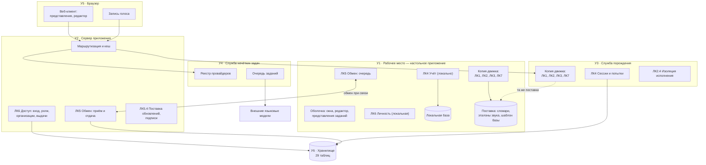

# Глава 5б. Физическая архитектура (уровень PA) — подробно

Развёрнутый уровень PA методологии ARCADIA: узлы развёртывания,
размещение логических компонентов по узлам, физические интерфейсы,
хранилища и то, чем каждое решение оплачено.

Главное отличие PA от LA: здесь появляется **дублирование**. На уровне LA
компонент существует в одном экземпляре; на уровне PA часть компонентов
оказывается в двух копиях, и это порождает риски, которых на LA не было.

---

## 5б.1. Узлы развёртывания

**Таблица 5б.1 — Узлы**

| Узел | Что это | Где исполняется | Обязателен |
|---|---|---|---|
| **У1** Рабочее место | настольное приложение | компьютер преподавателя или обучающегося | нет (можно только веб) |
| **У2** Сервер приложения | точка входа, роли, маршрутизация | сервер учебного заведения | нет (можно только автономно) |
| **У3** Служба порождения | движок графов и проверки | тот же сервер или отдельный | вместе с У2 |
| **У4** Служба нечётких задач | обращения к внешним моделям | тот же сервер или отдельный | нет |
| **У5** Браузер | тонкий клиент | компьютер пользователя | вместе с У2 |
| **У6** Хранилище | база данных | тот же сервер | вместе с У2 |

**Существенное свойство состава:** обязательных узлов нет ни одного.
Система разворачивается тремя способами — только У1 (полностью
автономно), У2+У3+У5+У6 (только веб), все шесть (полный состав). Это
прямое следствие требования СТ4 и главное, что отличает физическую
архитектуру от типовой клиент-серверной.

*Рис. 5б.1. Физическая архитектура: узлы и размещение компонентов.*

---

## 5б.2. Размещение логических компонентов по узлам

**Таблица 5б.2 — Компонент → узел**

| Компонент | У1 рабочее место | У2 сервер | У3 порождение | У4 нечёткие | У5 браузер |
|---|---|---|---|---|---|
| ЛК1.1 Язык описания | **копия** | | **копия** | | — |
| ЛК1.2 Каталог операций | **копия** | список установленных | **копия** | | — |
| ЛК1.3 Редактор описания | ● | | | | ● |
| ЛК1.4 Адресация материалов | **копия** | | **копия** | | — |
| ЛК2.1 Исполнитель | **копия** | | **копия** | | — |
| ЛК2.2 Источник случайности | **копия** | | **копия** | | — |
| ЛК2.3 Сборка представления | **копия** | | **копия** | | показ |
| ЛК2.4 Изоляция исполнения | — | | ● | | — |
| ЛК3.1–3.3 Критерий и правила | **копия** | | **копия** | | — |
| ЛК3.4 Формы ввода | ● | | описание формы | | ● |
| ЛК4.1 Сценарий прохождения | **копия** | | **копия** | | — |
| ЛК4.2 Сессия | локально | | ● | | — |
| ЛК4.3 Попытки | локально + очередь | | ● | | — |
| ЛК4.4 Усвоение | локально | | ● | | показ |
| ЛК5.1 Журнал изменений | ● | ● | | | — |
| ЛК5.2 Обмен | ● | ● | | | — |
| ЛК5.3 Разрешение расхождений | ● | ● | | | — |
| ЛК5.4 Поставка обновлений | приём | ● | | | — |
| ЛК6.1 Личность сеанса | локальная | ● | доверяет У2 | | — |
| ЛК6.2 Права на содержание | локальная | ● | | | — |
| ЛК6.3 Организации и группы | кеш | ● | | | показ |
| ЛК7.1–7.3 Подтверждение | **копия** | | **копия** | | — |

**Копия** — компонент существует в двух экземплярах, которые обязаны
вести себя одинаково. Таких **пятнадцать подкомпонентов**. Это цена
требования СТ4, выраженная числом.

---

## 5б.3. Главный риск уровня PA: расхождение копий

Пятнадцать дублированных подкомпонентов порождают риск, отсутствовавший
на уровне LA.

**Таблица 5б.3 — Виды расхождения и их проявление**

| Вид расхождения | Как проявляется | Замечает ли кто-нибудь |
|---|---|---|
| операция есть на одном узле, нет на другом | отказ при выдаче задания | **да**, отказ виден |
| операция есть на обоих, но реализована по-разному | **другое задание с другим ответом** | **нет** — оба узла считают себя правыми |
| разные версии материалов поставки | другой словарь под тем же номером | **нет** |
| разные версии схемы хранилища | отказ обмена или потеря поля | частично |

Вторая и третья строки — самые опасные: они молчат. Именно ради них
введены меры контроля.

**Таблица 5б.4 — Меры контроля**

| Мера | Что проверяет | Когда | Замер |
|---|---|---|---|
| сравнение операций по синтаксическому дереву | расхождение реализаций | при сборке | **0 расхождений из 140 операций** |
| перечень «только на сервере» | компонент уехал не на свой узел | при сборке | список выводится механически, а не ведётся руками |
| номер раздела из имени материала | подмена материала под тем же номером | при старте | совпадение на каталогах разной длины |
| проверка «у каждого раздела есть чем открыться» | целостность связи «раздел ↔ код» | при старте | 0 разделов без обслуживания |
| версионированные миграции схемы | расхождение схем | при старте | 15 миграций, повторный прогон — пустой |

Сравнение **по операциям, а не по файлам** — существенное решение:
операции переносят между модулями, и построчное сравнение файлов даёт
сотни строк шума, в которых теряется единственное значимое различие.

---

## 5б.4. Физические интерфейсы

**Таблица 5б.5 — Интерфейсы между узлами**

| ID | Между | Содержание | Свойства |
|---|---|---|---|
| ФИ1 | У5 → У2 | запросы пользователя веб-клиента | синхронный, обязателен для веба |
| ФИ2 | У2 → У3 | порождение варианта, проверка ответа | синхронный, внутренняя сеть |
| ФИ3 | У2 → У4 | постановка нечёткой задачи | асинхронный: результат приходит позже |
| ФИ4 | **У1 ↔ У2** | **обмен изменениями** | **асинхронный, допускает длительное отсутствие** |
| ФИ5 | У2/У3 → У6 | хранение | транзакционный |
| ФИ6 | У2 → У1 | поставка обновлений и пакетов операций | **односторонний** |
| ФИ7 | У4 → внешние модели | обращения к сторонним службам | ненадёжный по построению |

### ФИ4 — единственный интерфейс, который обязан переживать отсутствие

Все остальные интерфейсы при потере связи означают отказ. ФИ4 — нет: его
отсутствие является **штатным состоянием**, а не аварией.

Следствия для его устройства:

* очередь изменений на стороне У1 переживает перезапуск приложения;
* каждая сущность несёт версию записи — иначе после долгого перерыва
  нельзя понять, чьё изменение новее;
* удаление передаётся отметкой, а не отсутствием записи;
* повторная передача одного и того же изменения не должна порождать
  дубль (идемпотентность по идентификатору).

### ФИ6 — почему односторонний

Пакеты операций едут только от сервера к рабочему месту. Обратного пути
нет и не задумано: набор доступных операций — предмет решения
администратора учебного заведения, а не результат того, что кто-то
поставил себе пакет локально. Двусторонняя поставка означала бы, что
описание задания, собранное на одном рабочем месте, не исполняется на
другом.

---

## 5б.5. Хранилище (У6)

29 таблиц. Разложены по владеющим компонентам — это проверка того, что
хранилище не стало общей свалкой.

**Таблица 5б.6 — Таблицы по компонентам**

| Компонент | Таблицы | Назначение |
|---|---|---|
| ЛК1 Описание задания | `Subjects`, `Partitions` | предметы и разделы; описание графа лежит в поле раздела |
| ЛК4 Учёт | `attempts`, `interactive_sessions`, `WordStats` | попытки, живые сессии, межсессионная память тренажёра |
| ЛК4 + ЛК6 | `assignments` | выданные задания: кому, что, до какого срока |
| ЛК6 Доступ | `users`, `groups`, `group_members`, `teacher_groups`, `organizations`, `subject_grants` | личности, учебные единицы, выдача предметов |
| ЛК6 (сеансы) | `auth_sessions`, `devices` | сеансы и устройства |
| ЛК5 Обмен | версии записей в самих таблицах, `schema_migrations` | журнал изменений и версия схемы |
| ЛК5.4 Обновления | `app_releases`, `node_packages`, `installed_packages`, `package_requests`, `signing_key_sets` | поставка версий и пакетов, подписи |
| У4 Нечёткие задачи | `contour_jobs`, `corpus_records`, `corpus_curation` | очередь заданий и корпус |
| Внешний доступ | `api_clients`, `api_keys`, `api_client_subjects`, `api_usage` | сторонние потребители |
| Прочее | `app_settings`, `sqlite_sequence` | настройки развёртывания |

**Наблюдение о качестве разбиения.** Ни одна таблица не принадлежит двум
компонентам. Единственное исключение — `assignments`, и оно осмысленно:
выданное задание есть пересечение содержания и доступа по своей природе.

---

## 5б.6. Размещение проверки произношения

Новая возможность размещается **без нового узла** — это проверка
качества архитектуры.

**Таблица 5б.7 — Проверка произношения по узлам**

| Что | У1 рабочее место | У5 браузер | У3 служба порождения |
|---|---|---|---|
| запись голоса | средствами системы | средствами браузера | — |
| эталоны | из поставки локально | — | из поставки локально |
| признаки и расстояния | **локально** | — | **локально** |
| вердикт | локально | — | локально |
| хранение записи | локально, по решению режима | — | по решению режима |

**Ключевое свойство: вычисление местное.** Ни признаки, ни расстояния не
требуют обращения к внешней службе. Это не оптимизация, а условие: любое
обращение наружу сломало бы автономную работу (СТ4), ради которой вся
физическая архитектура и построена такой.

Цена решения названа: 13 МиБ эталонов в поставке и вычисление порядка
десятка миллисекунд на слово словаря.

**Чего размещение НЕ включает.** Распознавания речи здесь нет: узел не
переводит звук в текст. Добавление настоящего распознавания потребовало
бы либо модели в поставке (десятки мегабайт и лицензия), либо внешней
службы (и тогда — отказ от автономности для этой возможности). Обе
развилки названы в главе 6 и ни одна не пройдена.

---

## 5б.7. Развёртывания

**Таблица 5б.8 — Три способа развернуть систему**

| Способ | Узлы | Что доступно | Чего нет |
|---|---|---|---|
| **Автономный** | У1 | описание, порождение, проверка, учёт, выгрузка, произношение | обмена между людьми, сводного усвоения, выдачи заданий |
| **Только веб** | У2, У3, У5, У6 | всё, кроме автономной работы | занятия без сети, локальных файлов преподавателя |
| **Полный** | все шесть | всё | — |

Ни один способ не является урезанием другого: автономный даёт то, чего
нет у веба (работа без сети, локальные файлы), веб даёт то, чего нет у
автономного (совместная работа). Это отражено и в анализе альтернатив
(глава 5, §5.8): выбранный вариант выигрывал именно критерием
«настольное приложение».

---

## 5б.8. Нефункциональные характеристики по узлам

**Таблица 5б.9**

| Узел | Характеристика | Значение | Чем обеспечено |
|---|---|---|---|
| У1 | работа без сети | 100% функций порождения, проверки, учёта | копия движка + локальная база |
| У1 | размер поставки | ≈13 МиБ звука + словари + шаблон базы | заранее синтезированные эталоны |
| У1 | сохранность очереди обмена | переживает перезапуск | очередь в локальной базе |
| У3 | устойчивость к чужому описанию | ограничение времени и ресурсов | изоляция исполнения |
| У3 | время порождения варианта | ≤ 1 с для типового описания | — |
| У2 | согласованность личности | роль — свойство сеанса | сеансы в хранилище |
| У2 | подлинность обновлений | подпись проверяется до применения | набор ключей подписи |
| У4 | ненадёжность внешних служб | отказ провайдера не роняет задачу | очередь + повтор |
| У6 | согласованность схемы | версионированные миграции | 15 миграций |

---

## 5б.9. Прослеживание «логический компонент → узел → мера контроля»

**Таблица 5б.10 — Сквозная строка для СТ4**

| Уровень | Сущность |
|---|---|
| OA | OC4: занятие идёт там, где сети нет |
| SA | СТ4: одно описание — одинаковое исполнение в двух средах |
| LA | ЛК1, ЛК2, ЛК3, ЛК7 обязаны существовать независимо от связи |
| LA→PA | решение: полная копия движка (обосновано в главе 5, §5.8) |
| PA | 15 дублированных подкомпонентов на узлах У1 и У3 |
| PA | риск: расхождение копий, из них два вида молчаливых |
| Мера | сравнение операций по синтаксическому дереву |
| Замер | **0 расхождений из 140 операций** |

Восемь строк от операционной потребности до числа. Эту цепочку и стоит
показывать на защите: она демонстрирует, что модель связная.

---

## 5б.10. Выводы по уровню PA

1. Определено 6 узлов развёртывания; обязательных нет ни одного —
   система разворачивается тремя способами, и это следствие СТ4.
2. Пятнадцать подкомпонентов существуют в двух копиях. Дублирование —
   цена автономной работы, выраженная числом.
3. Из четырёх видов расхождения копий два проявляются молча; против них
   введены пять мер контроля, работающих при сборке и при старте.
4. Из семи физических интерфейсов ровно один (обмен между рабочим местом
   и сервером) обязан переживать длительное отсутствие связи; его
   устройство выведено из этого требования.
5. Хранилище из 29 таблиц разложено по владеющим компонентам без
   пересечений — за единственным осмысленным исключением.
6. Проверка произношения размещена без нового узла и без обращений
   наружу: признаки и расстояния вычисляются местно, что сохраняет
   автономность.
