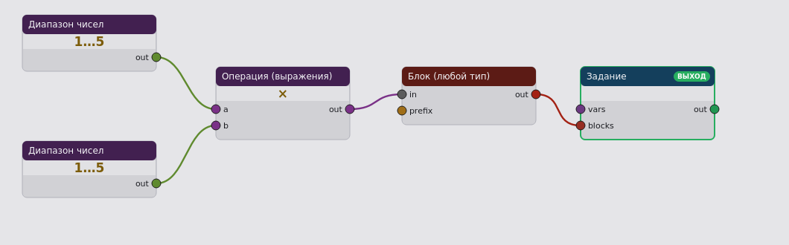
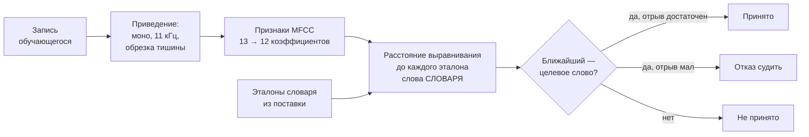

# Глава 6. Реализация

Глава показывает, как решения глав 3 и 5 выражены в работающем комплексе.
Порядок изложения — от того, что описывает преподаватель, к тому, что
видит студент.

---

## 6.1. Язык описания задания

Задание описывается **графом вычислений**: вершины — операции, дуги —
передача значений. Граф исполняется слева направо; вершина срабатывает,
когда готовы все её входы.



*Рис. 6.1. Описание задания «умножение двух чисел». Слева два источника
случайных чисел, в середине операция умножения, справа сборка блока и
финальная вершина задания. Цвет дуги соответствует типу значения.*

### Каталог операций

145 вершин, сгруппированных по областям:

| Область | Вершин | Назначение |
|---|---|---|
| символьные вычисления | 41 | выражения, упрощение, подстановка, производные |
| линейная алгебра | 38 | матрицы, определители, собственные значения |
| управление | 15 | ветвление, циклы, повторы |
| источники | 11 | числа, диапазоны, файлы поставки |
| коллекции | 8 | списки, выборка, перебор |
| английский язык | 5 | словари, предложения, выборка пары |
| арифметика | 4 | операции над числами |
| дифференциальные уравнения | 4 | построение и решение |
| информатика | 4 | код, вывод программы |
| изображения | 4 | схемы, графики |
| содержание | 4 | текст, формула, блок |
| комплексная плоскость | 3 | построение областей |
| сборка | 3 | объединение блоков |
| задание | 1 | финальная вершина |

Число вершин — не показатель качества, а показатель охвата: язык
покрывает пять учебных дисциплин.

### Три свойства языка, вытекающие из главы 2

**Типизация дуг.** У каждого выхода и входа есть тип (число, строка,
выражение, матрица, словарь, блок, задание). Несовместимое соединение
запрещается при составлении, а не при исполнении. Тип отображается
цветом дуги.

**Принадлежность вершины условию или ответу вычисляется.** Какие вершины
формируют условие, а какие — правильный ответ, определяется обратным
обходом от финальной вершины. Хранить эту пометку нельзя: при перетыкании
дуги она разошлась бы с графом, и расхождение проявилось бы правильным
ответом, показанным в условии.

**Файлы адресуются идентификатором.** Ссылка вида
`res:words/unit1_history.json` разрешается относительно каталога
поставки той среды, которая исполняет граф (см. главу 5, §5.10).

---

## 6.2. Порождение варианта

Исполнитель обходит граф топологически и получает две вещи: **условие**
(список блоков представления) и **спецификацию ответа**.

Вся случайность выводится из одного **зерна варианта**. Это даёт
требование СТ5: по зерну восстанавливается тот же вариант, что позволяет
разобрать сообщение «здесь неверный ответ», а не гадать. Без этого
разбор жалобы невозможен в принципе.

---

## 6.3. Спецификация ответа: ответ как данные

Центральное решение реализации. Правильный ответ хранится **не строкой**,
а описанием того, что считать правильным.

| Вид спецификации | Что задаёт | Параметры |
|---|---|---|
| числовая | значение | допуск (абсолютный, относительный, по значащим цифрам), единица измерения, запись для показа |
| текстовая | строку | чувствительность к регистру и пробелам, допуск на опечатку, множество допустимых |
| выражение | алгебраический объект | переменные, критерий эквивалентности |
| выбор | номер варианта | набор вариантов |

Спецификация путешествует вместе с вариантом: и на экран, и в проверку
идёт **одна и та же величина**. Ответ, переписанный студентом с экрана,
засчитывается по построению.

*Замечание, важное для точности изложения:* поле «запись для показа»
хранит содержательную часть ответа, а единица измерения добавляется при
отображении. Для физической задачи на экране стоит `32 Н`, и проверка
требует единицу — то есть `32` без единицы отвергается намеренно:
размерность является частью ответа физической задачи.

---

## 6.4. Правила эквивалентности по областям

Реализованы как отдельные модули, используемые И проверкой, И
порождением примеров.

### Числа

Совпадение с точностью до допуска; десятичный разделитель нормализуется
(запятая — самый частый ввод с русской раскладки); единица сравнивается
отдельно от значения, что даёт содержательное сообщение «ожидалась
размерность Н» вместо «неверно».

### Выражения

Эквивалентность проверяется приведением к канонической форме средствами
символьной алгебры: `x*x` и `x^2` — один ответ, `x+x` и `2*x` — один
ответ.

### Логические формулы

Эквивалентность — совпадение таблиц истинности, а не записи: `A и B` и
`B ∧ A` — один ответ.

### Вывод программы

Сравниваются результаты исполнения, а не тексты: программы, печатающие
одно и то же, считаются эквивалентными.

### Текст: допуск как функция окрестности

Реализация СТ2 — главный результат работы.

Правило:

```
допуск(слово) = min( политика_по_длине(слово),
                     расстояние_до_ближайшего_соседа(слово) − 1 )
```

где `политика_по_длине` даёт одно исправление на каждые четыре символа,
а `расстояние_до_ближайшего_соседа` считается по множеству допустимых
ответов (в словарном диктанте — по словарю сессии).

Из правила следует главное свойство **по построению, а не подбором
констант**:

> другой допустимый ответ не может быть принят как ошибка написания.

Действительно: если ближайший сосед находится на расстоянии *d*, допуск
не превышает *d* − 1, значит принятое множество не достигает соседа.
Если *d* = 1, допуск равен нулю — и это верно: в такой окрестности
опечатка неотличима от другого термина, и принимать её значит гадать за
студента.

**Тонкость реализации, без которой правило ломается.** Окрестность
считается по ПОЛНОМУ множеству допустимых ответов, зафиксированному в
начале сессии, а не по «оставшимся». Если считать по оставшимся, допуск
растёт к концу диктанта — соседи кончаются, окрестность разрежается, — и
один и тот же ответ принимается или отвергается в зависимости от того,
когда он дан. Объяснить это студенту было бы нечем.

---

## 6.5. Сопровождающие материалы задания

Для языковых заданий реализовано представление произношения: **405
транскрипций** в международном фонетическом алфавите и **462 звуковых
файла** на 463 термина поставки.

Оба вида показываются **в разборе ответа, а не в условии**. Основание:
озвученное английское слово в условии — подсказка к переводу, который и
спрашивается; транскрипция — то же слово другой записью.

Звук синтезируется заранее при сборке (свободный офлайн-синтезатор) и
адресуется идентификатором поставки. Исполняющая среда о синтезе не
знает — это следствие требования автономности: наличие синтезатора на
машине студента не гарантировано.

---

## 6.6. Проверка произношения

Реализация возможности C.07 — расширение правила окрестности на вторую
модальность.

### Ступени, из которых выбрана вторая

| Ступень | Что делает | Что требует | Состояние |
|---|---|---|---|
| 0. Самопроверка | обучающийся слушает эталон, записывает себя, сравнивает на слух и сам отмечает результат | ничего, кроме записи звука | **основа**: вердикт человека всегда доступен |
| 1. **Ближайший эталон в словаре** | система сравнивает запись с эталонами слов словаря и называет ближайшее | признаки, выравнивание по времени, эталоны в поставке | **реализована** |
| 2. Распознавание речи | перевод записи в текст, сравнение с целевым словом | модель распознавания в поставке (десятки МБ) либо внешняя служба | не реализована, развилка названа |

Ступень 1 выбрана потому, что она **не требует ни модели, ни сети**, а
значит не нарушает требование автономности СТ4 — единственное требование,
определившее всю физическую архитектуру.

### Устройство



*Рис. 6.2. Проверка произношения.*

**Признаки.** Мел-кепстральные коэффициенты. Нулевой коэффициент
отбрасывается, среднее вычитается — этим из признаков убирается
громкость и постоянная характеристика микрофона. Свойство не подбиралось,
оно следует из построения и закреплено проверкой.

**Расстояние.** Динамическое выравнивание по времени. Нужно потому, что
одно и то же слово произносят с разной скоростью; покадровое сравнение
считало бы это разными словами.

**Правило.** Принято, если эталон целевого слова оказался ближе прочих.
Абсолютного порога нет, и это то же решение, что в допуске на опечатку:
порогу нужна калибровка под голос и микрофон, правилу ближайшего — нет,
оно сравнивает внутри одной записи.

**Мера уверенности.** Относительный отрыв ближайшего от следующего. При
малом отрыве вердикт не выносится. Это отличает реализацию от обычной
классификации: **отказ судить — штатный исход, а не ошибка.**

### Чего в реализации нет

Распознавания речи. Модуль не переводит звук в текст и не оценивает
правильность произношения фонетически: он отвечает на один вопрос — на
какое слово словаря запись похожа больше. Для словарного тренажёра этого
достаточно; для постановки произношения — нет, и выдавать одно за другое
нельзя.

Ограничение правила: оно тем надёжнее, чем больше слов в словаре. При
двух словах случайное совпадение даёт половину, и мера уверенности здесь
не спасает — на это стоит отдельная проверка.

---

## 6.7. Автономная работа и согласование сред

Настольное приложение содержит собственную копию движка и собственную
базу. Без сети оно порождает варианты, проверяет ответы и накапливает
попытки в очередь.

При появлении сети — двусторонний обмен: изменения уезжают, чужие
приезжают. Расхождения разрешаются по версии записи; удаления передаются
отметками, а не исчезновением записи (иначе удаление на одной стороне
неотличимо от отсутствия на другой).

### Контроль расхождения копий движка

Автоматическое сравнение по абстрактному синтаксическому дереву на
уровне отдельных операций. Сравнение файлов построчно не годится:
операции переносят между модулями, и построчное сравнение даёт сотни
строк шума, в которых теряется единственное значимое различие.

Проверка различает три случая: операция есть только в одной копии;
операции совпадают; операции различаются реализацией. Первый и третий —
ошибки.

---

## 6.8. Разграничение доступа

Три роли: студент, преподаватель, администратор. Роль — свойство сеанса,
а не учётной записи.

Отдельно предусмотрен **режим примерки роли**: администратор
развёртывания может посмотреть систему глазами студента, не заводя
учётной записи. Примерка действует только «вниз» по уровню полномочий и
снимает признак администратора развёртывания. Следствие для надёжности:
код, забывший учесть примерку, ошибается в безопасную сторону — теряется
точность картинки, а не ограничение доступа.

---

## 6.9. Объём реализации

| Часть | Объём |
|---|---|
| движок и предметная область (сервер) | ≈47 тыс. строк |
| предметные генераторы | ≈8 тыс. строк |
| служба порождения | ≈4 тыс. строк |
| служба нечётких задач | ≈3,7 тыс. строк |
| точка входа и маршрутизация | ≈2 тыс. строк |
| веб-клиент | ≈13,6 тыс. строк |
| настольное приложение (с копией движка) | ≈57 тыс. строк |
| автоматические проверки | 3838 |

Числа приведены не как показатель качества, а как оценка масштаба, в
котором получены результаты главы 7.
