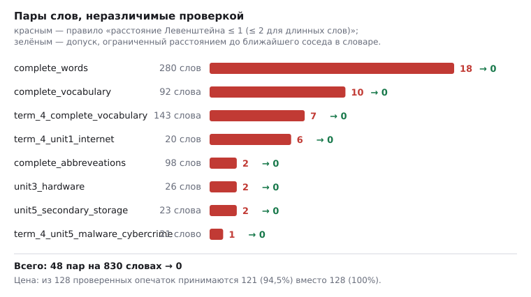
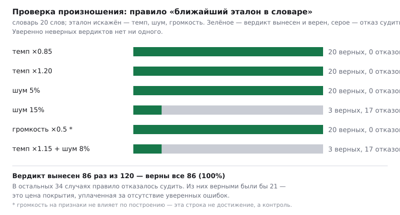

# Глава 7. Результаты и оценка

Глава содержит замеры. Правило изложения: **каждое число сопровождается
описанием того, как оно получено**, и рядом называется то, что НЕ
измерено. Второе не менее важно: работа, умалчивающая о границах,
проверяется читателем на первом же вопросе.

---

## 7.1. Проверка основной гипотезы: допуск из окрестности

### Постановка замера

**Материал.** 16 словарей учебной поставки, 830 словарных позиций
(объединённый словарь без повторов — 160 терминов).

**Что измерялось.**

1. *Число неразличимых пар* — пар различных допустимых ответов, между
   которыми расстояние Левенштейна не превышает допуска. Такая пара
   означает, что проверка не отличает знание от незнания.
2. *Доля принимаемых опечаток* — цена правила. Ужать допуск до нуля
   «безопасно» и бесполезно: проверка перестала бы отличаться от строгой.

**Сравниваемые правила.**

* П1 (исходное): допуск = 1 для слов до 6 символов, 2 для более длинных.
* П2 (предлагаемое): допуск = min(⌊длина/4⌋, расстояние до ближайшего
  соседа − 1).

**Модель опечатки** для второго измерения: выпадение одной буквы из
середины слова — самый частый тип при наборе.

### Результат



| Показатель | П1 | П2 |
|---|---|---|
| Неразличимых пар (830 позиций) | **48** | **0** |
| Принято опечаток (из 128 проверенных) | 128 (100%) | **121 (94,5%)** |

Распределение по словарям:

| Словарь | Слов | Пар при П1 | Пар при П2 |
|---|---|---|---|
| complete_words | 280 | 18 | 0 |
| complete_vocabulary | 92 | 10 | 0 |
| term_4_complete_vocabulary | 143 | 7 | 0 |
| term_4_unit1_internet | 20 | 6 | 0 |
| complete_abbreveations | 98 | 2 | 0 |
| unit3_hardware | 26 | 2 | 0 |
| unit5_secondary_storage | 23 | 2 | 0 |
| term_4_unit5_malware_cybercrime | 21 | 1 | 0 |
| остальные восемь | 207 | 0 | 0 |

### Интерпретация

**Ноль — не результат подбора констант, а следствие правила.** Если
ближайший сосед на расстоянии *d*, допуск не превышает *d* − 1, значит
принятое множество соседа не достигает. Поэтому свойство сохраняется на
любом словаре, а не только на измеренном; замер подтверждает, что
реализация соответствует правилу.

**Цена невелика и объяснима.** Потеряны 7 случаев из 128 — ровно те, где
сосед стоит вплотную. Это не потеря: там опечатка неотличима от другого
термина, и прежнее правило засчитывало догадку.

**Наиболее показательные пары** (все — из одного учебного раздела):

```
LAN ← MAN, WAN, WLAN      четыре типа сетей в одном юните
AI ← AR                    искусственный интеллект и дополненная реальность
DSL ← SDSL, SSL            две технологии связи и протокол шифрования
hardware ← shareware       оборудование и вид распространения ПО
```

Ни одна из них не является опечаткой. Все — разные термины, которые
студент обязан различать; именно ради этого диктант и проводится.

---

## 7.2. Замер отказов проверки по форме записи (проблема Pr.02)

### Как замер изменился по ходу работы

Планировалось мерить на накопленных попытках: прогнать введённые
студентами ответы строгой и предметной проверками и сравнить вердикты.
Проверка данных показала, что это невозможно: все 519 накопленных
попыток демонстрационные, поле введённого текста в них пустое.

Замысел заменён, а не подогнан. Вопрос «сколько допустимых записей одного
и того же ответа отвергнет строковое сравнение» от студентов не зависит:
это свойство спецификации ответа. Спецификация умеет перечислить записи,
которые сама признаёт верными, причём каждая из них проверена её же
проверкой — инвариант «предпросмотр не врёт».

### Постановка

**Материал.** Все генераторы поставки; у каждого взято 20 вариантов.
Собрано **681 вариант** со спецификацией ответа.

**Что измерялось.** Для каждой спецификации берётся перечень признаваемых
записей. Первая объявляется эталоном — это то, что наивная система
хранила бы строкой «правильный ответ». Остальные прогоняются через три
проверки:

* **строгое равенство строк** — `ответ == эталон`;
* **нормализованное равенство** — регистр, пробелы, десятичный
  разделитель (аккуратная наивная реализация);
* **предметная проверка** — сама спецификация.

Команда: `python -m scripts.measure_answer_forms --variants 20`

### Результат

Из 681 варианта **425 (62,4%)** имеют единственную допустимую запись —
там отвергать нечего. Остальные дали **282 альтернативные верные
записи**.

| Проверка | Отвергнуто | Доля |
|---|---|---|
| строгое равенство строк | **282** | **100%** |
| нормализованное равенство | **78** | **27,7%** |
| предметная проверка | **0** | **0%** |

Разложение по видам ответа оказалось резким и содержательным:

| Вид спецификации | Вариантов | Альтернативных записей | Отвергает строгая | Отвергает нормализованная |
|---|---|---|---|---|
| числовая | 300 | 204 | 204 | **0** |
| выражение | 361 | 78 | 78 | **78** |
| слоты | 20 | 0 | 0 | 0 |

### Интерпретация — и это не тот вывод, которого ждёшь

**Для чисел аккуратной нормализации достаточно.** Все 204 альтернативные
записи различаются десятичным разделителем и пробелами: `2,43×10^-9 Н`
против `2.43×10^-9 Н`. Утверждать, что здесь нужна предметная проверка,
было бы преувеличением.

**Для выражений нормализация не помогает ни в одном случае.** Записи
алгебраически равны, но структурно различны — разложенная форма против
раскрытой против приведённой к общему знаменателю:

```
эталон:      8*x*(2*x**2 + 2) + 2*x*cos(x**2)*tan(5/x**2)/(3*sin(x**2)**(2/3)) − …
принимается: 16*x**3 + 16*x + 2*x*cos(x**2)*tan(5/x**2)/(3*sin(x**2)**(2/3)) − …
```

Никакая нормализация строки этих двух записей не сближает: нужна
символьная алгебра, то есть **понятие равенства предметной области**.

Отсюда уточнённая формулировка результата Р1: строковое сравнение
недостаточно **не везде одинаково**. Там, где ответ — измеренная
величина, разрыв закрывается нормализацией; там, где ответ — алгебраический
объект, не закрывается в принципе.

### Отдельная находка: выбор вида спецификации имеет значение

Проверка на реалистичных записях показала границу применимости числовой
спецификации:

| Ответ `0.5` задан как | `1/2` | `2/4` | `0,5` | `.5` | `5e-1` |
|---|---|---|---|---|---|
| числовая спецификация | ✗ | ✗ | ✓ | ✓ | ✓ |
| спецификация-выражение | ✓ | ✓ | ✓ | ✓ | ✓ |

Числовая спецификация разбирает **число**, и дробная запись для неё не
число. Значит, задание с точным математическим ответом, оформленное
числовой спецификацией вместо выражения, воспроизводит исходный дефект
Pr.02.

Замер поставки: числовых спецификаций без размерности — **4 раздела**,
из них с нецелым значением — **2**, и в обоих значение приближённое
(6.312 и 3.67×10⁹), где дробная запись студентом маловероятна. То есть
риск в текущей поставке мал, но он есть, и он назван.

### Чего замер не показывает

Он меряет записи, ЗАЛОЖЕННЫЕ в спецификацию, а не те, что реально пишут
студенты. Распределение реальных ответов может быть смещено к одной
форме, и наблюдаемая частота споров окажется ниже. Это верхняя оценка
способности строкового сравнения ошибиться, а не частота ошибки.

---

## 7.3. Проверка произношения: правило окрестности на второй модальности

### Замысел

Проверка произношения строилась как расширение главного результата
работы на вторую модальность. Правило то же: **вердикт выносится
сравнением с остальными допустимыми ответами, а не с порогом.**

Для звука это означает: запись принимается как слово W, если эталон W
оказался ближе к ней, чем эталоны остальных слов словаря.

### Постановка

**Материал.** Учебный словарь из 20 слов, для каждого — заранее
синтезированный эталон произношения из поставки.

**Признаки:** мел-кепстральные коэффициенты; расстояние — динамическое
выравнивание по времени (разная скорость речи не должна считаться разным
словом). Всё вычисляется местно, без обращения к внешним службам, — иначе
сломалось бы требование автономности СТ4.

**Живых записей людей нет.** Вместо них эталон искажается тремя
способами, заведомо различающими дикторов и микрофоны: темп, шум,
громкость.

Команда: `python -m scripts.measure_pronunciation --words 20`

### Результат

| Искажение | Опознано верно | Вердикт вынесен | Вердикт верен |
|---|---|---|---|
| темп ×0.85 | 20/20 (100%) | 20 | 20 |
| темп ×1.20 | 20/20 (100%) | 20 | 20 |
| шум 5% | 20/20 (100%) | 20 | 20 |
| шум 15% | 11/20 (55%) | 3 | 3 |
| громкость ×0.5 | 20/20 (100%) | 20 | 20 |
| темп ×1.15 + шум 8% | 16/20 (80%) | 3 | 3 |
| **Итого** | **107/120 (89,2%)** | **86** | **86** |



*Рис. 7.2. Вердикты по видам искажения. Зелёное — вердикт вынесен и
верен, серое — отказ судить. Красного (уверенно неверных) нет.*

### Главное свойство: система не ошибается уверенно

Правило снабжено мерой уверенности — относительным отрывом ближайшего
эталона от следующего. При отрыве ниже порога вердикт **не выносится**.

| | Число | Из них верных |
|---|---|---|
| вердикт вынесен | 86 | **86 (100%)** |
| отказ судить | 34 | (21 были бы верны) |

**Ни одного уверенно неверного вердикта.** Правило либо отвечает верно,
либо честно отказывается отвечать. Для учебной системы это ровно то
свойство, которое требуется: неверно зачесть произношение хуже, чем не
зачесть его вовсе.

Цена — покрытие: вердикт выносится в 71,7% случаев.

### Что здесь измерено честно, а что нет

**Измерено:** правило различает слова словаря и корректно отказывается
судить при зашумлении.

**Не измерено и не утверждается:** работа на записях живых людей.
Искажения синтетические, эталоны порождены одним синтезатором. Это
**нижняя граница**: правило, не пережившее искусственного искажения, не
пережило бы и живого. Обратное неверно.

**Отдельно — отрицательный результат, который стоит назвать.**
Предполагалось показать, что абсолютный порог непереносим между
дикторами (известное положение). На нашем материале это **не
подтвердилось**: наибольшее расстояние «своё к своему после искажения»
составило 18,2 против наименьшего «чужое к чужому» 21,0 — то есть порог
разделял. Опираться на непроверенное положение работа не может, и
обоснование правила изменено на проверяемое: **порогу нужна калибровка
под голос и микрофон, а правилу ближайшего — нет**, оно сравнивает
внутри одной записи.

Результат «громкость ×0.5 → 100%» также не является достижением:
признаки строятся так, что громкость на них не влияет по построению.

---

## 7.4. Проверка согласованности пары «условие — ответ»

### Постановка

Утверждение «генератор порождает задания с верным ответом» проверяется
не чтением кода, а прогоном: порождается множество вариантов, у каждого
вычисленный ответ сверяется с независимо посчитанным.

Для задач линейной алгебры независимая проверка формулируется как
математическое свойство результата. Пример: характеристический многочлен
матрицы обязан обращаться в нуль ровно на её спектре — это проверяется
подстановкой, не повторяя вычисление многочлена.

### Результат

Всего автоматических проверок в комплексе — **3840** (сервер 1592,
настольное приложение 2177, веб-клиент 71).

**Найденное этим способом** (примеры, показывающие класс ошибок):

| Ошибка | Почему не видна при чтении |
|---|---|
| проверка подставляла символ `lambda`, тогда как модель использует `lamda`; подстановка молча не выполнялась | обе записи выглядят правильно; проверка проходила на любых данных |
| один файл проверок давал ноль тестов из-за несоответствия формы, и одно утверждение в нём уже не выполнялось | прогон был зелёным |

Второй случай привёл к отдельной мере: проверке того, что **каждый файл
проверок действительно даёт проверки**. Набор обязан говорить о себе
правду.

### Приём «регрессия наоборот»

Проверка, не падающая на старой реализации, не проверяет ничего. Поэтому
рядом с проверкой нового правила ставится проверка того, что старое на
тех же данных ошибалось. В наборе таких пар четыре — по числу правил,
изменённых в ходе работы.

---

## 7.5. Проверка требования об одинаковом исполнении в двух средах

### Расхождение копий движка

Сравнение по абстрактному синтаксическому дереву: 140 операций в каждой
копии, **все 140 идентичны**, файлов «не на своей стороне» нет.

### Расхождение идентификаторов содержимого

Замер выявил дефект, который иначе остался бы незамеченным. При выводе
номера раздела из положения файла в списке:

| Номер | Установка А (20 словарей) | Установка Б (12 словарей) |
|---|---|---|
| 1001 | `complete_vocabulary` | `complete_words` |
| 1002 | `complete_words` | `term_4_complete_vocabulary` |

Согласование сред переносит разделы по номеру. Следовательно, задание,
выданное на установке А, открывало на установке Б **другой словарь** —
без сообщений об ошибке.

После перехода к выводу номера из имени описания номера совпадают на
обеих установках по построению. Проверка сформулирована как свойство:
«каталоги разной длины дают один и тот же номер для одного и того же
имени».

---

## 7.6. Оценка полноты покрытия предметных областей

| Область | Вершин языка | Проверяемый ответ |
|---|---|---|
| символьные вычисления | 41 | да, по эквивалентности |
| линейная алгебра | 38 | да, числовой и матричный |
| английский язык | 5 + 3 генератора | да, текстовый с допуском |
| информатика | 4 | да, по выводу программы |
| физика | конструктор | да, числовой с размерностью |
| дифференциальные уравнения | 4 | частично |
| комплексная плоскость | 3 | нет: ответ графический |

Последние две строки — граница применимости, и её надо назвать: там, где
ответом является построение, а не значение, предложенный способ задания
критерия неприменим без расширения.

---

## 7.7. Чего замеры НЕ показывают

Этот раздел обязателен. Всё измеренное — свойства системы, а не
свидетельства учебного эффекта.

| Не измерено | Что потребовалось бы |
|---|---|
| влияние на усвоение материала | курс, контрольная группа, семестр, согласование |
| время преподавателя на составление задания | хронометраж на нескольких преподавателях |
| доля списывания при индивидуальных вариантах | сравнение с периодом до внедрения |
| пригодность языка описания для непрограммиста | наблюдаемое использование, а не мнение |
| работа проверки произношения на живых записях | записи не менее 10 говорящих на том же словаре |
| частота реальных отказов по форме записи | попытки с сохранённым введённым текстом (сейчас поле пустое) |
| частота отказов при автономной работе | эксплуатация на реальных рабочих местах |

**Из этого следует ограничение формулировок работы.** Утверждать можно:
«предложенное правило устраняет неразличимость допустимых ответов при
незначительном снижении доли принимаемых опечаток». Утверждать нельзя:
«применение системы повышает успеваемость» — для этого нет данных.

### Отдельно: незакрытые дефекты

Честность требует назвать и их. На момент завершения работы открыты:
аварийное завершение настольного приложения при правке формулы (причина
не установлена, диагностика включена); повреждение файла базы на одном
рабочем месте (копия эталона цела, воспроизвести не удалось; поставлены
меры контроля). Оба относятся к эксплуатации настольного приложения и не
затрагивают результатов §7.1–7.6.

---

## 7.8. Выводы по главе

1. Гипотеза главы 1 (§1.9) подтверждена: правило допуска, выводимое из
   окрестности ответа, устраняет неразличимость допустимых ответов
   полностью (48 → 0 на 830 позициях) при снижении доли принимаемых
   опечаток со 100% до 94,5%.

   **Правило перенесено на вторую модальность.** На звуке оно даёт 86
   верных вердиктов из 86 вынесенных, отказываясь судить в остальных 34
   случаях. Ни одного уверенно неверного вердикта — то есть переносится
   не только форма правила, но и его главное свойство.
2. Свойство выполняется по построению, а не подбором констант, поэтому
   переносится на произвольный словарь; замер подтверждает соответствие
   реализации правилу.
3. Массовый прогон с независимой сверкой ответа обнаруживает класс
   ошибок, невидимых при чтении кода; обнаружены два таких случая, один
   из которых делал часть проверок бездействующей.
4. Требование одинакового исполнения в двух средах выполнено; контроль
   расхождения показывает полное совпадение 140 операций.
5. Замер отказов по форме (Pr.02) выполнен способом, отличным от
   первоначального замысла: данных для замысла не оказалось. Результат
   уточняет Р1 — строковое сравнение недостаточно НЕ везде одинаково:
   для чисел разрыв закрывается нормализацией (0 из 204), для выражений
   не закрывается ни в одном случае (78 из 78).
6. Границы применимости названы: задания с графическим ответом
   предложенным способом не покрываются; проверка произношения измерена
   на синтетических искажениях, а не на живых записях; учебный эффект не
   измерялся и не утверждается.
7. Два предположения, проверенных и НЕ подтвердившихся, оставлены в
   тексте: непереносимость абсолютного порога между дикторами (§7.3) и
   возможность замерить Pr.02 на накопленных попытках (§7.2). Оба
   заменены на проверяемые формулировки.
